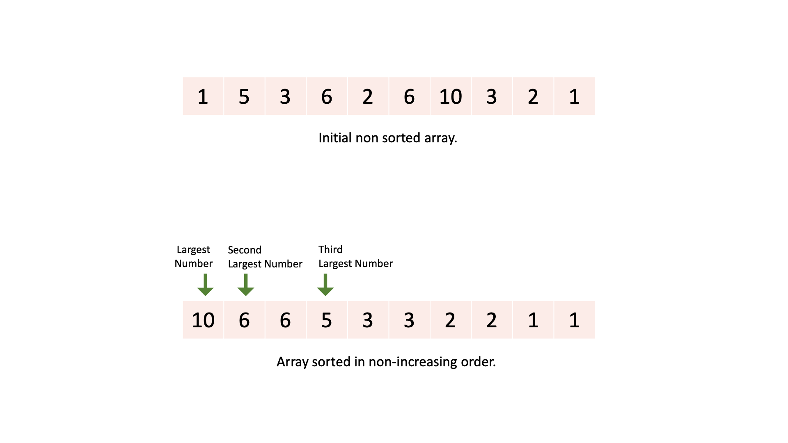

[TOC]

## Solution

---

### Overview

In this problem, we have to return the $3^{rd}$ largest number and if it does not exist we have to return the largest number.

In problems where we have to find $k^{th}$ largest/smallest number, we can always start by using any one of these three methods: sorting the array, using a priority queue, or using a sorted set.
As these three methods keep array elements in sorted order and it's easy to find the required element.

Also, we can keep track of the $3^{rd}$ largest number using 3 pointers which point to the top 3 largest numbers of the array.
Let's explore all of these approaches in detail.

---

### Approach 1: Sorting

#### Intuition

The most intuitive approach will be sorting the array and finding the $3^{rd}$ largest number.
We also have to take care of duplicates, we have to consider only distinct numbers.

After the array is sorted in non-increasing order, we can check the current number with the previous number. If the current number is different from the previous number it means the current number can be counted.
And whenever we count 3 different numbers we return that $3^{rd}$ distinct number.



#### Algorithm

1. Sort the `nums` array in non-increasing order.

2. Initialize variables:
- $elemCounted = 1$, it counts the number of distinct numbers that occurred till now.
- `prevElem` to the first array number, it denotes the previous counted number of the array.

3. Iterate on `nums` array's second number to the last number:
- If the current number is different than `prevElem`, it means it is a new distinct number, thus increment `elemCounted` by `1` and store the current number in `prevElem`.
- If `elemCounted` reaches `3`, it means the current number is the third largest number, thus return this number.

4. If we traversed on the whole array it means `3` distinct numbers were not present in the array, thus we return the largest number, which is at the beginning of the `nums` array.

#### Implementation

```python
class Solution:
    def thirdMax(self, nums: List[int]) -> int:
        # Sort the array.
        nums.sort(reverse = True)

        elem_counted = 1
        prev_elem = nums[0]

        for index in range(len(nums)):
            # Current element is different from previous.
            if nums[index] != prev_elem:
                elem_counted += 1
                prev_elem = nums[index]

            # If we have counted 3 numbers then return current number.
            if elem_counted == 3:
                return nums[index]

        # We never counted 3 distinct numbers, return largest number.
        return nums[0]
```

#### Complexity Analysis

If $N$ is the number of elements in the input array.

* Time complexity: $O(N \log N)$.
  - We sort the `nums` array, which takes $O(N \log N)$ time.
  - We iterate on the `nums` array once to find the $3^{rd}$ distinct number.
  - Thus, overall it takes, $O(N \log N + N) = O(N \log N)$ time.

* Space complexity: $O(1)$.
- We don't use any additional space.
       > **Note:** The built-in sort methods do use some additional space, you can tell this during the interview, but, the interviewer does not expect us to go into much detail about it, and it will be fine if we state the above space complexity analysis.

---

### Approach 2: Min Heap Data Structure

#### Intuition

We can use one max heap data structure and keep all distinct numbers of our array in sorted order.

> A max heap is a complete binary tree, in which the key present at the root node must be greatest among the keys present at all of it’s children. And the same property must be recursively true for all sub-trees in that tree.
If you are not familiar with heaps and priority queues, you can learn about them in our [explore card](https://leetcode.com/explore/featured/card/heap/643/heap/4018/).

The max heap will keep the largest number on the top, thus we can get the $3^{rd}$ largest number from it.

But we can further optimize this method.

We are keeping all array numbers in the heap instead while iterating the given array we can keep the three largest numbers till now in the heap and when a new number comes which is larger than any one of those three numbers, we remove the smallest among them and push this new number in the heap.
At any moment, the heap will only have three numbers in it.

But we need to tell which is the smallest number among all numbers in the heap, thus we have to use a **min heap**.

If after iterating over the given array, the heap does not contain three elements, it means that three distinct elements were not present in the array, thus in that case we return the maximum element among the elements stored in the min heap.

Also, we can keep one hash set to prevent the insertion of already used numbers in the min heap and the hash set can also maintain a size of three elements just like the min heap.
If a number is removed from the min heap it can also be removed from the hash set as all the numbers in the min heap are greater than the removed number and it will never be inserted again in the heap.

You can better understand the whole approach with the following slideshow:

!?!../Documents/414/slideshow1.json:960,540!?!

<br />

#### Algorithm

1. Initialize variables:
- `minHeap`, a min heap to keep the smallest element on top.
- `taken`, a hash set to track inserted numbers in min heap.

2. Iterate on all numbers of `nums` array:
- If the current number is already in the min heap, we skip it.
- If the min heap has three numbers in it, and if the current number is greater than the smallest in the min heap, then remove the smallest number and push the current number in both the min heap and the hash set.
   - Otherwise, if the min heap has less than three elements, then just push the current number in the min heap and the hash set.

3. If the min heap has less than three elements at the end, return the maximum element among all elements present in the min heap, which will be the largest number of the `nums` array.

4. Otherwise, return the top element of the min heap, which will be the third largest number.

#### Implementation

```python
class Solution:
    def thirdMax(self, nums: List[int]) -> int:
        min_heap = []
        taken = set()

        for index in range(len(nums)):
            # If current number was already taken, skip it.
            if nums[index] in taken:
                continue

            # If min heap already has three numbers in it.
            # Pop the smallest if current number is bigger than it.
            if len(min_heap) == 3:
                if min_heap[0] < nums[index]:
                    taken.remove(min_heap[0])
                    heappop(min_heap)

                    heappush(min_heap, nums[index])
                    taken.add(nums[index])

            # If min heap does not have three numbers we can push it.
            else:
                heappush(min_heap, nums[index])
                taken.add(nums[index])

        # 'nums' has only one distinct element it will be the maximum.
        if len(min_heap) == 1:
            return min_heap[0]

        # 'nums' has two distinct elements.
        elif len(min_heap) == 2:
            first_num = min_heap[0]
            heappop(min_heap)
            return max(first_num, min_heap[0])

        return min_heap[0]
```

#### Complexity Analysis

If $N$ is the number of elements in the input array.

* Time complexity: $O(N)$.

  - We iterate on `nums` array and can push each element in the min heap and hash set once.

  - Time taken to push and pop elements from min heap depends on number of elements in the heap (or height of the heap), and as here the heap will have at most three elements in it, those operations are considered constant time operations.

  - Thus, overall it takes $O(N)$ time.

* Space complexity: $O(1)$.
- Both the min heap and hashset will only have at most three elements in them  thus, it is considered as constant space usage.

---

### Approach 3: Ordered Set

#### Intuition

A set is a data structure that only keeps unique elements in it and an ordered set keeps those unique elements in sorted order.
> **Note:** If you don't know, the inner implementation of this data structure is basically a self-balancing binary search tree. Thus, insertions, deletions, searching, etc. basically take logarithmic time.
Not going into much detail about their implementation we will now focus on the problem statement.

Similar to the previous approach, instead of priority queue, we can use an ordered set to keep track of largest three elements of the array at any time. And as we can search any element in the set we don't have to use any other data structure to track already used elements.

#### Algorithm

1. Initialize variables:
- `sortedNums`, an ordered set to store elements

2. Iterate on all numbers of the `nums` array:
- If the current number is already in the ordered set, we skip it.
- If the ordered set has three numbers in it, and if the current number is greater than the smallest number in it, then remove the smallest number and push the current number in it.
   - Otherwise, if the ordered set has less than three elements, then just push the current number in it.

3. If the ordered set has three elements in it, return the smallest element among all elements present in the set, which will be the third largest number of the `nums` array.

4. Otherwise, return the biggest element of the ordered set, which will be the largest number of the `nums` array.

#### Implementation

```python
from sortedcontainers import SortedSet

class Solution:
    def thirdMax(self, nums: List[int]) -> int:
        # Sorted set to keep elements in sorted order.
        sorted_nums = SortedSet()

        # Iterate on all elements of 'nums' array.
        for num in nums:
            # Do not insert same element again.
            if num in sorted_nums:
                continue

            # If sorted set has 3 elements.
            if len(sorted_nums)== 3:
                # And the smallest element is smaller than current element.
                if sorted_nums[0] < num:
                    # Then remove the smallest element and push the current element.
                    sorted_nums.discard(sorted_nums[0])
                    sorted_nums.add(num)
            # Otherwise push the current element of nums array.
            else:
                sorted_nums.add(num)

        # If sorted set has three elements return the smallest among those 3.
        if len(sorted_nums) == 3:
            return sorted_nums[0]

        # Otherwise return the biggest element of nums array.
        return sorted_nums[-1]
```

#### Complexity Analysis

If $N$ is the number of elements in the input array.

* Time complexity: $O(N)$.

  - We iterate on the `nums` array and can push each element in the ordered set once.

  - Time is taken to push and pop elements from the ordered set depends on the number of elements in it, and as here the ordered set will have at most three elements in it, those operations are considered constant time operations.

  - Thus, overall it takes $O(N)$ time.

* Space complexity: $O(1)$.
- The ordered set will only have at most three elements in it, thus, it is considered as constant space usage.

---

### Approach 4: 3 Pointers

#### Intuition

We know that when traversing an array, we only need to keep track of the first three largest numbers in the array.
This could also be done by using three variables, `firstMax`, which stores the largest number in the array till now, `secondMax`, which stores the second largest number till now, and, `thirdMax`, which stores the third largest number.

We will use long integer variable because the minimum possible value in the input array is $-2^{31}$, and initially, we need to store a value lower than this.
In the end we compared if the `thirdMax` variable is equal to the initial value, to check if we had three different numbers in our array or not.
But if we store $-2^{31}$ as the initial value then, it will not give the correct answer.

For example, consider a case where the array is $[1, 2, -2^{31}]$.
Now at the end, we have $\text{firstMax} = 2$, $\text{secondMax} = 1$, and $\text{thirdMax} = -2^{31}$.
Thus, now we will think `thirdMax` still has the initial value thus this variable is not changed and we will assume the array doesn't have 3 different numbers and will return the wrong answer.

Now, if while traversing the array:
  - the current number is already stored in any of the three variables, it means we will not use it again.
  - the current number is greater than `firstMax`, then, the current number will become the largest of all numbers and `firstMax` will become the second largest, and `secondMax` will become the third largest number.
  - the current number is not greater than `firstMax` but greater than `secondMax`, then, the current number will become the second largest, and `secondMax` will become the third largest number.
  - the current number is smaller than `firstMax` and `secondMax`, but greater than `thirdMax`, then, the current number will become the third largest number.
  - the current number is smaller than all three, then it will have no effect on those three variables.

So, while traversing the array we update these three variables based on the current number.

You can better understand it with the following slideshow:

!?!../Documents/414/slideshow2.json:960,540!?!

<br />

#### Algorithm

1. Initialize variables:
- `firstMax`, `secondMax`, and `thirdMax`, to a value less than the minimum possible integer in the array.

2. Iterate on all numbers of the `nums` array:
- If the current number is already stored in any of three variables we will skip this number.
- If the current number is greater than, `firstMax`, update all three variables.
- Otherwise, if the current number if greater than, `secondMax`, update `secondMax` and `thirdMax`.
- Otherwise, if the current number if greater than, `thirdMax`, update `thirdMax`.

3. If `thirdMax` still has the initial value it means we, never had three distinct numbers, return `firstMax`, the largest number.

4. Otherwise, return the third largest number, `thirdMax`.

#### Implementation

```python
class Solution:
    def thirdMax(self, nums: List[int]) -> int:
        # Three variables to store maxiumum three numbers till now.
        first_max = -inf
        second_max = -inf
        third_max = -inf

        for num in nums:
            # This number is already used once, thus we skip it.
            if first_max == num or second_max == num or third_max == num:
                continue

            # If current number is greater than first maximum,
            # It means that this is the greatest number and first maximum and second max
            # will become the next two greater numbers.
            if first_max <= num:
                third_max = second_max
                second_max = first_max
                first_max = num
            # When current number is greater than second maximum,
            # it means that this is the second greatest number.
            elif second_max <= num:
                third_max = second_max
                second_max = num
            # It is the third greatest number.
            elif third_max <= num:
                third_max = num

        # If third max was never updated, it means we don't have 3 distinct numbers.
        if third_max == -inf:
            return first_max

        return third_max
```

#### Complexity Analysis

If $N$ is the number of elements in the input array.

* Time complexity: $O(N)$.

  - We iterate on the `nums` array once and update some variables.
    Thus, overall it takes $O(N)$ time.

* Space complexity: $O(1)$.
- We only used three extra variables.

---

### Approach 5: 3 Pointers (Follow-Up)

#### Intuition

After giving the previous approach, the interviewer might come up with a restriction, that our environment doesn't support long, big integers, etc.
We used long integer variable because the minimum possible value in the input array was $-2^{31}$, and initially, we need to store a value lower than this and used it to check if `thirdMax` was updated or not.

But, we can also keep some boolean variables to indicate if `firstMax`, `secondMax`, `thirdMax` were ever changed or not.
Thus, here we keep pairs of int (to store the int variable) and boolean (to show if the number was ever updated).

#### Algorithm

1. Initialize variables:
- `firstMax`, `secondMax`, and `thirdMax`, pairs of int and bool, where bool must be `false` to show they are not updated.

2. Iterate on all numbers of the `nums` array:
- If the current number is already stored in any of three variables we will skip this number.
- If `firstMax` was never updated or the current number is greater than `firstMax`, update all three variables. And mark `firstMax` updated as `true`.
- Otherwise, if `secondMax` was never updated or the current number is greater than `secondMax`, update `secondMax` and `thirdMax`. And mark `secondMax` updated as `true`.
- Otherwise, if `thirdMax` was never updated or the current number is greater than `thirdMax`, update `thirdMax`. And mark `thirdMax` updated as `true`.

3. If `thirdMax` was not updated, then return the largest number stored in `firstMax`.

4. Otherwise, return the third largest number stored in `thirdMax`.

#### Implementation

```python
class Solution:
    def thirdMax(self, nums: List[int]) -> int:
        firstMax = (-1, False)
        secondMax = (-1, False)
        thirdMax = (-1, False)

        for num in nums:
            # If current number is already stored, skip it.
            if (firstMax[1] and firstMax[0] == num) or \
                (secondMax[1] and secondMax[0] == num) or \
                (thirdMax[1] and thirdMax[0] == num):
                continue

            # If we never stored any variable in firstMax
            # or curr num is bigger than firstMax, then curr num is the biggest number.
            if not firstMax[1] or firstMax[0] <= num:
                thirdMax = secondMax
                secondMax = firstMax
                firstMax = (num, True)
            # If we never stored any variable in secondMax
            # or curr num is bigger than secondMax, then curr num is 2nd biggest number.
            elif not secondMax[1] or secondMax[0] <= num:
                thirdMax = secondMax
                secondMax = (num, True)
            # If we never stored any variable in thirdMax
            # or curr num is bigger than thirdMax, then curr num is 3rd biggest number.
            elif not thirdMax[1] or thirdMax[0] <= num:
                thirdMax = (num, True)

        # If third max was never updated, it means we don't have 3 distinct numbers.
        if not thirdMax[1]:
            return firstMax[0]

        return thirdMax[0]
```

#### Complexity Analysis

If $N$ is the number of elements in the input array.

* Time complexity: $O(N)$.
  - We iterate on the `nums` array once. Thus, overall it takes $O(N)$ time.

* Space complexity: $O(1)$.
- We only used three extra variables.