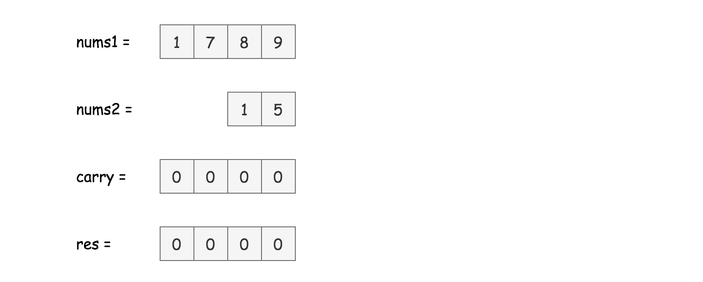
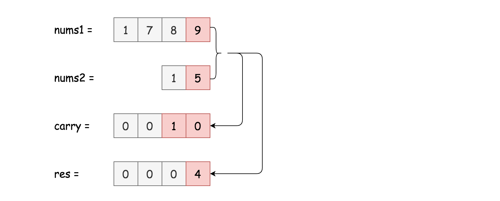
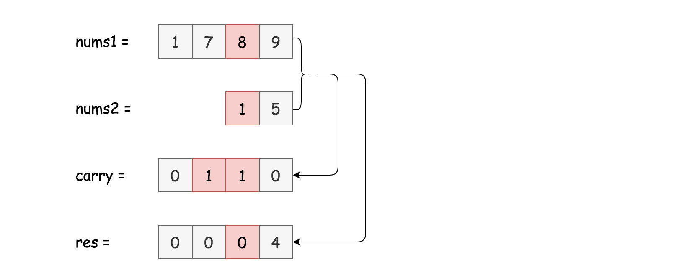
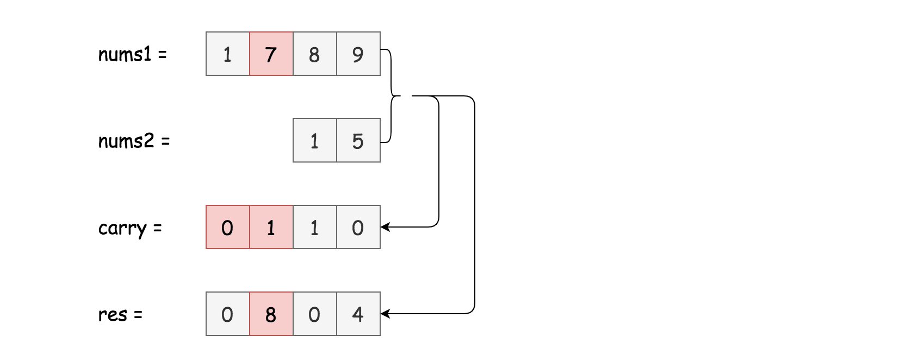
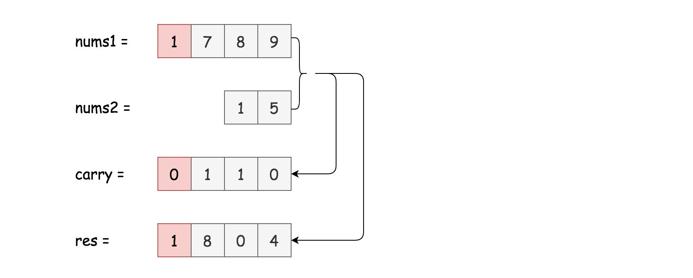
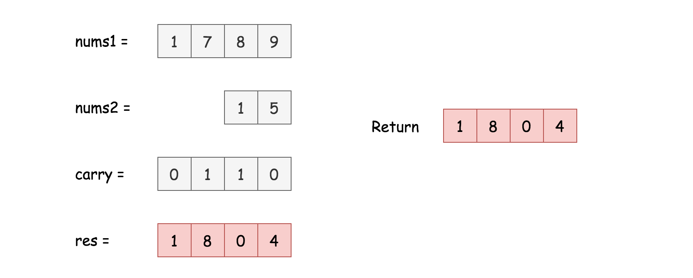

---

### Overview

Facebook interviewers like this question and propose it in four main variations. The choice of algorithm should be based on the input format:

1. Strings (the current problem).
Use schoolbook digit-by-digit addition. Note, that to fit into constant space is not possible for languages with immutable strings, for example, for Java and Python. Here are two examples:

- [Add Binary](https://leetcode.com/articles/add-binary/): sum two binary strings.

- [Add Strings](https://leetcode.com/problems/add-strings/): sum two non-negative numbers in a string representation without converting them to integers directly.

2. Integers.
Usually, the interviewer would ask you to implement a sum without using `+` and `-` operators. Use the bit manipulation approach. Here is an example:

- [Sum of Two Integers](https://leetcode.com/articles/sum-of-two-integers/): Sum two integers without using `+` and `-` operators.

3. Arrays.
The same textbook addition. Here is an example:

- [Add to Array Form of Integer](https://leetcode.com/articles/add-to-array-form-of-integer/).

4. Linked Lists.
Sentinel Head + Textbook Addition. Here are some examples:

- [Plus One](https://leetcode.com/articles/plus-one/).

- [Add Two Numbers](https://leetcode.com/articles/add-two-numbers/).

- [Add Two Numbers II](https://leetcode.com/problems/add-two-numbers-ii/).

<br />
<br />

---
### Approach 1: Elementary Math

Here we have two strings as input and asked not to convert them to integers. Digit-by-digit addition is the only option here.













**Algorithm**

- Initialize an empty `res` structure. Once could use array in Python and StringBuilder in Java.

- Start from $carry = 0$.

- Set a pointer at the end of each string: $p1 = \text{num1.length}() - 1$, $p2 = \text{num2.length}() - 1$.

- Loop over the strings from the end to the beginning using `p1` and `p2`. Stop when both strings are used entirely.

- Set `x1` to be equal to a digit from string `nums1` at index `p1`. If `p1` has reached the beginning of `nums1`, set `x1` to `0`.

- Do the same for `x2`. Set `x2` to be equal to digit from string `nums2` at index `p2`. If `p2` has reached the beginning of `nums2`, set `x2` to `0`.

- Compute the current value: $value = (x1 + x2 + carry) \% 10$, and update the carry: $carry = (x1 + x2 + carry) / 10$.

- Append the current value to the result: `res.append(value)`.

- Now both strings are done. If the carry is still non-zero, update the result: `res.append(carry)`.

- Reverse the result, convert it to a string, and return that string.

**Implementation**

```python
class Solution:
    def addStrings(self, num1: str, num2: str) -> str:
        res = []

        carry = 0
        p1 = len(num1) - 1
        p2 = len(num2) - 1
        while p1 >= 0 or p2 >= 0:
            x1 = ord(num1[p1]) - ord('0') if p1 >= 0 else 0
            x2 = ord(num2[p2]) - ord('0') if p2 >= 0 else 0
            value = (x1 + x2 + carry) % 10
            carry = (x1 + x2 + carry) // 10
            res.append(value)
            p1 -= 1
            p2 -= 1

        if carry:
            res.append(carry)

        return ''.join(str(x) for x in res[::-1])
```

**Complexity Analysis**

* Time Complexity: $\mathcal{O}(\max(N_1, N_2))$, where $N_1$ and $N_2$ are length of `nums1` and `nums2`. Here we do $\max(N_1, N_2)$ iterations at most.

* Space Complexity: $\mathcal{O}(\max(N_1, N_2))$, because the length of the new string is at most $\max(N_1, N_2) + 1$.

<br />
<br />

---