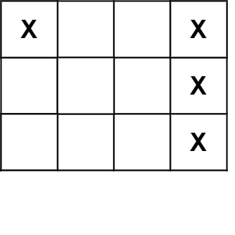

### 1. Description

Given an `m x n` matrix `board` where each cell is a battleship `'X'` or empty `'.'`, return *the number of the **battleships** on* `board`.

**Battleships** can only be placed horizontally or vertically on `board`. In other words, they can only be made of the shape `1 x k` (`1` row, `k` columns) or `k x 1` (`k` rows, `1` column), where `k` can be of any size. At least one horizontal or vertical cell separates between two battleships (i.e., there are no adjacent battleships).

### 2. Function Contract

Let $m$ and $n$ denote the board's row and column counts.

**Inputs**

- `board`: The $m \times n$ matrix whose cells are `"X"` or `"."`.

**Return value**

Return the number of distinct horizontal or vertical battleships on `board`.

### 3. Examples

#### Example 1

- **Input:** $board = [["X",".",".","X"],[".",".",".","X"],[".",".",".","X"]]$
- **Output:** `2`
#### Example 2

- **Input:** $board = [["."]]$
- **Output:** `0`

### 4. Constraints

- $m = \text{board.length}$

- $n = \text{board}[i].length$

- $1 \le m, n \le 200$

- $\text{board}[i][j]$ is either `'.'` or `'X'`.

**Follow up:** Could you do it in one-pass, using only `O(1)` extra memory and without modifying the values `board`?