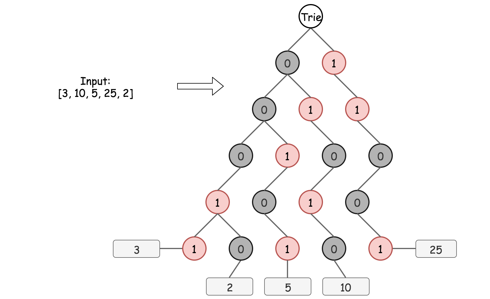
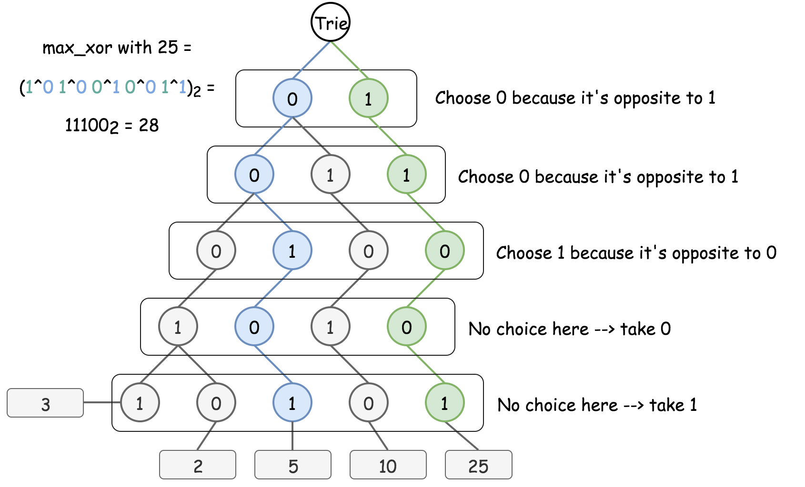

[TOC]

## Solution

---

### Overview

Requirements are to have $\mathcal{O}(N)$ time complexity, and we'll discuss here two standard approaches to achieve that complexity.

1. Bitwise Prefixes in HashSet.

2. Bitwise Prefixes in Trie.

The idea behind both solutions is the same: to convert all numbers into the binary form, and to construct the maximum XOR bit by bit, starting from the leftmost one. The difference is in the data structure used to store unique bitwise prefixes, i.e. the first i*th* bits.

The first approach works faster on the given test case set, but the second one is standard, more simple, and easily generalized for more complex problems like _Find maximum subarray XOR in a given array_.

**Prerequisites**

XOR of zero and a bit results in that bit

$0 \oplus x = x$

XOR of two equal bits (even if they are zeros) results in a zero

$x \oplus x = 0$
<br />
<br />

---
### Approach 1: Bitwise Prefixes in HashSet

Let's start from rewriting all numbers `[3, 10, 5, 25, 2, 8]` in binary from

$3 = (00011)_2$

$10 = (01010)_2$

$5 = (00101)_2$

$25 = (11001)_2$

$2 = (00010)_2$

$8 = (01000)_2$

To simplify the work with prefixes, better to use the same number of bits $L$ for all the numbers. It's enough to take $L$ equal to the length of the max number in the binary representation.

Now let's construct the max XOR starting from the leftmost bit. The absolute maximum one could have with $L = 5$ bits here is $(11111)_2$. So let's check bit by bit:

- Could we have the leftmost bit for XOR to be equal to 1-bit, i.e. max XOR to be equal to $(1****)_2$?

Yes, for that it's enough to pair $25 = (11001)_2$ with another number starting with the zero leftmost bit. So the max XOR is $(1****)_2$.

- Next step. Could we have max XOR to be equal to $(11***)_2$?

For that, let's consider all prefixes of length 2 and check if there is a pair of them, $p_1$ and $p_2$, such that its XOR is equal to 11: $p_1 \oplus p_2 = 11$

$3 = (00***)_2$

$10 = (01***)_2$

$5 = (00***)_2$

$25 = (11***)_2$

$2 = (00***)_2$

$8 = (01***)_2$

Yes, it's the case, for example, pair $5 = (00***)_2$ and $25 = (11***)_2$, or $2 = (00***)_2$ and $25 = (11***)_2$, or $3 = (00***)_2$ and $25 = (11***)_2$.

And so on, and so forth. The complexity remains linear. One has to perform $N$ operations to compute prefixes, though the number of prefixes containing $L - i$ bits could not be greater than $2^{L - i}$. Hence the check if XOR could have the i*th* bit to be equal to 1-bit takes $2^{L - i} \times 2^{L - i}$ operations.

**Algorithm**

- Compute the number of bits $L$ to be used. It's the length of the max number in binary representation.

- Initiate $\text{max}_{xor} = 0$.

- Loop from $i = L - 1$ down to $i = 0$ (from the leftmost bit $L - 1$ to the rightmost bit 0):

- Left shift the $\text{max}_{xor}$ to free the next bit.

- Initiate variable $\text{curr}_{xor} = \text{max}_{xor} | 1$ by setting 1 in the rightmost bit of $\text{max}_{xor}$. Now let's check if $\text{curr}_{xor}$ could be done using available prefixes.

- Compute all possible prefixes of length $L - i$ by iterating over `nums`.

- Put in the HashSet `prefixes` the prefix of the current number of the length $L - i$: `num >> i`.

- Iterate over all prefixes and check if $\text{curr}_{xor}$ could be done using two of them: $p1^p2 = \text{curr}_{xor}$. Using the self-inverse property of XOR $p1^p2^p2 = p1$, one could rewrite it as $p1 = \text{curr}_{xor}^p2$ and simply check for each `p` if $\text{curr}_{xor}^p$ is in prefixes. If so, set $\text{max}_{xor}$ to be equal to $\text{curr}_{xor}$, i.e. set 1-bit in the rightmost bit. Otherwise, let $\text{max}_{xor}$ keep 0-bit in the rightmost bit.

- Return $\text{max}_{xor}$.

```python
class Solution:
    def findMaximumXOR(self, nums: List[int]) -> int:
        # Length of the max number in a binary representation
        L = len(bin(max(nums))) - 2
        max_xor = 0
        for i in range(L)[::-1]:
            # Go to the next bit by the left shift
            max_xor <<= 1

            # Set 1 in the smallest bit
            curr_xor = max_xor | 1

            # Compute all existing prefixes
            # of length (L - i) in binary representation
            prefixes = {num >> i for num in nums}

            # Update max_xor, if two of these prefixes could result in curr_xor.
            # Check if p1^p2 == curr_xor, i.e. p1 == curr_xor^p2
            max_xor |= any(curr_xor^p in prefixes for p in prefixes)

        return max_xor
```

**Complexity Analysis**

* Time complexity: $\mathcal{O}(N)$. One has to perform $N$ operations to compute prefixes, though the number of prefixes containing $L - i$ bits is $2^{L - i}$. Check if XOR could have the i*th* bit to be equal to 1-bit takes $2^{L - i} \times 2^{L - i}$ operations. Altogether that results in $\sum_{i = 0}^{L - 1}{(N + 4^{L - i})} = NL + \frac{4}{3}(4^L - 1)$ operations, that means $\mathcal{O}(N)$ time complexity.

* Space complexity: $\mathcal{O}(N)$. One has to keep at most $N$ prefixes in the worst-case scenario.

<br />
<br />

---
### Approach 2: Bitwise Trie

**Why HashSet is not a Good Structure to Store Prefixes**

The hashset structure, used to store the prefixes in Approach 1, doesn't provide the functionality to cut off some paths which don't lead to the solution.

For example, after two steps of max XOR computation $(11***)_2$ it's quite obvious that 25 should be paired with $00$ prefix, i.e. with 2, 3, or 5.

$3 = (00011)_2$

$10 = (01010)_2$

$5 = (00101)_2$

$25 = (11001)_2$

$2 = (00010)_2$

$8 = (01000)_2$

However, for the third step, we'll again compute all possible prefixes, including the ones for 10 and 8, even if it's quite obvious that they will not lead to the solution.

$3 = (000**)_2$

$10 = (010**)_2$

$5 = (001**)_2$

$25 = (110**)_2$

$2 = (000**)_2$

$8 = (010**)_2$

To cut these branches off, would be great to use some sort of tree structure.

**Bitwise Trie: What is it and How to Construct**

The standard way is to use [Bitwise Trie](https://en.wikipedia.org/wiki/Trie#Bitwise_tries). It's a special type of [Trie](https://leetcode.com/articles/word-search-ii/), which is used to store binary prefixes in an efficient way. There are plenty of real-life examples of bitwise trie usage, for example, [in GCC](https://gcc.gnu.org/onlinedocs/libstdc++/ext/pb_ds/trie_based_containers.html).

Let's start with Bitwise Trie for the array `[3, 10, 5, 25, 2]`

$3 = (00011)_2$

$10 = (01010)_2$

$5 = (00101)_2$

$25 = (11001)_2$

$2 = (00010)_2$



Each root -> leaf path in Bitwise Trie represents a binary form of a number in nums, for example, 0 -> 0 -> 0 -> 1 -> 1 is 3. As before, the same number of bits $L$ is used for all numbers, and $L = 1 + [\log_2 M]$, where M is a maximum number in nums. The depth of Bitwise Trie is equal to $L$ as well, and all leaves are on the same level.

Bitwise Trie is a perfect way to see how different the binary forms of numbers are, for example, 3 and 2 share 4 bits of 5. The construction of Bitwise Trie is pretty straightforward, it's basically nested hashmaps. At each step one has to verify, if the child node to add (0 or 1) is already present. If yes, just go one step down. If not, add it into the Trie and then go one step down.

```python
trie = {}
for num in nums:
    node = trie
    for bit in num:
        if not bit in node:
            node[bit] = {}
        node = node[bit]
```

**Maximum XOR of a Given Number with All Numbers in Trie**

Now the Trie is constructed, so let's find the maximum XOR of a given number with all numbers that have been already inserted into Bitwise Trie.

To maximize XOR, the strategy is to choose the opposite bit at each step whenever it's possible. Step by step for 25 as a given number:



The implementation is also pretty simple:

- Try to go down to the opposite bit at each step if it's possible. Add 1-bit at the end of the current XOR.

- If not, just go down to the same bit. Add 0-bit at the end of the current XOR.

```python
trie = {}
for num in nums:
    xor_node = trie
    curr_xor = 0
    for bit in num:
        opp_bit = 1 - bit
        if opp_bit in xor_node:
            curr_xor = (curr_xor << 1) | 1
            xor_node = xor_node[opp_bit]
        else:
            curr_xor <<= 1
            xor_node = xor_node[bit]
```

**Algorithm**

To summarise, now one could

- Insert a number into Bitwise Trie.

- Find the maximum XOR of a given number with all numbers that have been inserted so far.

That's all one needs to solve the initial problem:

- Convert all numbers to the binary form.

- Add the numbers into Trie one by one and compute the maximum XOR of a number to add with all previously inserted. Update maximum XOR at each step.

- Return $\text{max}_{xor}$.

**Implementation**

```python
class Solution:
    def findMaximumXOR(self, nums: List[int]) -> int:
        # Compute length L of max number in a binary representation
        L = len(bin(max(nums))) - 2
        # zero left-padding to ensure L bits for each number
        nums = [[(x >> i) & 1 for i in range(L)][::-1] for x in nums]

        max_xor = 0
        trie = {}
        for num in nums:
            node = trie
            xor_node = trie
            curr_xor = 0
            for bit in num:
                # insert new number in trie
                if not bit in node:
                    node[bit] = {}
                node = node[bit]

                # to compute the max xor of that new number
                # with all previously inserted
                toggled_bit = 1 - bit
                if toggled_bit in xor_node:
                    curr_xor = (curr_xor << 1) | 1
                    xor_node = xor_node[toggled_bit]
                else:
                    curr_xor = curr_xor << 1
                    xor_node = xor_node[bit]

            max_xor = max(max_xor, curr_xor)

        return max_xor
```

**Complexity Analysis**

* Time complexity: $\mathcal{O}(N)$. It takes $\mathcal{O}(L)$ to insert a number in Trie, and $\mathcal{O}(L)$ to find the max XOR of the given number with all already inserted ones. $L = 1 + [\log_2 M]$ is defined by the maximum number in the array and could be considered as a constant here. Hence the overall time complexity is $\mathcal{O}(N)$.

* Space complexity: $\mathcal{O}(1)$, since one needs at maximum $\mathcal{O}(2^L) = \mathcal{O}(M)$ space to keep Trie, and $L$ and $M$ could be considered as constants here because of input limitations.