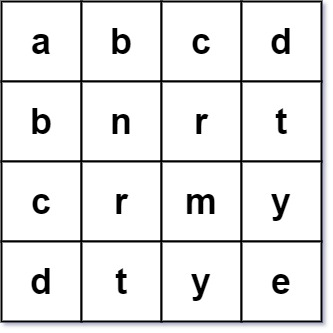
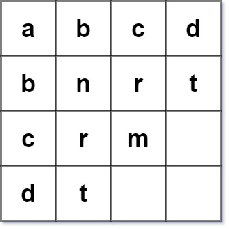
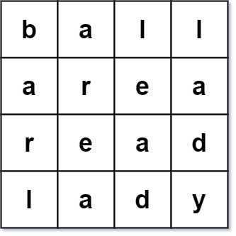

### 1. Description

Given an array of strings `words`, return `true` *if it forms a valid **word square***.

A sequence of strings forms a valid **word square** if the $$k^{\text{th}}$$ row and column read the same string, where $0 \le k < max(numRows, numColumns)$.

### 2. Function Contract

**Inputs**

- `words`: An ordered array of nonempty lowercase-English strings.

**Return value**

Return `True` exactly when every row is identical to the column at the same zero-based position; otherwise, return
`False`.

### 3. Examples

#### Example 1

- **Input:** $words = ["abcd","bnrt","crmy","dtye"]$
- **Output:** `true`
- **Explanation:**
The 1^st row and 1^st column both read "abcd".
The 2^nd row and 2^nd column both read "bnrt".
The 3^rd row and 3^rd column both read "crmy".
The 4^th row and 4^th column both read "dtye".
Therefore, it is a valid word square.
#### Example 2

- **Input:** $words = ["abcd","bnrt","crm","dt"]$
- **Output:** `true`
- **Explanation:**
The 1^st row and 1^st column both read "abcd".
The 2^nd row and 2^nd column both read "bnrt".
The 3^rd row and 3^rd column both read "crm".
The 4^th row and 4^th column both read "dt".
Therefore, it is a valid word square.
#### Example 3

- **Input:** $words = ["ball","area","read","lady"]$
- **Output:** `false`
- **Explanation:**
The 3^rd row reads "read" while the 3^rd column reads "lead".
Therefore, it is NOT a valid word square.

### 4. Constraints

- $1 \le \text{words.length} \le 500$

- $1 \le \text{words}[i].length \le 500$

- $\text{words}[i]$ consists of only lowercase English letters.