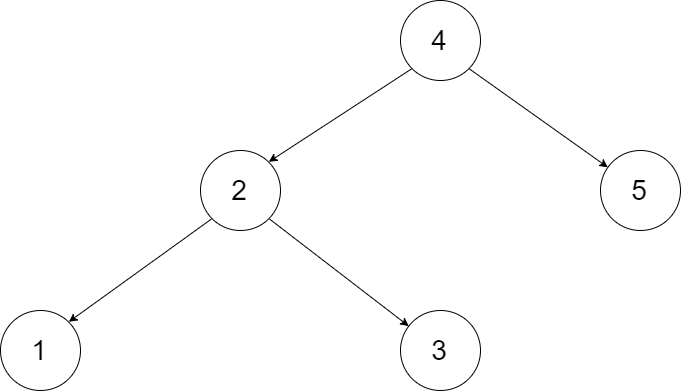
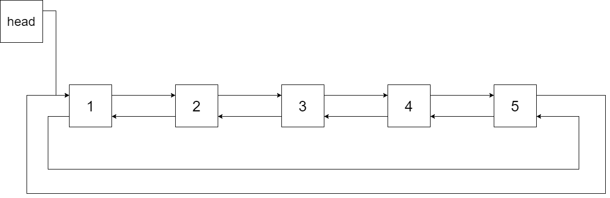

## Description

Convert a **Binary Search Tree** to a sorted **Circular Doubly-Linked List** in place.

You can think of the left and right pointers as synonymous to the predecessor and successor pointers in a doubly-linked list. For a circular doubly linked list, the predecessor of the first element is the last element, and the successor of the last element is the first element.

We want to do the transformation **in place**. After the transformation, the left pointer of the tree node should point to its predecessor, and the right pointer should point to its successor. You should return the pointer to the smallest element of the linked list.
### Function Contract

**Inputs**

- `root`: The root node of a binary search tree, represented by `Node`, or `None` for an empty tree.

Each `Node` has a value `val` and pointers `left` and `right`.

**Return value**

Return the smallest node of the resulting in-place sorted circular sequence. In the result, `left` points to the
sorted predecessor and `right` points to the sorted successor. Return `None` when the tree is empty.

### Examples

#### Example 1

- **Input:** `root = [4,2,5,1,3]`

- **Output:** `[1,2,3,4,5]`
- **Explanation:** The figure below shows the transformed BST. The solid line indicates the successor relationship, while the dashed line means the predecessor relationship.

#### Example 2

- **Input:** `root = [2,1,3]`
- **Output:** `[1,2,3]`
### Constraints

- The number of nodes in the tree is in the range `[0, 2000]`.

- $-1000 \le \text{Node.val} \le 1000$

- All the values of the tree are **unique**.