[TOC]

## Solution

---

### How to traverse the tree

There are two general strategies to traverse a tree:

- *Depth First Search* (`DFS`)

    In this strategy, we adopt the `depth` as the priority, so that one would start from a root and reach all the way down to a certain leaf, and then back to the root to reach another branch.

    The DFS strategy can further be distinguished as `preorder`, `inorder`, and `postorder` depending on the relative order among the root node, left node, and right node.

- *Breadth First Search* (`BFS`)

    We scan through the tree level by level, following the order of height, from top to bottom. The nodes on higher levels would be visited before the ones with lower levels.

In the following figure, the nodes are numerated in the order you visit them, please follow `1-2-3-4-5` to compare different strategies.

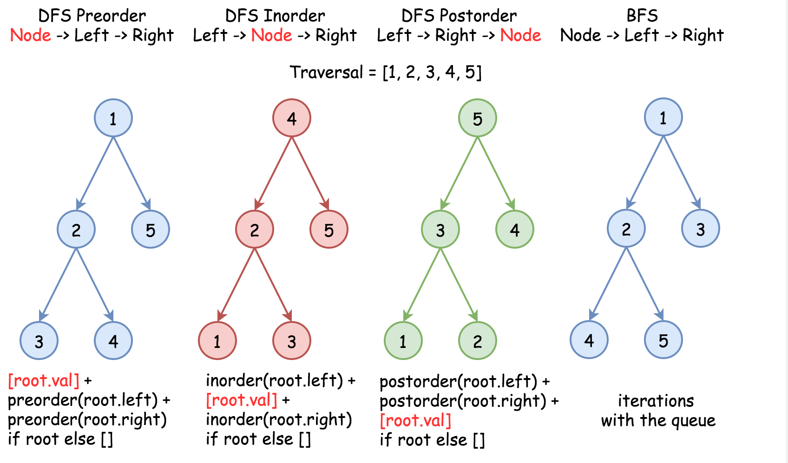

Here the problem is to implement DFS inorder traversal in a textbook recursion way because of in-place requirement.
<br />
<br />

---
### Approach 1: Recursion

**Algorithm**

Standard inorder recursion follows `left -> node -> right` order, where `left` and `right` parts are the recursion calls, and `node` part is where all processing is done.

Processing here is basically to link the previous node with the current one, and because of that one has to track the last node which is the largest node in a new doubly linked list so far.

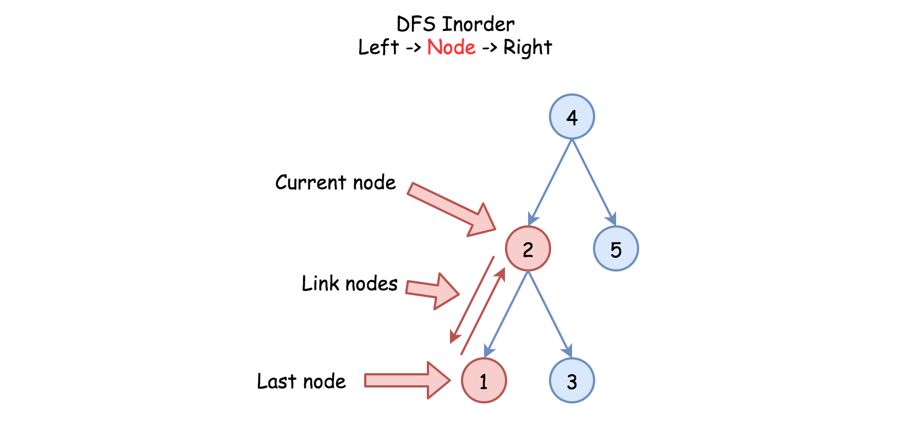

One more detail: one has to keep the first, or the smallest, node as well to close the ring of the doubly linked list.

Here is the algorithm :

- Initiate the `first` and the `last` nodes as nulls.

- Call the standard inorder recursion `helper(root)` :

- If the node is not null :

- Call the recursion for the left subtree `helper(node.left)`.

- If the `last` node is not null, link the `last` and the current `node` nodes.

- Else initiate the `first` node.

- Mark the current node as the last one: $last = node$.

- Call the recursion for the right subtree `helper(node.right)`.

- Link the first and the last nodes to close the DLL ring and then return the `first` node.

**Implementation**

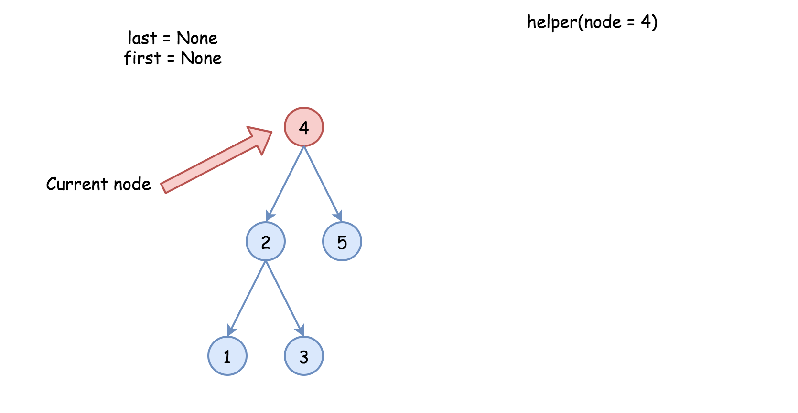

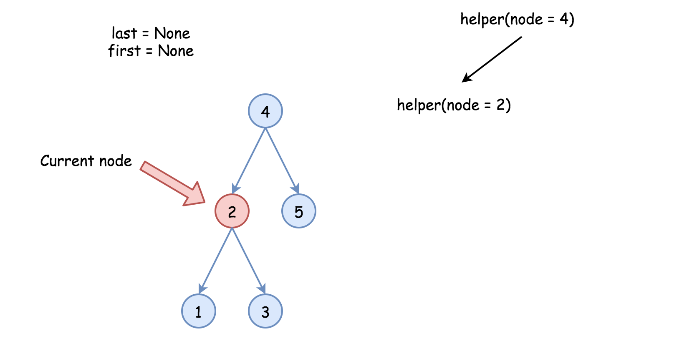

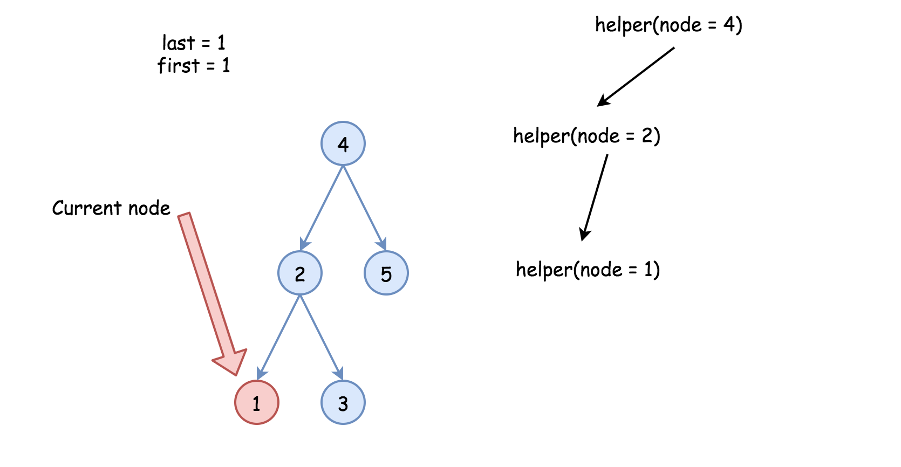

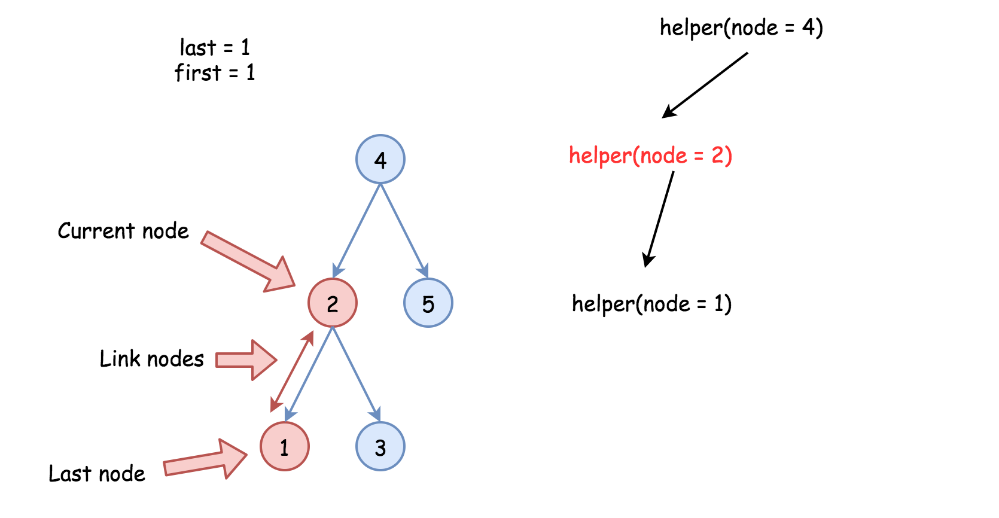

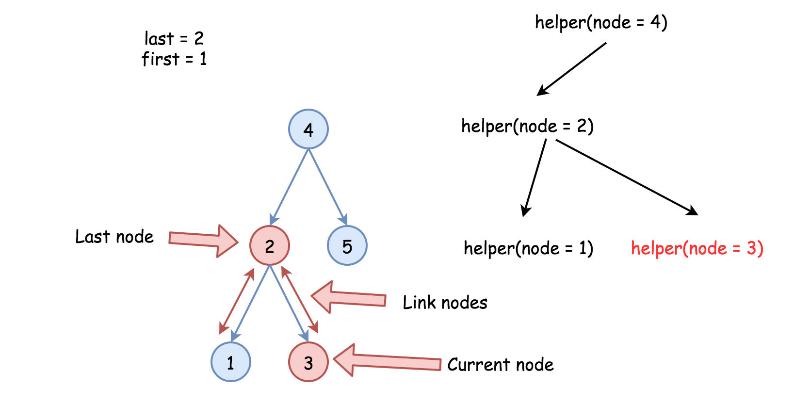

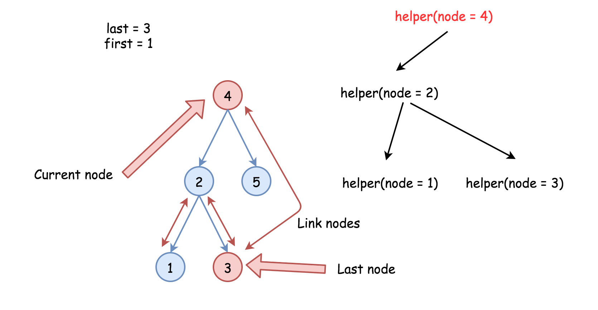

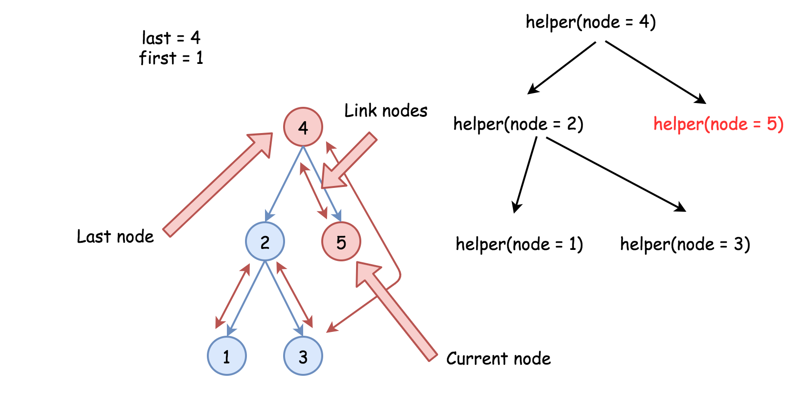

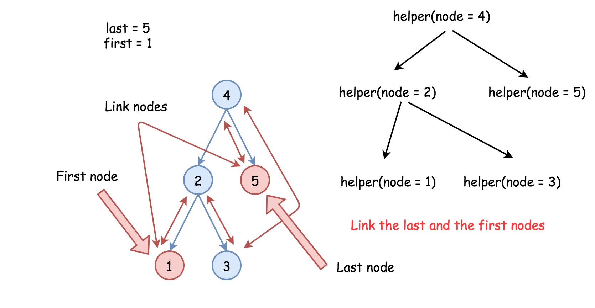

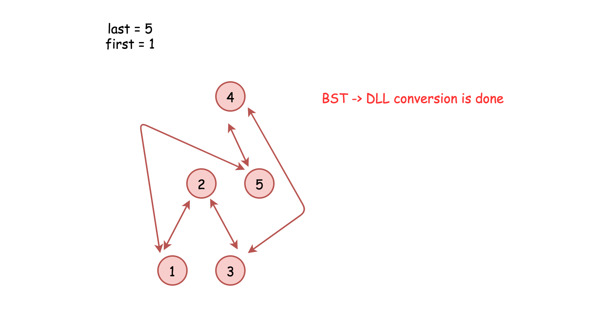

```python
class Solution:
    def treeToDoublyList(self, root: 'Node') -> 'Node':
        def helper(node):
            """
            Performs standard inorder traversal:
            left -> node -> right
            and links all nodes into DLL
            """
            nonlocal last, first
            if node:
                # left
                helper(node.left)

                # node
                if last:
                    # link the previous node (last)
                    # with the current one (node)
                    last.right = node
                    node.left = last
                else:
                    # keep the smallest node
                    # to close DLL later on
                    first = node
                last = node

                # right
                helper(node.right)

        if not root:
            return None

        # the smallest (first) and the largest (last) nodes
        first, last = None, None
        helper(root)

        # close DLL
        last.right = first
        first.left = last
        return first
```

**Complexity Analysis**

* Time complexity : $\mathcal{O}(N)$ since each node is processed exactly once.

* Space complexity : $\mathcal{O}(N)$. We have to keep a recursion stack of the size of the tree height, which is $\mathcal{O}(\log N)$ for the best case of a completely balanced tree and $\mathcal{O}(N)$ for the worst case of a completely unbalanced tree.