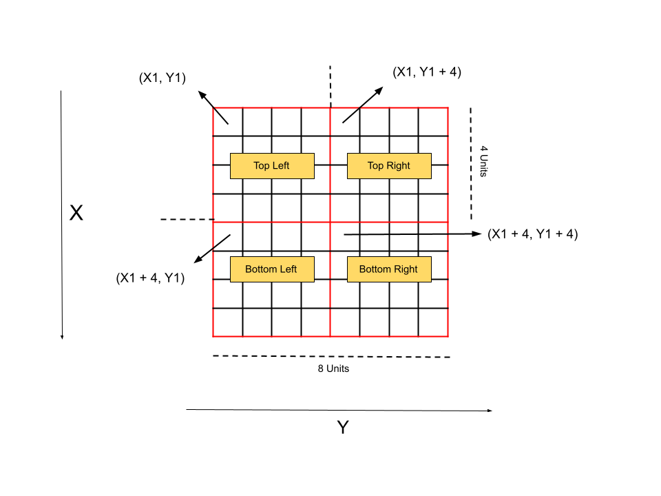
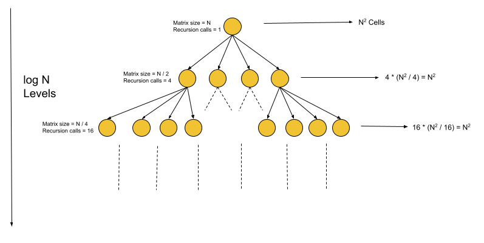

[TOC]

## Solution

---

### Overview

We have a square matrix of size $N * N$ of `0's` and `1's`. We need to convert this matrix to a quad tree with nodes having two attributes, `val` and `isLeaf`:

1. If the whole matrix has the same value (0 or 1), then `isLeaf` would be `true` and `val` would be the same as the matrix value, and we can return.
2. Otherwise, it's not a leaf node, so `isLeaf` would be `false`, and `val` will not matter. This node will have four child nodes.
3. Divide the current matrix into four equally sized square matrices and recurse the same process to each.

Note that $N$ would always be in the form of $2^x$ ($x \ge 0$), and hence at any point in the above process, it would be possible to divide the matrix into four equal parts.

We can see in the problem explanation that the matrix is repeatedly divided into 4 subparts again and again.
It suggests we use a recursive approach to divide the current matrix into four equal parts and then again repeat the same division on smaller parts recursively. We will discuss two recursive approaches to solve this problem.
</br>

---

### Approach 1: Recursion

**Intuition**

The most intuitive way of solving recursive problems like these is to perform what the problem description says and just follow the same recursive approach. Before we start the process, we need a way to define the current state of our matrix to generate the following states from it. As discussed above, the given matrix is square; we can represent it using two coordinates such as the top-left and bottom-right. Though this would be correct too, for simplicity, we will use only one top-left coordinate and another variable, `length`, which will be the side of the square. Using these two pieces of information, we can find any corner coordinate of the square.

Let's read the steps of making the quad tree in the problem description and perform the same with the code. The first one says that if the matrix contains only 0 or 1, then we can return. Notice that this is the base condition, we can simply check all the values of the current matrix state, and if it has all the same values, we will simply return the node with specified attributes. If not, then we need to divide the matrix into four equal parts and follow the above process to each of the four separately, and then they would become the four child nodes. The four matrices would have the top-left coordinates as shown below, and each of them would have the length of the side as $length / 2$. Therefore, we will call our recursive function for each sub-matrices and assign the returned nodes as the child of the root node we will return.



**Algorithm**

1. Iterate over all the values in the current matrix, i.e., with the top-left coordinate at `(x1, y1)` and the length of the side as `length`. If all values are the same, then create and return a leaf node with the same value.
2. If all values are not the same, create a new node `root`, and then make recursive calls to the four sub-matrices:

   a. Top-Left matrix with top-left coordinate as `(x1, y1)`.

   b. Top-Right matrix with top-left coordinate as $(x1, y1 + length / 2)$.

   c. Bottom-Left matrix with top-left coordinate as $(x1 + length / 2, y1)$.

   d. Bottom-Right matrix with top-left coordinate as $(x1 + length / 2, y1 + length / 2)$.
3. Assign the nodes returned by these recursive calls as the respective child nodes of `root`.
4. Return `root`.

**Implementation**

```cpp
class Solution {
public:
    // Returns true if all the values in the matrix are the same; otherwise, false.
    bool sameValue(vector<vector<int>>& grid, int x1, int y1, int length) {
        for (int i = x1; i < x1 + length; i++) {
            for (int j = y1; j < y1 + length; j++)
                if (grid[i][j] != grid[x1][y1])
                    return false;
        }
        return true;
    }

    Node* solve(vector<vector<int>>& grid, int x1, int y1, int length) {
        // Return a leaf node if all values are the same.
        if (sameValue(grid, x1, y1, length)) {
            return new Node(grid[x1][y1], true);
        } else {
            Node* root = new Node(false, false);

            // Recursive call for the four sub-matrices.
            root -> topLeft = solve(grid, x1, y1, length / 2);
            root -> topRight = solve(grid, x1, y1 + length / 2, length / 2);
            root -> bottomLeft = solve(grid, x1 + length / 2, y1, length / 2);
            root -> bottomRight = solve(grid, x1 + length / 2, y1 + length / 2, length / 2);

            return root;
        }
    }

    Node* construct(vector<vector<int>>& grid) {
        return solve(grid, 0, 0, grid.size());
    }
};
```

**Complexity Analysis**

Here $N$ is the side of the matrix.

* Time complexity: $O(N^2 \log N)$.

  After every level of recursion the original length of matrix get reduced to half, this implies that the size of matrix will reduced down to one after $\log N$ iterations. At each of these $\log N$ iterations, we will have some number of recursive calls for the current matrix size. For example, initially we have one call for the size of matrix $N *N$, then we will have four recursive calls each for matrix of size $(N * N) / 4$ and so on. The image below represents how at each level the total number of iterations over the matrix cells remains same at $N ^ 2$. Hence, $N^2$ iterations at each of the $\log N$ levels makes up the time complexity to be $O(N^2 \log N)$.



* Space complexity: $O(\log N)$.

  The space to store the output is generally not part of the space complexity. Hence the only space needed is for the recursion call stack; the maximum number of active stack calls is $\log N$. Therefore, the total space complexity equals $O(\log N)$.

<br/>

---

### Approach 2: Optimized Recursion

**Intuition**

In the previous approach, we first iterate over all the cells in the matrix and then decide if this should be a leaf or not and have four child nodes. In case we decide to have four child nodes, we recursively move to the four sub-matrices and follow the same process. The redundant part in this approach is when we will iterate over the cells in the sub-matrices that would have already been iterated for the root node. It can also be explained by the time complexity of the previous approach, which is $O(N^2 \log N)$; hence all the $N^2$ cells can be at max iterated $(\log N)$ times.

These redundant operations can be avoided if we simply make a recursive call to the four sub-matrices instead of first checking all the values. Once all four recursive calls are returned, we will decide whether to let these as child nodes of the root node or should be combined them into one as the root node. This decision will again depend on the values, but we won't have to check all the cells; instead, we can just check if the four nodes are leaf nodes and all have the same value (`value` attribute). If it is, we can just return a root leaf node with a value same as the four nodes; otherwise, we will return a node with any value and having these nodes as the respective child nodes.

In this approach, the only time we will have to check the cell value is when we have a matrix of size one. This would be the base condition of the recursion and is doable in constant time.

**Algorithm**

1. If `length` is one, return a new leaf node with `value` equal to the cell value at `(x1, y1)`.
2. Otherwise, make a recursive call to the four sub-matrices:

   a. Top-Left matrix with top-left coordinate as `(x1, y1)`.

   b. Top-Right matrix with top-left coordinate as $(x1, y1 + length / 2)$.

   c. Bottom-Left matrix with top-left coordinate as $(x1 + length / 2, y1)$.

   d. Bottom-Right matrix with top-left coordinate as $(x1 + length / 2, y1 + length / 2)$.

3. If all the four nodes returned by the above recursive calls are leaf nodes with the same value. Then return a new leaf node with the same value.
4. Otherwise, return a non-leaf node with any value having child pointers pointing to the four above-returned nodes.

**Implementation**

```cpp
class Solution {
public:
    Node* solve(vector<vector<int>>& grid, int x1, int y1, int length) {
        // Return a leaf node if the matrix size is one.
        if (length == 1) {
            return new Node(grid[x1][y1], true);
        }

        // Recursive calls to the four sub-matrices.
        Node* topLeft = solve(grid, x1, y1, length / 2);
        Node* topRight = solve(grid, x1, y1 + length / 2, length / 2);
        Node* bottomLeft = solve(grid, x1 + length / 2, y1, length / 2);
        Node* bottomRight = solve(grid, x1 + length / 2, y1 + length / 2, length / 2);

        // If the four returned nodes are leaf and have the same values
        // Return a leaf node with the same value.
        if (topLeft -> isLeaf && topRight -> isLeaf && bottomLeft -> isLeaf && bottomRight -> isLeaf
           && topLeft -> val == topRight -> val && topRight -> val == bottomLeft -> val
           && bottomLeft -> val == bottomRight -> val) {
            return new Node(topLeft -> val, true);
        }

        // If the four nodes aren't identical, return non-leaf node with corresponding child pointers.
        return new Node(false, false, topLeft, topRight, bottomLeft, bottomRight);
    }

    Node* construct(vector<vector<int>>& grid) {
        return solve(grid, 0, 0, grid.size());
    }
};
```

**Complexity Analysis**

Here $N$ is the side of the matrix.

* Time complexity: $O(N^2)$.

  All the cells in the matrix will be iterated only once, and hence the total time complexity would be $O(N^2)$.

* Space complexity: $O(\log N)$.

  The space to store the output is generally not part of the space complexity. Hence the only space needed is for the recursion call stack; the maximum number of active stack calls is $\log N$. Therefore, the total space complexity equals $O(\log N)$.

<br/>

---