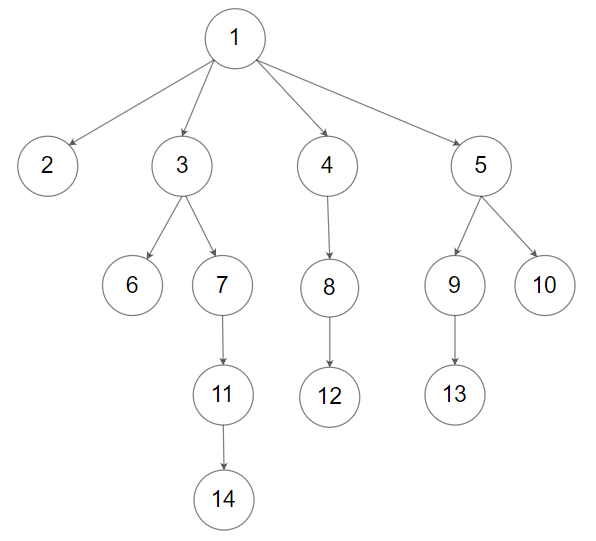

### 1. Description

Given an n-ary tree, return the *level order* traversal of its nodes' values.

*Nary-Tree input serialization is represented in their level order traversal, each group of children is separated by the null value (See examples).*

### 2. Function Contract

**Inputs**

- `root`: An N-ary `Node` that begins the structure, or `None` for an empty tree. Each node exposes `val` and an
  ordered `children` list.

Canonical JSON fixtures encode an app-local node recursively as `[value, children]`; the runner constructs `Node`
objects before calling `solve`.

**Return value**

Return one list of node values per occupied depth, ordered from the root downward and from left to right within each
level.

### 3. Examples

#### Example 1

- **Input:** `root = [1,null,3,2,4,null,5,6]`
- **Output:** `[[1],[3,2,4],[5,6]]`
#### Example 2

- **Input:** `root = [1,null,2,3,4,5,null,null,6,7,null,8,null,9,10,null,null,11,null,12,null,13,null,null,14]`
- **Output:** `[[1],[2,3,4,5],[6,7,8,9,10],[11,12,13],[14]]`

### 4. Constraints

- The height of the n-ary tree is less than or equal to `1000`

- The total number of nodes is between $[0, 10^{4}]$