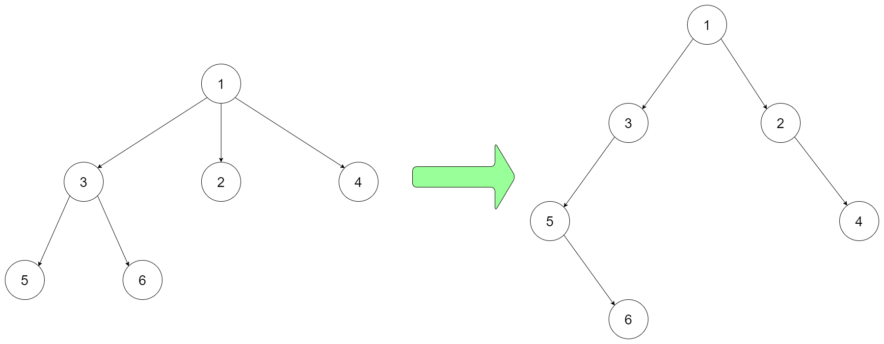

### 1. Description

Design an algorithm to encode an N-ary tree into a binary tree and decode the binary tree to get the original N-ary tree. An N-ary tree is a rooted tree in which each node has no more than N children. Similarly, a binary tree is a rooted tree in which each node has no more than 2 children. There is no restriction on how your encode/decode algorithm should work. You just need to ensure that an N-ary tree can be encoded to a binary tree and this binary tree can be decoded to the original N-nary tree structure.

*Nary-Tree input serialization is represented in their level order traversal, each group of children is separated by the null value (See following example).*

For example, you may encode the following `3-ary` tree to a binary tree in this way:

- **Input:** `root = [1,null,3,2,4,null,5,6]`

Note that the above is just an example which *might or might not* work. You do not necessarily need to follow this format, so please be creative and come up with different approaches yourself.

### 2. Function Contract

**Inputs**

- `root`: An N-ary `Node` that begins the structure, or `None` for an empty tree. Each node exposes `val` and an
  ordered `children` list.

Canonical JSON fixtures encode an app-local node recursively as `[value, children]`; the runner constructs `Node`
objects before calling `solve`.

**Return value**

The app adapter encodes `root` as a binary `TreeNode`, decodes that representation, and returns the reconstructed
N-ary `Node`. The immutable native artifact exposes the source-required `Codec.encode(root)` and
`Codec.decode(data)` methods.

### 3. Examples

#### Example 1

- **Input:** `root = [1,null,3,2,4,null,5,6]`
- **Output:** `[1,null,3,2,4,null,5,6]`
#### Example 2

- **Input:** `root = [1,null,2,3,4,5,null,null,6,7,null,8,null,9,10,null,null,11,null,12,null,13,null,null,14]`
- **Output:** `[1,null,2,3,4,5,null,null,6,7,null,8,null,9,10,null,null,11,null,12,null,13,null,null,14]`
#### Example 3

- **Input:** `root = []`
- **Output:** `[]`

### 4. Constraints

- The number of nodes in the tree is in the range $[0, 10^{4}]$.

- $0 \le \text{Node.val} \le 10^{4}$

- The height of the n-ary tree is less than or equal to `1000`

- Do not use class member/global/static variables to store states. Your encode and decode algorithms should be stateless.