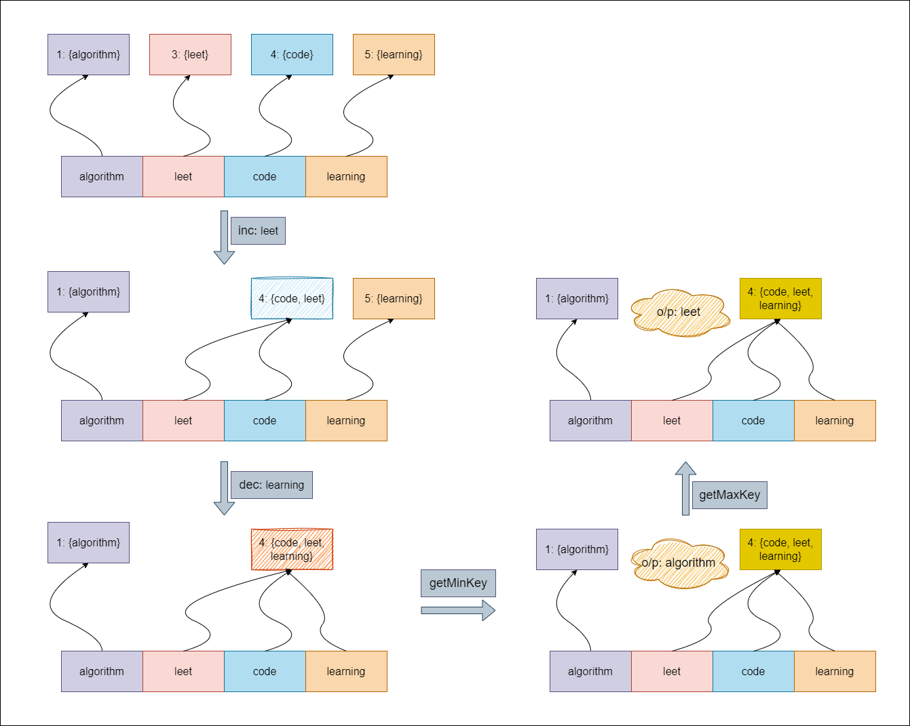

## Solution

---

### Overview:

We need to create a specialized data structure that efficiently handles the following operations on strings and their associated counts:

- Increase the count of a specified string.
- Decrease the count of a specified string.
- Retrieve the string with the highest count.
- Retrieve the string with the lowest count.

A key requirement is that each of these operations must be performed in constant time, $Θ(1)$ on average.



### Approach: Using Doubly Linked List

#### Intuition

To manage a collection of keys and their frequencies, we need a structure that updates easily and provides quick access to maximum and minimum frequencies. We start with a hashmap to look up each key’s frequency quickly.

However, a hashmap alone does not track frequencies well. We need a way to group keys by their frequencies and find keys with the same frequency. We use a doubly linked list for this. Each node represents a frequency and holds all keys linked to that frequency. This setup allows us to add and remove keys efficiently as their frequencies change.

To handle edge cases better, we include dummy head and tail nodes in the list. These nodes make it easier to manage operations when the list is empty or when we add or remove nodes at the ends.

When we increment a key, we first check if it exists in the hashmap. If the key is new, we look at the node after the dummy head. If that node does not have a frequency of 1, we create a new node for frequency 1. We add the key to this node and update the hashmap. If the key already exists, we find its current frequency node and check the next node, which shows the next higher frequency. If that next node is the tail or does not have the expected frequency, we create a new node with the increased frequency. We then move the key to the right node, remove it from the old node, and delete the old node if it becomes empty.

When we decrement a key, we first check if it is in the hashmap. If it is, we remove it from its current node. If the key’s frequency is greater than one, we check the previous node. If needed, we create a new node for the decreased frequency and add the key to the appropriate previous node, updating the hashmap. If the frequency is one, we remove the key from the hashmap completely.

To find the key with the maximum frequency, we return one of the keys from the last node in the list. For the minimum frequency key, we get a key from the first node after the dummy head. If there are no keys, we return an empty string.

#### Algorithm

 - `Node` Class:
  - Each `Node` contains:
- `freq`: the frequency of the keys.
- `prev`: a pointer to the previous node.
- `next`: a pointer to the next node.
- `keys`: a set of strings representing the keys with this frequency.
  - The constructor initializes the `freq`, and sets `prev` and `next` to `nullptr`.

- `AllOne` Class:
  - Create a dummy head node and a dummy tail node.
  - Link the dummy head to the dummy tail and vice versa.

  - Incrementing a Key (`inc` function):
- If the key already exists:
      - Retrieve the corresponding `node` from the `map`.
      - Erase the key from the current `node`.
      - Check the next node:
- If it doesn’t exist or its frequency is not $freq + 1$:
          - Create a new node with frequency $freq + 1$.
          - Insert the key into this new node.
          - Link the new node with the current and next nodes.
          - Update the `map` to point to the new node.
- Otherwise, insert the key into the existing next node.
      - If the current node has no keys left, remove it.

- If the key does not exist:
      - Check the first node after the head:
- If it doesn’t exist or its frequency is greater than `1`:
          - Create a new node with frequency `1`.
          - Insert the key into this new node.
          - Link this new node with the head and the first node.
- Otherwise, insert the key into the first node.

  - Decrementing a Key (`dec` function):
- If the key does not exist in the `map`, return immediately.
- Retrieve the node corresponding to the key.
- Erase the key from the current node.
- If the frequency is `1`:
      - Remove the key from the `map`.
- Otherwise, check the previous node:
      - If it doesn’t exist or its frequency is not $freq - 1$:
- Create a new node with frequency $freq - 1$.
- Insert the key into this new node and link it with the current node and the previous node.
      - Otherwise, insert the key into the existing previous node.
- If the node has no keys left, remove it.

  - Getting the Maximum Key (`getMaxKey` function):
- If there are no keys (i.e., the tail's previous node points to the head), return an empty string.
- Return one of the keys from the tail's previous node.

  - Getting the Minimum Key (`getMinKey` function):
- If there are no keys (i.e., the head's next node points to the tail), return an empty string.
- Return one of the keys from the head's next node.

- Removing a Node (`removeNode` function):
  - Link the previous node to the next node and vice versa to remove the specified node from the linked list.
  - Delete the removed node to free its memory.

#### Implementation

```python
class Node:
    def __init__(self, freq):
        self.freq = freq
        self.prev = None
        self.next = None
        self.keys = set()

class AllOne:
    def __init__(self):
        self.head = Node(0)  # Dummy head
        self.tail = Node(0)  # Dummy tail
        self.head.next = self.tail  # Link dummy head to dummy tail
        self.tail.prev = self.head  # Link dummy tail to dummy head
        self.map = {}  # Mapping from key to its node

    def inc(self, key: str) -> None:
        if key in self.map:
            node = self.map[key]
            freq = node.freq
            node.keys.remove(key)  # Remove key from current node

            nextNode = node.next
            if nextNode == self.tail or nextNode.freq != freq + 1:
                # Create a new node if next node does not exist or freq is not freq + 1
                newNode = Node(freq + 1)
                newNode.keys.add(key)
                newNode.prev = node
                newNode.next = nextNode
                node.next = newNode
                nextNode.prev = newNode
                self.map[key] = newNode
            else:
                # Increment the existing next node
                nextNode.keys.add(key)
                self.map[key] = nextNode

            # Remove the current node if it has no keys left
            if not node.keys:
                self.removeNode(node)
        else:  # Key does not exist
            firstNode = self.head.next
            if firstNode == self.tail or firstNode.freq > 1:
                # Create a new node
                newNode = Node(1)
                newNode.keys.add(key)
                newNode.prev = self.head
                newNode.next = firstNode
                self.head.next = newNode
                firstNode.prev = newNode
                self.map[key] = newNode
            else:
                firstNode.keys.add(key)
                self.map[key] = firstNode

    def dec(self, key: str) -> None:
        if key not in self.map:
            return  # Key does not exist

        node = self.map[key]
        node.keys.remove(key)
        freq = node.freq

        if freq == 1:
            # Remove the key from the map if freq is 1
            del self.map[key]
        else:
            prevNode = node.prev
            if prevNode == self.head or prevNode.freq != freq - 1:
                # Create a new node if the previous node does not exist or freq is not freq - 1
                newNode = Node(freq - 1)
                newNode.keys.add(key)
                newNode.prev = prevNode
                newNode.next = node
                prevNode.next = newNode
                node.prev = newNode
                self.map[key] = newNode
            else:
                # Decrement the existing previous node
                prevNode.keys.add(key)
                self.map[key] = prevNode

        # Remove the node if it has no keys left
        if not node.keys:
            self.removeNode(node)

    def getMaxKey(self) -> str:
        if self.tail.prev == self.head:
            return ""  # No keys exist
        return next(
            iter(self.tail.prev.keys)
        )  # Return one of the keys from the tail's previous node

    def getMinKey(self) -> str:
        if self.head.next == self.tail:
            return ""  # No keys exist
        return next(
            iter(self.head.next.keys)
        )  # Return one of the keys from the head's next node

    def removeNode(self, node):
        prevNode = node.prev
        nextNode = node.next

        prevNode.next = nextNode  # Link previous node to next node
        nextNode.prev = prevNode  # Link next node to previous node
```

#### Complexity Analysis

Let $N$ be the number of unique keys.

- Time complexity: $O(1)$

    The `inc` and `dec` methods both perform operations that are constant time. In `inc`, whether inserting a new key or updating an existing one, the operations primarily involve updating pointers in the linked list and updating the hash map, which are $O(1)$ operations.

    Similarly, in `dec`, removing a key, updating the hash map, and possibly creating a new node or modifying the previous node also take constant time. Therefore, both operations run in $O(1)$.

    The `getMaxKey` and `getMinKey` methods return a key from the front or back of the linked list, which is also $O(1)$ since it involves accessing the first or last element of the list.

> This assumes that map operations typically run in "average-case $Θ(1)$". However, in the worst case, where many hash collisions occur, these operations can degrade to $O(N)$.

- Space complexity: $O(N)$

    The space used by the `AllOne` data structure is primarily due to the hash map and the linked list of `Node`s.

    The hash map stores pointers to nodes for each unique key, requiring $O(N)$ space where $N$ is the number of unique keys.

    Each `Node` contains a set of `keys`, which can also grow with the number of unique keys in the worst case. Hence, the total space consumed by the linked list of nodes will also contribute to $O(N)$.

---

</br>

<details>
<summary>Further Thoughts: Understanding Hashmap Time Complexity [Click Here]</summary>

</br>

A common question that always arises is: why are hashmap lookups considered $O(1)$ in terms of time complexity, even in worst-case scenarios? This seems counterintuitive, especially considering that hash collisions can occur.

If we use a predetermined hash function, the worst-case time for hashmap operations could indeed be $O(n)$. Why? Because someone could craft a set of keys that all hash to the same value, causing a chain of collisions. This would force the lookup to scan through all $n$ elements, resulting in $O(n)$ time complexity.

The key to achieving $O(1)$ time complexity lies in randomization. Instead of using a fixed hash function like $h(x) = (\text{constant}_{a} . x + \text{constant}_{b}) \% \text{constant}_{prime}$, we can use a randomized approach. For example, we might choose random values for the parameters in our hash function each time we initialize our hashmap, such as $h(x) = (\text{random}_{a} . x + \text{random}_{b}) \% \text{random}_{prime}$. (This is just one way to construct a hash function; there are many other types you can design.)

This randomization makes it virtually impossible for someone to predict and exploit the hash function's behavior.

From a mathematical perspective, when analyzing the "expected runtime" of hashmap operations using a randomized hash function, it averages out to $O(1)$. While some individual operations might take longer due to collisions, the overall average remains constant.

It's crucial to understand that when we say "expected worst-case time is $O(1)$", we're referring to the average over all possible random choices of the hash function, for any given input.

This isn't just theoretical—it’s applied in practice. For instance, Google’s Abseil library randomizes hash functions at the program start. This helps prevent attacks that exploit hash collisions and makes systems more secure. Randomization also ensures that software doesn't become dependent on a specific hash function. Hardcoding a hash function and never changing it makes future updates to improve security or performance challenging.

This concept illustrates a broader principle in system design: the power of introducing controlled randomness to improve system performance and security. It also relates to Hyrum's Law, which suggests that all observable behaviors of a system will eventually be depended on by somebody. By randomizing hash functions, we prevent dependencies on specific hash behaviors, making systems more robust and flexible.

Additionally, when we say "expected value," it's not just a random term; it is formally defined, similar to worst-case and average-case scenarios. You can read the definition and understand the concept here in [probability theory: Expected value](https://en.m.wikipedia.org/wiki/Expected_value).

</details>