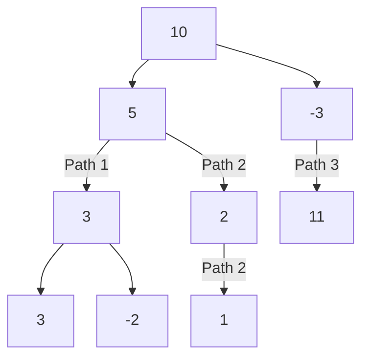

## Examples

**Example 1**

- Input: `root = [10,5,-3,3,2,null,11,3,-2,null,1], targetSum = 8`
- Output: `3`
- Explanation: The three qualifying downward paths are `5 -> 3`, `5 -> 2 -> 1`, and `-3 -> 11`.

**Example 2**

- Input: `root = [5,4,8,11,null,13,4,7,2,null,null,5,1], targetSum = 22`
- Output: `3`
