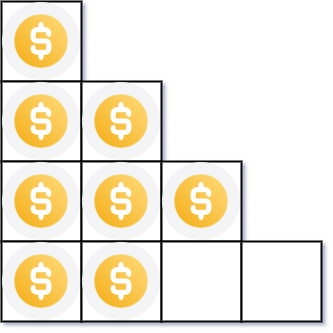

### 1. Description

You have `n` coins and you want to build a staircase with these coins. The staircase consists of `k` rows where the $$i^{\text{th}}$$ row has exactly `i` coins. The last row of the staircase **may be** incomplete.

Given the integer `n`, return *the number of **complete rows** of the staircase you will build*.

### 2. Function Contract

**Inputs**

- `n`: The positive number of available coins.

**Return value**

Return the greatest number of initial staircase rows that can each receive their required number of coins.

### 3. Examples

#### Example 1

- **Input:** $n = 5$
- **Output:** `2`
- **Explanation:** Because the 3^rd row is incomplete, we return 2.

#### Example 2

- **Input:** $n = 8$
- **Output:** `3`
- **Explanation:** Because the 4^th row is incomplete, we return 3.

### 4. Constraints

- $1 \le n \le 2^{31} - 1$
