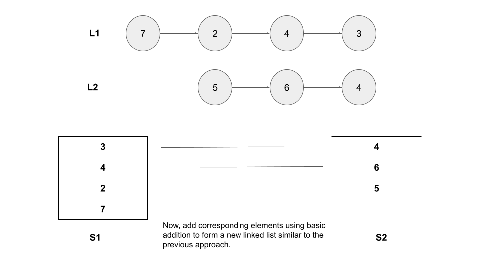

[TOC]

## Solution

---

### Approach 1: Reverse Given Linked Lists

#### Intuition

We are told that the most significant digit comes first, and that each of their nodes includes a single digit. To do a basic addition of two numbers using a sum of two digits and a carry, we must start with the least significant digits (the lowest place) and work our way up to the most significant digits.

To get the order of digits from the least significant digits to the the most significant digits, we can reverse the given lists so the least significant digits come first.

We can then iterate over the reversed lists to perform the addition of digits at corresponding places similar to the first approach.

Let's understand how to reverse a linked list. This is a classical problem that you can try [here](https://leetcode.com/problems/reverse-linked-list/).

To reverse a linked list, we need three pointers. The first pointer `head` points to the current node under consideration, `temp` points to the next node, and `prev` points to the previous node. This is because while traversing the list, we change the current node's (`head`) next pointer to point to its previous element (`prev`). Since a node does not have reference to its previous node, we must store its previous element beforehand. We also need another pointer to store the next node (`temp`) before changing the reference so we don't lose it after changing `head.next`.

We start with initializing `prev` to `null`. We then loop until `head` is null, i.e., until we iterate over all the elements. We store `head.next` in `temp` to store the next node we will go to. After storing the next node, we reverse `next` of `head` to the previous element, i.e., $\text{head.next} = prev$. We then move `prev` to `head` as this becomes the previous node for the next node and also move `head` to `temp` as this becomes the new node under consideration.

Here's an animation visually showing how the approach works:

!?!../Documents/445/445-slides.json:601,301!?!

#### Algorithm

1. Create two linked lists `r1` and `r2` to store the reverse of the linked lists `l1` and `l2` respectively.
2. Create two integers `totalSum` and `carry` to store the sum and carry of current digits.
3. Create a new `ListNode`, `ans` that will store the sum of current digits.
4. We will add the two numbers using the reverse list by adding the digits one by one. We continue until we cover all the nodes in `r1` and `r2`:
- If `r1` is not `null`, we add `r1.val` to `totalSum`.
- If `r2` is not `null`, we add `r2.val` to `totalSum`.
- Set $\text{ans.val} = totalSum \% 10$.
- Store the `carry` as $totalSum / 10$.
- Create a new `ListNode`, `newNode` that will have `val` as `carry`. Set `next` of `newNode` to `ans`. Update $ans = newNode$ to use the same variable `ans` for the next iteration.
- Update $totalSum = carry$.
7. If $carry = 0$, it means the `newNode` that we created in the final iteration of while loop has $val = 0$. Because we perform $ans = newNode$ at the end of each while loop iteration while loop, to avoid returning a linked list with a head of `0` (leading zero), we return the next element, i.e., we return `ans.next`. Otherwise, if `carry` is not equal to `0`, the value of `ans` is non-zero. Hence, we just return `ans`.

#### Implementation

```python
class Solution:
    def reverseList(self, head: Optional[ListNode]) -> Optional[ListNode]:
        prev = None
        temp = None
        while head:
            # Keep the next node
            temp = head.next
            # Reverse the link
            head.next = prev
            # Update the previous node and the current node.
            prev = head
            head = temp
        return prev

    def addTwoNumbers(self, l1: Optional[ListNode], l2: Optional[ListNode]) -> Optional[ListNode]:
        r1 = self.reverseList(l1)
        r2 = self.reverseList(l2)

        total_sum = 0
        carry = 0
        ans = ListNode()
        while r1 or r2:
            if r1:
                total_sum += r1.val
                r1 = r1.next
            if r2:
                total_sum += r2.val
                r2 = r2.next

            ans.val = total_sum % 10
            carry = total_sum // 10
            head = ListNode(carry)
            head.next = ans
            ans = head
            total_sum = carry

        return ans.next if carry == 0 else ans
```

#### Complexity Analysis

Here, $m$ and $n$ are is the number of nodes in `l1` and `l2` respectively

* Time complexity: $O(m + n)$

- Reversing the list `l1` and `l2`  take $O(m)$ and $O(n)$ time respectively.
- We then iterate over digits of the both lists. We iterate until both the lists are fully traversed. We iterate in the while loop `max(m, n)` times. We compute `totalSum`, `carry` and create a new node in each iteration which takes $O(1)$ time. Hence, the complexity of all the while loop can be written as $O(m + n)$ time.

* Space complexity: $O(m + n)$

- As we have reversed the input linked lists, we will count the space consumed by the reversed lists. The `r1` linked list takes $O(m)$ space and `r2` takes $O(n)$ space.
- Note: one could argue that because `r1` and `r2` are only referencing the input lists and not making copies of them, we are using $O(1)$ space. In most problems, you wouldn't count the input as part of the space complexity because the input doesn't contribute toward the algorithm. In this approach, the input is used heavily by our algorithm in terms of logic, and thus, we are counting it as part of the space complexity.

---

### Approach 2: Stack

#### Intuition

Our task is to do a basic addition of two numbers starting with the least significant digits and working our way up to the most significant digits. In the previous approach, we reversed the linked lists to access the least significant digits first. We can also use **stacks** to access the least significant digits first.

The advantage of using a stack is that when we loop over a given linked list from the first node to the last and push all the digits in the stack, the top of the stack will have the least significant digit and the bottom will contain the most significant digit.

We can add the digits at corresponding places of the linked lists using the two stacks moving from the least to the most significant digits using the stack's `pop` method.

Here's a brief visual representation explaining the approach:



#### Algorithm

1. Create two integer stacks `s1` and `s2` to store the integers of the linked lists `l1` and `l2` respectively.
2. Push all the integers of `l1` in `s1` starting from the integer at the first node. The most significant comes first in the list, so it will be stored at the bottom of the stack and the least significant digit will stored at the top.
3. Similarly, push all the integers of `l2` in `s2`.
4. Create two integers `totalSum` and `carry` to store the sum and carry of current digits.
5. Create a new `ListNode`, `ans` that will store the answer.
6. We will add the two numbers present in the linked list now by adding the digits one by one. We continue until both `s1` and `s2` are empty:
- If `s1` is not empty, pop the first element from the stack and add it to `totalSum`.
- If `s2` is not empty, pop the first element from the stack and add it to `totalSum`.
- Set $\text{ans.val} = totalSum \% 10$.
- Store the `carry` as $totalSum / 10$.
- Create a new `ListNode`, `newNode` that will have `val` as `carry`. Set `next` of `newNode` to `ans`. Update $ans = newNode$ to use the same variable `ans` for the next iteration.
- Update $totalSum = carry$.
7. If $carry = 0$, it means the `newNode` that we created in the final iteration of while loop has $val = 0$. Because we perform $ans = newNode$ at the end of each while loop, to avoid returning a linked list with a head of `0` (leading zero), we return the next element, i.e., we return `ans.next`. Otherwise, if `carry` is not equal to `0`, the value of `ans` is non-zero. Hence, we just return `ans`.

#### Implementation

```python
class Solution:
    def addTwoNumbers(self, l1: Optional[ListNode], l2: Optional[ListNode]) -> Optional[ListNode]:
        s1 = []
        s2 = []

        while l1:
            s1.append(l1.val)
            l1 = l1.next
        while l2:
            s2.append(l2.val)
            l2 = l2.next

        total_sum = 0
        carry = 0
        ans = ListNode()
        while s1 or s2:
            if s1:
                total_sum += s1.pop()
            if s2:
                total_sum += s2.pop()

            ans.val = total_sum % 10
            carry = total_sum // 10
            head = ListNode(carry)
            head.next = ans
            ans = head
            total_sum = carry

        return ans.next if carry == 0 else ans
```

#### Complexity Analysis

Here, $m$ and $n$ are is the number of nodes in `l1` and `l2` respectively

* Time complexity: $O(m + n)$

- Iterating over both the lists and pushing all the values in the respective stacks take $O(m + n)$ time.
- We then iterate over digits of the both lists. We iterate until both the stacks are empty. We iterate in the while loop `max(m, n)` times. We compute `sum`, `carry` and create a new node in each iteration which takes $O(1)$ time. Hence, the complexity of all the while loop can be written as $O(m + n)$ time.

* Space complexity: $O(m + n)$

- The `s1` stack takes $O(m)$ space and the `s2` stack takes $O(n)$ space.