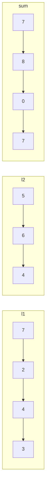

## Examples

**Example 1**

- Input: `l1 = [7,2,4,3], l2 = [5,6,4]`
- Output: `[7,8,0,7]`

**Example 2**

- Input: `l1 = [2,4,3], l2 = [5,6,4]`
- Output: `[8,0,7]`

**Example 3**

- Input: `l1 = [0], l2 = [0]`
- Output: `[0]`
