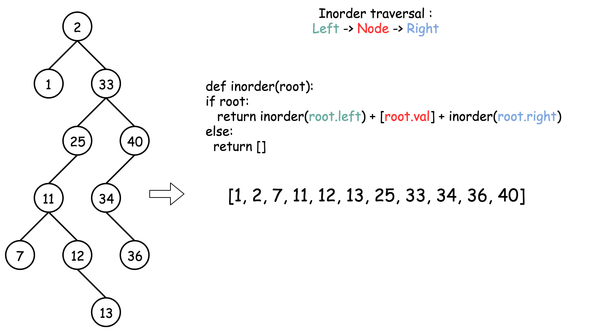
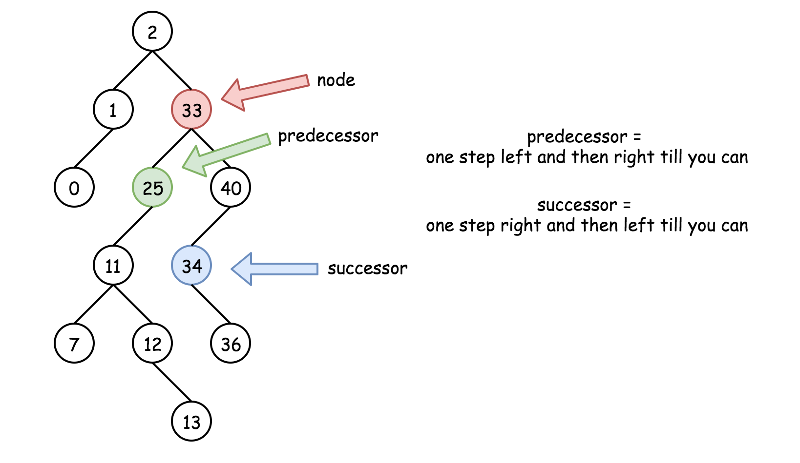
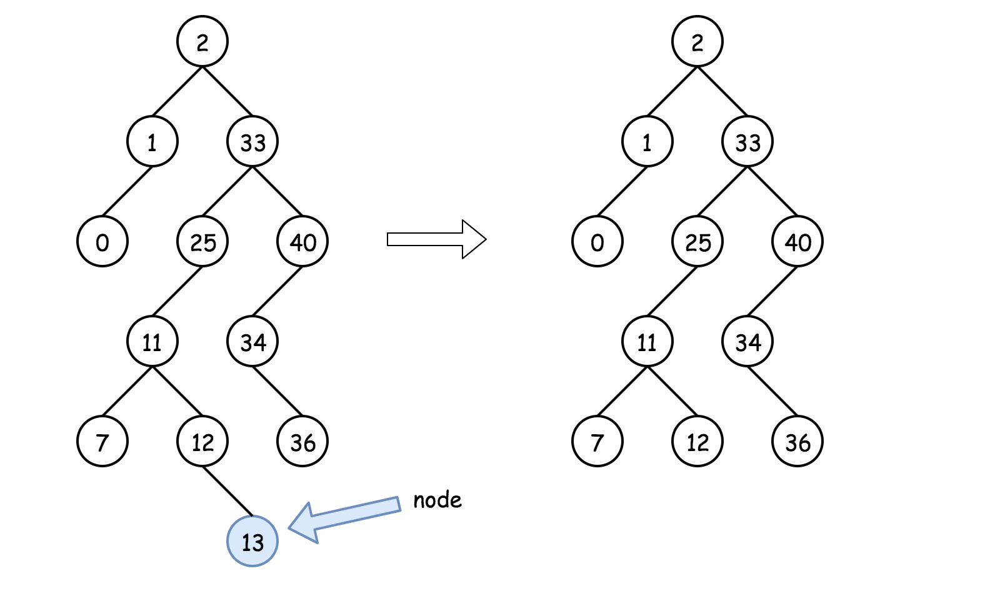
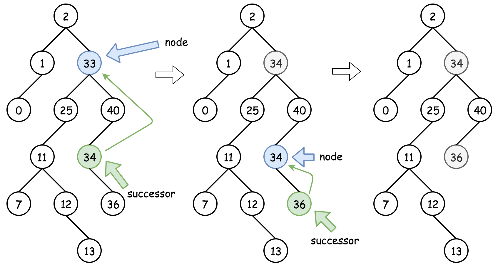
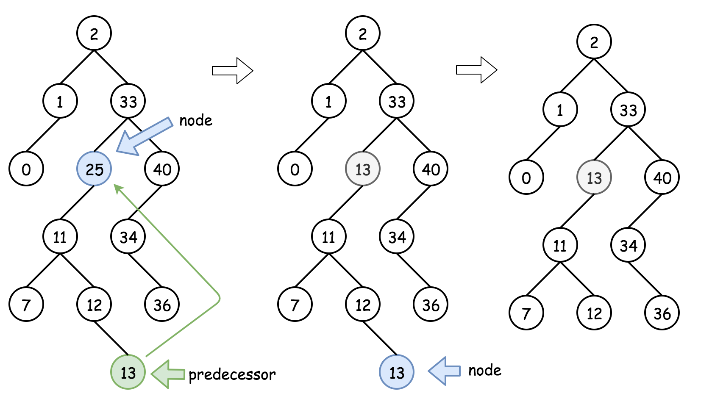
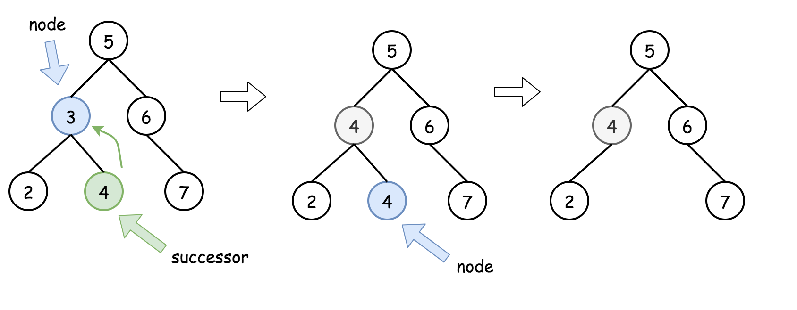

[TOC]

## Solution

---

### Overview: Three Facts to Know about BST

Here is a list of facts that are better to know before the interview.

> Inorder traversal of BST is an array sorted in ascending order.

To compute inorder traversal follow the direction `Left -> Node -> Right`.

```python
def inorder(root: Optional[TreeNode]) -> List:
    return inorder(root.left) + [root.val] + inorder(root.right) if root else []
```



> Successor = "after node", i.e. the next node, or the smallest node _after_ the current one.

It's also the _next_ node in the inorder traversal. To find a successor, go to the right once and then as many times to the left as you could.

```python
def successor(root: TreeNode) -> TreeNode:
    root = root.right
    while root.left:
        root = root.left
    return root
```

> Predecessor = "before node", i.e. the previous node, or the largest node _before_ the current one.

It's also the _previous_ node in the inorder traversal. To find a predecessor, go to the left once and then as many times to the right as you could.

```python
def predecessor(root: TreeNode) -> TreeNode:
    root = root.left
    while root.right:
        root = root.right
    return root
```



<br />
<br />

---

### Approach 1: Recursion

#### Intuition

There are three possible situations here :

- Node is a leaf, and one could delete it straightforwardly: $node = null$.



- Node is not a leaf and has a right child. Then the node could be replaced by its
_successor_ which is somewhere lower in the right subtree. Then one could proceed down recursively to delete the successor.



- Node is not a leaf, has no right child, and has a left child. That means that its _successor_ is somewhere upper in the tree but we don't want to go back. Let's use the _predecessor_ here which is somewhere lower in the left subtree. The node could be replaced by its _predecessor_ and then one could proceed down recursively to delete the predecessor.



#### Algorithm

- If `key > root.val` then delete the node to delete is in the right subtree $\text{root.right} = deleteNode(\text{root.right}, key)$.

- If `key < root.val` then delete the node to delete is in the left subtree $\text{root.left} = deleteNode(\text{root.left}, key)$.

- If $key = \text{root.val}$ then the node to delete is right here. Let's do it :

- If the node is a leaf, the delete process is straightforward: $root = null$.

- If the node is not a leaf and has the right child, then replace the node value with a successor value $\text{root.val} = \text{successor.val}$, and then recursively delete, the successor in the right subtree $\text{root.right} = deleteNode(\text{root.right}, \text{root.val})$.

- If the node is not a leaf and has only the left child, then replace the node value with a predecessor value $\text{root.val} = \text{predecessor.val}$, and then recursively delete the predecessor in the left subtree $\text{root.left} = deleteNode(\text{root.left}, \text{root.val})$.

- Return `root`.

#### Implementation



> Note that in our implementation, `successor`/`predecessor` has a different function signature from what we define above because we only need the value of the returned node when replacing the current node with its `successor` or `predecessor`. But we still provide a full definition and algorithm to locate those nodes in case of encountering a similar problem and need to get the `TreeNode` object instead of just a value.

```python
class Solution:
    # One step right and then always left
    def successor(self, root: TreeNode) -> int:
            root = root.right
            while root.left:
                root = root.left
            return root.val

    # One step left and then always right
    def predecessor(self, root: TreeNode) -> int:
        root = root.left
        while root.right:
            root = root.right
        return root.val

    def deleteNode(self, root: TreeNode, key: int) -> TreeNode:
        if not root:
            return None

        # delete from the right subtree
        if key > root.val:
            root.right = self.deleteNode(root.right, key)
        # delete from the left subtree
        elif key < root.val:
            root.left = self.deleteNode(root.left, key)
        # delete the current node
        else:
            # the node is a leaf
            if not (root.left or root.right):
                root = None
            # The node is not a leaf and has a right child
            elif root.right:
                root.val = self.successor(root)
                root.right = self.deleteNode(root.right, root.val)
            # the node is not a leaf, has no right child, and has a left child
            else:
                root.val = self.predecessor(root)
                root.left = self.deleteNode(root.left, root.val)

        return root
```

**Complexity Analysis**

* Time complexity : $\mathcal{O}(\log N)$. During the algorithm execution we go down the tree all the time - on the left or on the right, first to search the node to delete ($\mathcal{O}(H_1)$ time complexity as already [discussed](https://leetcode.com/articles/insert-into-a-bst/)) and then to actually delete it. $H_1$ is a tree height from the root to the node to delete. The delete process takes $\mathcal{O}(H_2)$ time, where $H_2$ is a tree height from the root to delete to the leaves. That in total results in $\mathcal{O}(H_1 + H_2) = \mathcal{O}(H)$ time complexity, where $H$ is a tree height, equal to $\log N$ in the case of the balanced tree.

* Space complexity : $\mathcal{O}(H)$ to keep the recursion stack, where $H$ is a tree height. $H = \log N$ for the balanced tree.