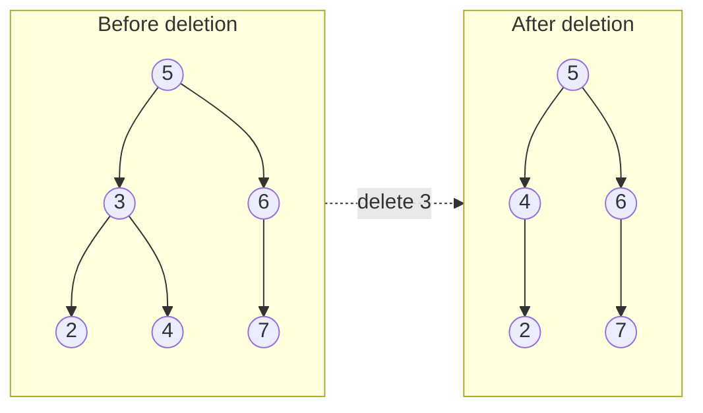
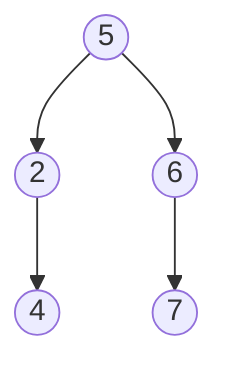

## Examples

**Example 1**

- Input: `root = [5,3,6,2,4,null,7], key = 3`
- Output: `[5,4,6,2,null,null,7]`

- **Explanation:** The node with value `3` is present, so it is removed. Replacing it with `4` produces one valid result:

The BST shape is not unique. Promoting `2` instead gives the equally valid result `[5,2,6,null,4,null,7]`:

**Example 2**

- Input: `root = [5,3,6,2,4,null,7], key = 0`
- Output: `[5,3,6,2,4,null,7]`

- **Explanation:** No node contains `0`, so there is nothing to delete.

**Example 3**

- Input: `root = [], key = 0`
- Output: `[]`
