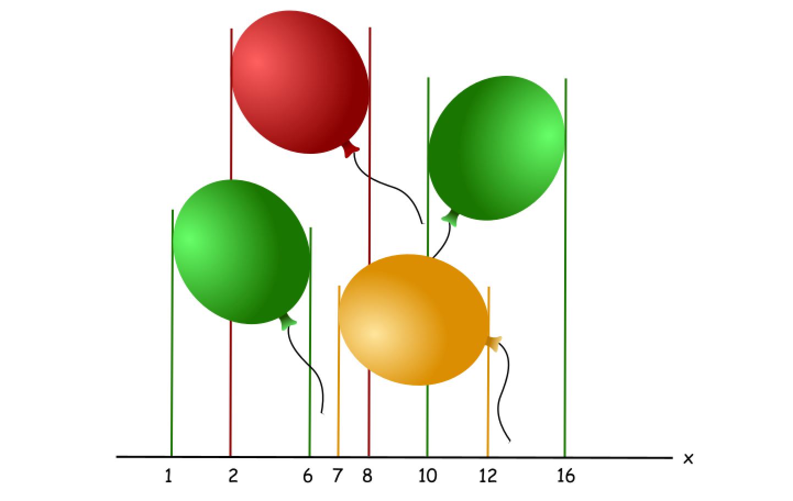
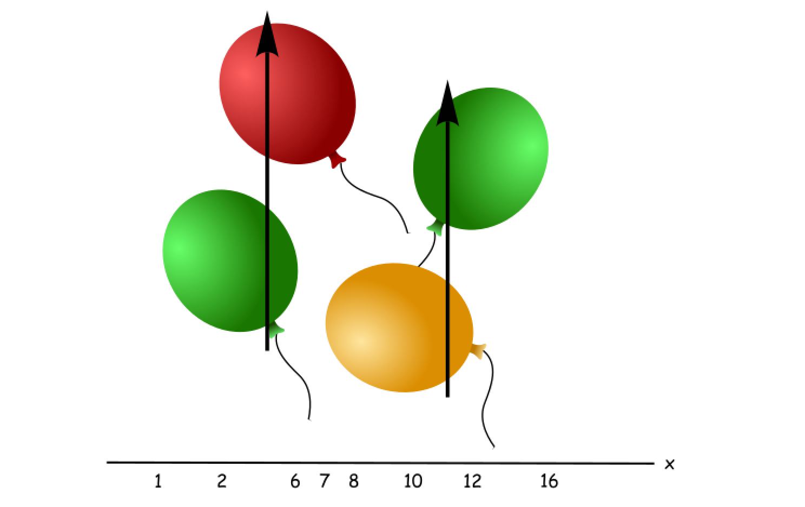
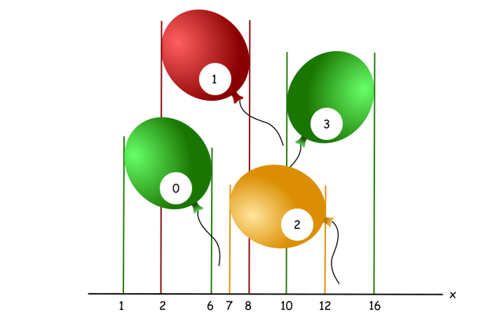

[TOC]

## Solution

---

### Approach 1: Greedy

**Greedy algorithms**

Greedy problems usually look like "Find the minimum number of _something_ to do _something_" or "Find the maximum number of _something_ to fit in _some conditions_", and typically propose an unsorted input.

> The idea of the greedy algorithm is to pick the _locally_ optimal move at each step, that will lead to the _globally_ optimal solution.

The standard solution has $\mathcal{O}(N \log N)$ time complexity and consists of two parts:

- Figure out how to sort the input data ($\mathcal{O}(N \log N)$ time). That could be done directly by sorting or indirectly by heap usage. Typically sort is better than the heap usage because of gain in space.

- Parse the sorted input to have a solution ($\mathcal{O}(N)$ time).

Please notice that in the case of well-sorted input, one doesn't need the first part and the greedy solution could have $\mathcal{O}(N)$ time complexity, [here is an example](https://leetcode.com/articles/gas-station/).

> How to prove that your greedy algorithm provides a globally optimal solution?

Usually, you could use the [proof by contradiction](https://en.wikipedia.org/wiki/Proof_by_contradiction).

**Intuition**

Let's consider the following combinations of balloons.



That's quite obvious that two arrows are enough to burst them all, let's figure out how to compute this result with the help of a greedy algorithm.



Let's sort the balloons by the end coordinate, and then check them one by one. The first balloon is a green number `0`, it ends at coordinate `6`, and there are no balloons ending before it because of sorting.

The other balloons have two possibilities :

- To have a start coordinate smaller than `6`, like a red balloon. These ones could be burst together with the balloon `0` by one arrow.

- To have a start coordinate larger than `6`, like a yellow balloon. These ones couldn't be burst together with the balloon `0` by one arrow, and hence one needs to increase the number of arrows here.



> That means that one could always track the end of the current balloon, and ignore all the balloons which end before it. Once the current balloon is ended (= the next balloon starts after the current balloon), one has to increase the number of arrows by one and start to track the end of the next balloon.

**Algorithm**

Now the algorithm is straightforward :

- Sort the balloons by end coordinate $x_{end}$.

- Initiate the end coordinate of a balloon which ends first: $\text{first}_{end} = \text{points}[0][1]$.

- Initiate the number of arrows: $arrows = 1$.

- Iterate over all balloons:

- If the balloon starts after $\text{first}_{end}$:

- Increase  the number of arrows by one.

- Set $\text{first}_{end}$ to be equal to the end of the current balloon.

- Return arrows.

**Implementation**

```python
class Solution:
    def findMinArrowShots(self, points: List[List[int]]) -> int:
        if not points:
            return 0

        # sort by x_end
        points.sort(key = lambda x : x[1])

        arrows = 1
        first_end = points[0][1]
        for x_start, x_end in points:
            # if the current balloon starts after the end of another one,
            # one needs one more arrow
            if first_end < x_start:
                arrows += 1
                first_end = x_end

        return arrows
```

**Complexity Analysis**

* Time complexity : $\mathcal{O}(N \log N)$ because of sorting of the input data.

* Space complexity : $\mathcal{O}(N)$ or $\mathcal{O}(\log{N})$

  - The space complexity of the sorting algorithm depends on the implementation of each programming language.

  - For instance, the `list.sort()` function in Python is implemented with the [Timsort](https://en.wikipedia.org/wiki/Timsort) algorithm whose space complexity is $\mathcal{O}(N)$.

  - In Java, the [Arrays.sort()](https://docs.oracle.com/javase/8/docs/api/java/util/Arrays.html#sort-byte:A-) is implemented as a variant of quicksort algorithm whose space complexity is $\mathcal{O}(\log{N})$.

---