[TOC]

## Video Solution
---

<div>
    <div class="video-container">
        <iframe src="https://player.vimeo.com/video/476759485" width="640" height="360" frameborder="0" allow="autoplay; fullscreen" allowfullscreen></iframe>
    </div>
</div>

<div>
</div>

## Solution Article

---
### Approach 1: Brute Force

The simplest solution is to consider every triplet $(i, j, k)$ and check if the corresponding numbers satisfy the 132 criteria. If any such triplet is found, we can return a True value. If no such triplet is found, we need to return a False value.

```python
class Solution:
    def find132pattern(self, nums: List[int]) -> bool:
        for i in range(len(nums) - 2):
            for j in range(i + 1, len(nums) - 1):
                for k in range(j + 1, len(nums)):
                    if nums[i] < nums[k] < nums[j]:
                        return True
        return False
```

**Complexity Analysis**

* Time complexity : $O(n^3)$. Three loops are used to consider every possible triplet. Here, $n$ refers to the size of $nums$ array.

* Space complexity : $O(1)$. Constant extra space is used.
<br />
<br />

---
### Approach 2: Better Brute Force

**Algorithm**

We can improve the last approach to some extent, if we make use of some observations. We can note that for a particular number $\text{nums}[j]$ chosen as 2nd element in the 132 pattern, if we don't consider $\text{nums}[k]$(the 3rd element) for the time being, our job is to find out the first element, $\text{nums}[i]$($i<j$) which is lesser than $\text{nums}[j]$.

Now, assume that we have somehow found a $\text{nums}[i],\text{nums}[j]$ pair. Our task now reduces to finding out a $\text{nums}[k]$($Kk>j>i)$, which falls in the range $(\text{nums}[i], \text{nums}[j])$. Now, to maximize the likelihood of a $\text{nums}[k]$ falling in this range, we need to increase this range as much as possible.

Since, we started off by fixing a $\text{nums}[j]$, the only option in our hand is to choose a minimum value of $\text{nums}[i]$ given a particular $\text{nums}[j]$. Once, this pair $\text{nums}[i],\text{nums}[j]$, has been found out, we simply need to traverse beyond the index $j$ to find if a $\text{nums}[k]$ exists for this pair satisfying the 132 criteria.

Based on the above observations, while traversing over the $nums$ array choosing various values of $\text{nums}[j]$, we simultaneously keep a track of the minimum element found so far(excluding $\text{nums}[j]$). This minimum element always serves as the $\text{nums}[i]$ for the current $\text{nums}[j]$. Thus, we only need to traverse beyond the $j^{th}$ index to check the $\text{nums}[k]$'s to determine if any of them satisfies the 132 criteria.

```python
class Solution:
    def find132pattern(self, nums: List[int]) -> bool:
        min_i = inf
        for j in range(len(nums) - 1):
            min_i = min(min_i, nums[j])
            for k in range(j + 1, len(nums)):
                if min_i < nums[k] < nums[j]:
                    return True
        return False
```

**Complexity Analysis**

* Time complexity : $O(n^2)$. Two loops are used to find the $\text{nums}[j],\text{nums}[k]$ pairs. Here, $n$ refers to the size of $nums$ array.

* Space complexity : $O(1)$. Constant extra space is used.
<br />
<br />

---
### Approach 3: Searching Intervals

**Algorithm**

As discussed in the last approach, once we've fixed a $\text{nums}[i],\text{nums}[j]$ pair, we just need to determine a $\text{nums}[k]$ which falls in the range $(\text{nums}[i],\text{nums}[j])$. Further, to maximize the likelihood of any arbitrary $\text{nums}[k]$ falling in this range, we need to try to keep this range as much as possible. But, in the last approach, we tried to work only on $\text{nums}[i]$. But, it'll be a better choice, if we can somehow work out on $\text{nums}[j]$ as well.

To do so, we can look at the given $nums$ array in the form of a graph, as shown below:

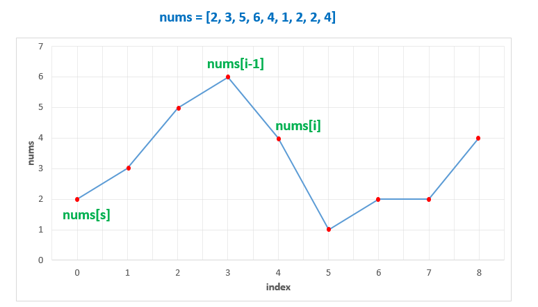

From the above graph, which consists of rising and falling slopes, we know, the best qualifiers to act as the $\text{nums}[i],\text{nums}[j]$ pair,  as discussed above, to maximize the range $\text{nums}[i], \text{nums}[j]$, at any instant, while traversing the $nums$ array, will be the points at the endpoints of a local rising slope. Thus, once we've found such points, we can traverse over the $nums$ array to find a $\text{nums}[k]$ satisfying the given 132 criteria.

To find these points at the ends of a local rising slope, we can traverse over the given $nums$ array. While traversing, we can keep a track of the minimum point found after the last peak($\text{nums}[s]$).

Now, whenever we encounter a falling slope, say, at index $i$, we know, that $nums[i-1]$ was the endpoint of the last rising slope found. Thus, we can scan over the $k$ indices(k>i), to find a 132 pattern.

But, instead of traversing over $nums$ to find a $k$ satisfying the 132 pattern for every such rising slope, we can store this range $(\text{nums}[s], nums[i-1])$(acting as $(\text{nums}[i], \text{nums}[j])$) in, say an $intervals$ array.

While traversing over the $nums$ array to check the rising/falling slopes, whenever we find any rising slope, we can keep adding the endpoint pairs to this $intervals$ array. At the same time, we can also check if the current element falls in any of the ranges found so far. If so, this element satisfies the 132 criteria for that range.

If no such element is found till the end, we need to return a False value.

```python
class Solution:
    def find132pattern(self, nums: List[int]) -> bool:
        intervals = []
        i = 1
        min_point_after_last_peak_index = 0
        for i in range(len(nums)):
            # if we encounter a falling edge, then element i - 1 is a peak
            if nums[i] < nums[i - 1]:
                # make sure the peak occurs after the rising edge's minimum
                if min_point_after_last_peak_index < i - 1:
                    # nums[min_point_after_last_peak_index...(i-1)] is a valid rising peak
                    intervals.append(
                        (nums[min_point_after_last_peak_index], nums[i - 1])
                    )
                # the current element is the minimum for the next rising peak
                min_point_after_last_peak_index = i
            for interval in intervals:
                if interval[0] < nums[i] < interval[1]:
                    return True
        return False
```

**Complexity Analysis**

* Time complexity : $O(n^2)$. We traverse over the $nums$ array of size $n$ once to find the slopes. But for every element, we also need to traverse over the $intervals$ to check if any element falls in any range found so far. This array can contain at most $(n/2)$ pairs, in the case of an alternate increasing-decreasing sequence(worst case e.g.`[5 6 4 7 3 8 2 9]`).

* Space complexity : $O(n)$. $intervals$ array can contain at most $n/2$ pairs, in the worst case(alternate increasing-decreasing sequence).
<br />
<br />

---
### Approach 4: Stack

**Algorithm**

In Approach 2, we found out $\text{nums}[i]$ corresponding to a particular $\text{nums}[j]$ directly without having to consider every pair possible in $nums$ to find this $\text{nums}[i],\text{nums}[j]$ pair. If we do some preprocessing, we can make the process of finding a $\text{nums}[k]$ corresponding to this $\text{nums}[i],\text{nums}[j]$ pair also easy.

The preprocessing required is to just find the best $\text{nums}[i]$ value corresponding to every $\text{nums}[j]$ value. This is done in the same manner as in the second approach i.e. we find the minimum element found till the $j^{th}$ element which acts as the $\text{nums}[i]$ for the current $\text{nums}[j]$. We maintain thes values in a $min$ array. Thus, $\text{min}[j]$ now refers to the best $\text{nums}[i]$ value for a particular $\text{nums}[j]$.

Now, we traverse back from the end of the $nums$ array to find the $\text{nums}[k]$'s. Suppose, we keep a track of the $\text{nums}[k]$ values which can potentially satisfy the 132 criteria for the current $\text{nums}[j]$. We know, one of the conditions to be satisfied by such a $\text{nums}[k]$ is that it must be greater than $\text{nums}[i]$. Or in other words, we can also say that it must be greater than $\text{min}[j]$ for a particular $\text{nums}[j]$ chosen.

Once it is ensured that the elements left for competing for the $\text{nums}[k]$ are all greater than $\text{min}[j]$(or $\text{nums}[i]$), our only task is to ensure that it should be lesser than $\text{nums}[j]$. Now, the best element from among the competitors, for satisfying this condition will be the minimum one from out of these elements.

If this element, $\text{nums}[k]$ satisfies $\text{nums}[k] < \text{nums}[j]$, we've found a 132 pattern. If not, no other element will satisfy this criteria, since they are all greater than or equal to $\text{nums}[min]$ and thus greater than or equal to $\text{nums}[j]$ as well.

To keep a track of these potential $\text{nums}[k]$ values for a particular $\text{nums}[i],\text{nums}[j]$ considered currently, we maintain a $stack$ on which these potential $\text{nums}[k]$'s satisfying the 132 criteria lie in a descending order(minimum element on the top). We need not sort these elements on the $stack$, but they'll be sorted automatically as we'll discuss along with the process.

After creating a $min$ array, we start traversing the $\text{nums}[j]$ array in a backward manner. Let's say, we are currently at the $j^{th}$ element and let's also assume that the $stack$ is sorted right now. Now, firstly, we check if $\text{nums}[j] > \text{min}[j]$. If not, we continue with the $(j-1)^{th}$ element and the $stack$ remains sorted. If not, we keep on popping the elements from the top of the $stack$ till we find an element, $\text{stack}[top]$ such that, $\text{stack}[top] > \text{min}[j]$(or $\text{stack}[top] > \text{nums}[i]$).

Once the popping is done, we're sure that all the elements pending on the $stack$ are greater than $\text{nums}[i]$ and are thus, the potential candidates for $\text{nums}[k]$ satisfying the 132 criteria. We can also note that the elements which have been popped from the $stack$, all satisfy $\text{stack}[top] ≤ \text{min}[j]$.

Since, in the $min$ array, $\text{min}[p] ≤ \text{min}[q]$, for every $p > q$, these popped elements also satisfy $\text{stack}[top] ≤ \text{min}[k]$, for all $0 ≤ k < j$. Thus, they are not the potential $\text{nums}[k]$ candidates for even the preceding elements. Even after  doing the popping, the $stack$ remains sorted.

After the popping is done, we've got the minimum element from amongst all the potential $\text{nums}[k]$'s on the top of the $stack$(as per the assumption). We can check if it is less than or equal to $\text{nums}[j]$ to satisfy the 132 criteria(we've already checked $\text{stack}[top] > \text{nums}[i]$). If this element satisfies the 132 criteria, we can return a True value. If not, we know that for the current $j$, $\text{nums}[j] > \text{min}[j]$. Thus, the element $\text{nums}[j]$ could be a potential $\text{nums}[k]$ value, for the preceding $\text{nums}[i]'s$.

Thus, we push it over the $stack$. We can note that, we need to push this element $\text{nums}[j]$ on the $stack$ only when it didn't satisfy $\text{stack}[top]<\text{nums}[j]$. Thus, $\text{nums}[j] ≤ \text{stack}[top]$. Thus, even after pushing this element on the $stack$, the $stack$ remains sorted. Thus, we've seen by induction, that the $stack$ always remains sorted.

Also, note that in case $\text{nums}[j] ≤ \text{min}[j]$, we don't push $\text{nums}[j]$ onto the $stack$. This is because this $\text{nums}[j]$ isn't greater than even the minimum element lying towards its left and thus can't act as $\text{nums}[k]$ in the future.

If no element is found satisfying the 132 criteria till reaching the first element, we return a False value.

The following animation better illustrates the process.

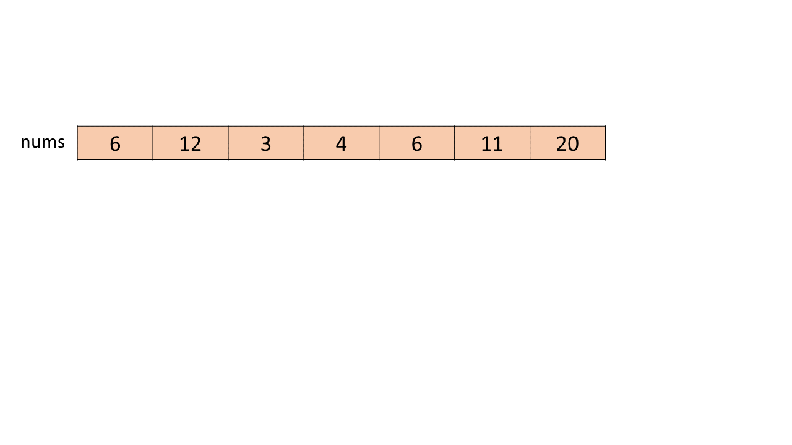

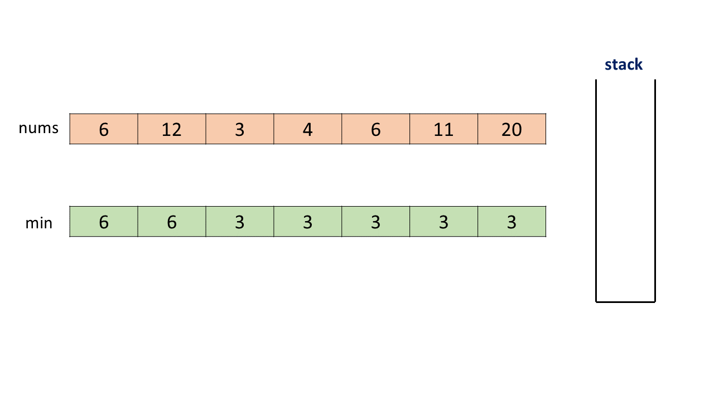

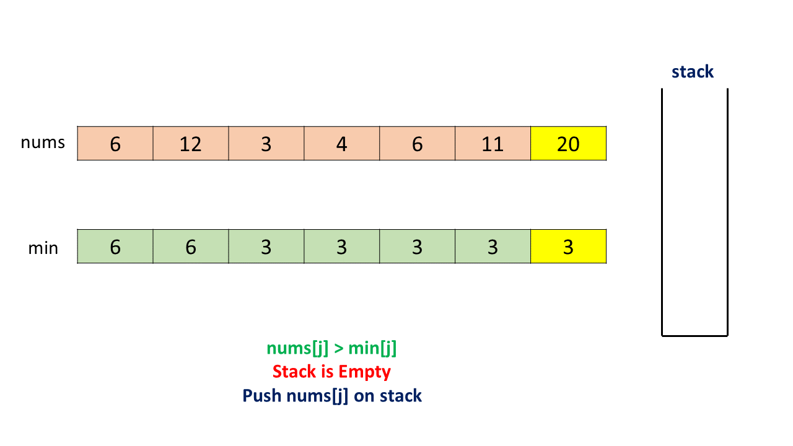

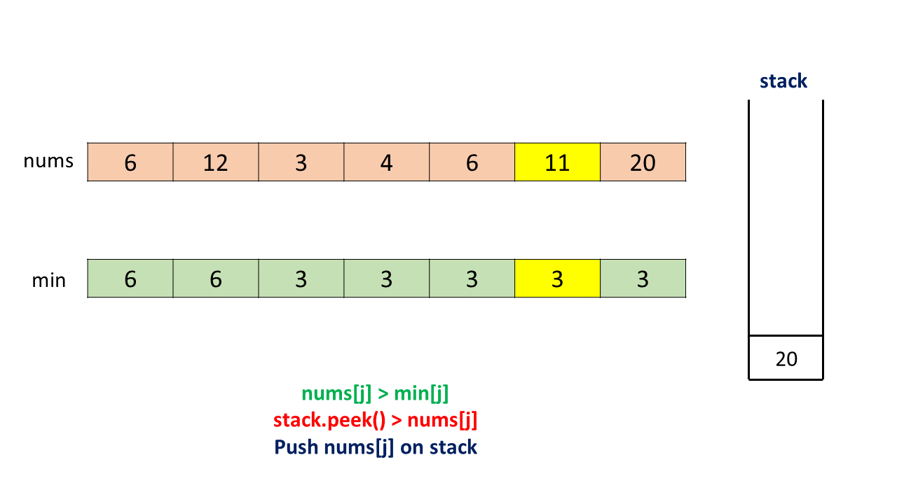

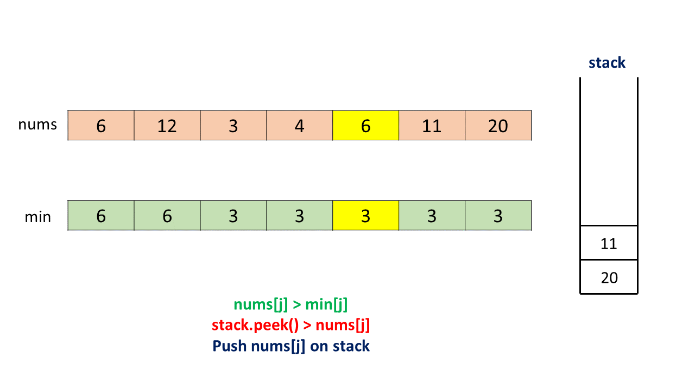

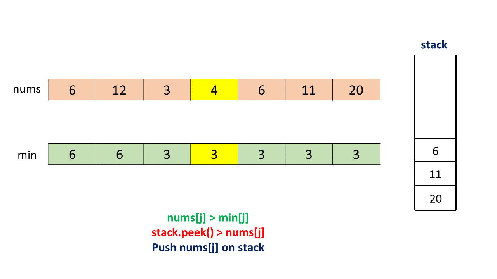

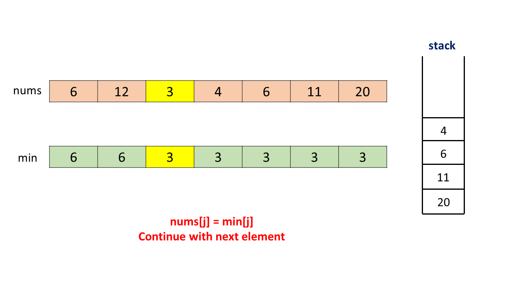

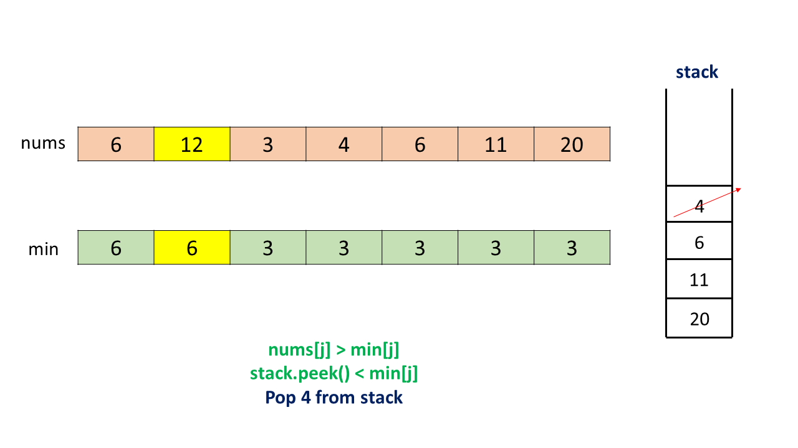

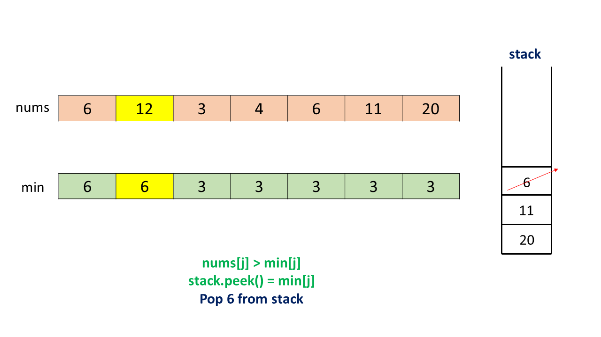

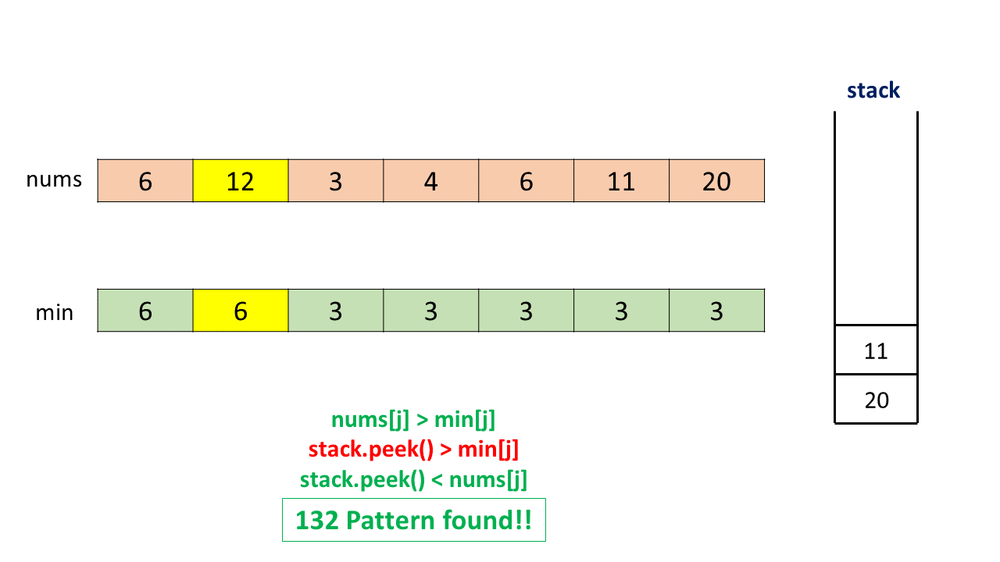

```python
class Solution:
    def find132pattern(self, nums: List[int]) -> bool:
        if len(nums) < 3:
            return False
        stack = []
        min_array = [-1] * len(nums)
        min_array[0] = nums[0]
        for i in range(1, len(nums)):
            min_array[i] = min(min_array[i - 1], nums[i])

        for j in range(len(nums) - 1, -1, -1):
            if nums[j] <= min_array[j]:
                continue
            while stack and stack[-1] <= min_array[j]:
                stack.pop()
            if stack and stack[-1] < nums[j]:
                return True
            stack.append(nums[j])
        return False
```

**Complexity Analysis**

* Time complexity : $O(n)$. We travesre over the $nums$ array of size $n$ once to fill the $min$ array. After this, we traverse over $nums$ to find the $\text{nums}[k]$. During this process, we also push and pop the elements on the $stack$. But, we can note that at most $n$ elements can be pushed and popped off the $stack$ in total. Thus, the second traversal requires only $O(n)$ time.

* Space complexity : $O(n)$. The $stack$ can grow upto a maximum depth of $n$. Furhter, $min$ array of size $n$ is used.
<br />
<br />

---

### Approach 5: Binary Search

**Algorithm**

In the last approach, we've made use of a separate $stack$ to push and pop the $\text{nums}[k]$'s. But, we can also note that when we reach the index $j$ while scanning backwards for finding $\text{nums}[k]$, the $stack$ can contain at most $n-j-1$ elements. Here, $n$ refers to the number of elements in $nums$ array.

We can also note that this is the same number of elements which lie beyond the $j^{th}$ index in $nums$ array. We also know that these elements lying beyond the $j^{th}$ index won't be needed in the future ever again. Thus, we can make use of this space in $nums$ array instead of using a separate $stack$. The rest of the process can be carried on in the same manner as discussed in the last approach.

We can try to go for another optimization here. Since, we've got an array for storing the potential $\text{nums}[k]$ values now, we need not do the popping process for a $\text{min}[j]$ to find an element just larger than $\text{min}[j]$ from amongst these potential values.

Instead, we can make use of Binary Search to directly find an element, which is just larger than $\text{min}[j]$ in the required interval, if it exists. If such an element is found, we can compare it with $\text{nums}[j]$ to check the 132 criteria. Otherwise, we continue the process as in the last approach.

```python
class Solution:
    def find132pattern(self, nums: List[int]) -> bool:
        if len(nums) < 3:
            return False
        min_array = [-1] * len(nums)
        min_array[0] = nums[0]
        for i in range(1, len(nums)):
            min_array[i] = min(min_array[i - 1], nums[i])

        k = len(nums)
        for j in range(len(nums) - 1, -1, -1):
            if nums[j] <= min_array[j]:
                continue
            k = bisect_left(nums, min_array[j] + 1, k, len(nums))
            if k < len(nums) and nums[k] < nums[j]:
                return True
            k -= 1
            nums[k] = nums[j]
        return False
```

**Complexity Analysis**

* Time complexity : $O\big(n \log n\big)$. Filling $min$ array requires $O(n)$ time. The second traversal is done over the whole $nums$ array of length $n$. For every current $\text{nums}[j]$ we need to do the Binary Search, which requires $O\big(\log n\big)$. In the worst case, this Binary Search will be done for all the $n$ elements, and the required element won't be found in any case, leading to a complexity of $O\big(n \log n\big)$.

* Space complexity : $O(n)$. $min$ array of size $n$ is used.
<br />
<br />

---
### Approach 6: Using Array as a Stack

**Algorithm**

In the last approach, we've seen that in the worst case, the required element won't be found for all the $n$ elements and thus Binary Search is done at every step increasing the time complexity.

To remove this problem, we can follow the same steps as in Approach 4 i.e. We can remove those elements(update the index $k$) which aren't greater than $\text{nums}[i]$($\text{min}[j]$). Thus, in case no element is larger than $\text{min}[j]$ the index $k$ reaches the last element.

Now, at every step, only $\text{nums}[j]$ will be added and removed from consideration in the next step, improving the time complexity in the worst case. The rest of the method remains the same as in Approach 4.

This approach is inspired by [@fun4leetcode](https://leetcode.com/fun4leetcode/)

```python
class Solution:
    def find132pattern(self, nums: List[int]) -> bool:
        if len(nums) < 3:
            return False
        min_array = [-1] * len(nums)
        min_array[0] = nums[0]
        for i in range(1, len(nums)):
            min_array[i] = min(min_array[i - 1], nums[i])

        k = len(nums)
        for j in range(len(nums) - 1, -1, -1):
            if nums[j] <= min_array[j]:
                continue
            while k < len(nums) and nums[k] <= min_array[j]:
                k += 1
            if k < len(nums) and nums[k] < nums[j]:
                return True
            k -= 1
            nums[k] = nums[j]
        return False
```

**Complexity Analysis**

* Time complexity : $O(n)$. We travesre over the $nums$ array of size $n$ once to fill the $min$ array. After this, we traverse over $nums$ to find the $\text{nums}[k]$. At most $n$ elements can be put in and out of the $nums$ array in total. Thus, the second traversal requires only $O(n)$ time.

* Space complexity : $O(n)$. $min$ array of size $n$ is used.