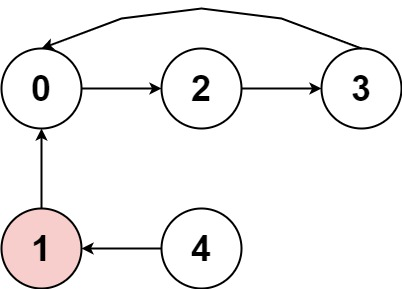
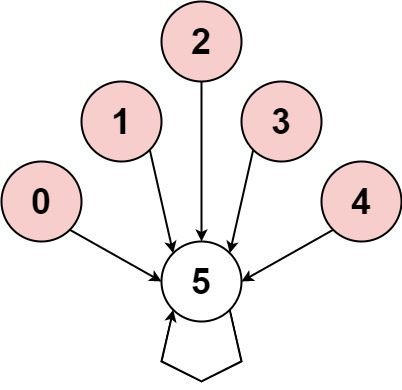
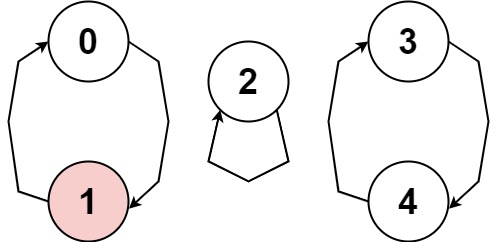

### 1. Description

You are playing a game involving a **circular** array of non-zero integers `nums`. Each $\text{nums}[i]$ denotes the number of indices forward/backward you must move if you are located at index `i`:

- If $\text{nums}[i]$ is positive, move $\text{nums}[i]$ steps **forward**, and

- If $\text{nums}[i]$ is negative, move $abs(\text{nums}[i])$ steps **backward**.

Since the array is **circular**, you may assume that moving forward from the last element puts you on the first element, and moving backwards from the first element puts you on the last element.

A **cycle** in the array consists of a sequence of indices `seq` of length `k` where:

- Following the movement rules above results in the repeating index sequence $\text{seq}[0] -> \text{seq}[1] -> ... -> seq[k - 1] -> \text{seq}[0] -> ...$

- Every $nums[\text{seq}[j]]$ is either **all positive** or **all negative**.

- `k > 1`

Return `true`* if there is a **cycle** in *`nums`*, or *`false`* otherwise*.

### 2. Function Contract

**Inputs**

- `nums`: A nonempty circular array of nonzero signed jump lengths.

**Return value**

- Return `True` if some repeated route contains more than one position and uses jumps of one consistent sign; otherwise, return `False`.

The destination of position `i` is $(i + \text{nums}[i]) \% len(nums)$. A one-position self-loop is not a valid cycle.

### 3. Examples

#### Example 1

- **Input:** `nums = [2,-1,1,2,2]`
- **Output:** `true`
- **Explanation:** The graph shows how the indices are connected. White nodes are jumping forward, while red is jumping backward.
We can see the cycle 0 --> 2 --> 3 --> 0 --> ..., and all of its nodes are white (jumping in the same direction).

#### Example 2

- **Input:** `nums = [-1,-2,-3,-4,-5,6]`
- **Output:** `false`
- **Explanation:** The graph shows how the indices are connected. White nodes are jumping forward, while red is jumping backward.
The only cycle is of size 1, so we return false.

#### Example 3

- **Input:** `nums = [1,-1,5,1,4]`
- **Output:** `true`
- **Explanation:** The graph shows how the indices are connected. White nodes are jumping forward, while red is jumping backward.
We can see the cycle 0 --> 1 --> 0 --> ..., and while it is of size > 1, it has a node jumping forward and a node jumping backward, so **it is not a cycle**.
We can see the cycle 3 --> 4 --> 3 --> ..., and all of its nodes are white (jumping in the same direction).

### 4. Constraints

- $1 \le \text{nums.length} \le 5000$

- $-1000 \le \text{nums}[i] \le 1000$

- $\text{nums}[i] \neq 0$

**Follow up:** Could you solve it in `O(n)` time complexity and `O(1)` extra space complexity?
