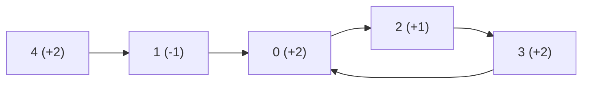
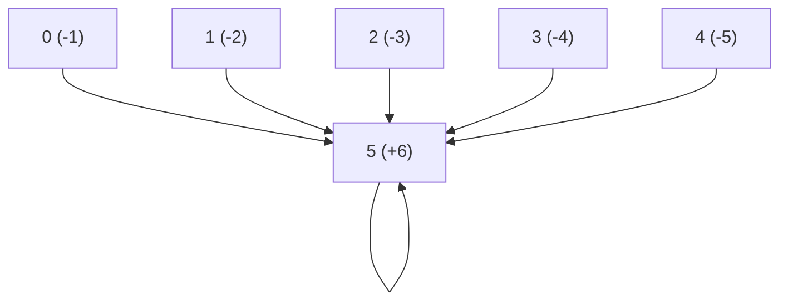
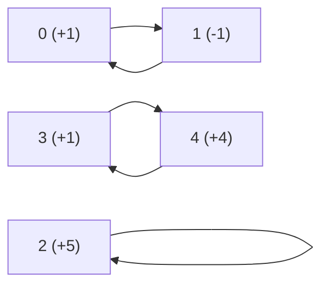

## Examples

**Example 1**

- Input: `nums = [2,-1,1,2,2]`
- Output: `true`
- **Explanation:** In the movement graph, positive entries jump forward and the negative entry jumps backward. The route `0 -> 2 -> 3 -> 0 -> ...` is a cycle whose entries are all positive, so it is valid.

**Example 2**

- Input: `nums = [-1,-2,-3,-4,-5,6]`
- Output: `false`
- **Explanation:** Positions `0` through `4` all jump backward to position `5`. Position `5` jumps to itself, so the only cycle has length one and is invalid.

**Example 3**

- Input: `nums = [1,-1,5,1,4]`
- Output: `true`
- **Explanation:** Positions `0` and `1` repeat as `0 -> 1 -> 0 -> ...`, but their jumps have opposite signs, so that route is invalid. Position `2` has an invalid one-position self-loop. Positions `3` and `4` form `3 -> 4 -> 3 -> ...`, and both jumps are positive, so this is a valid cycle.

