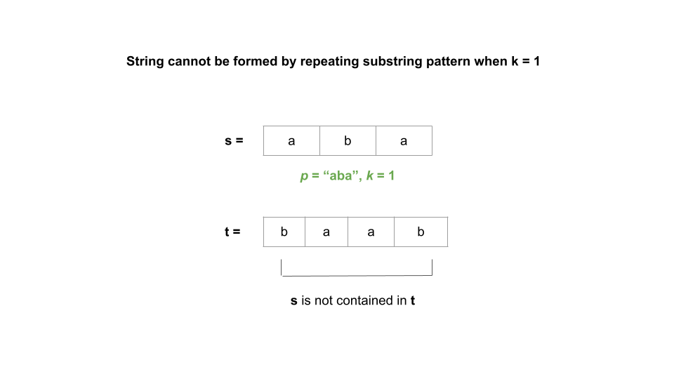
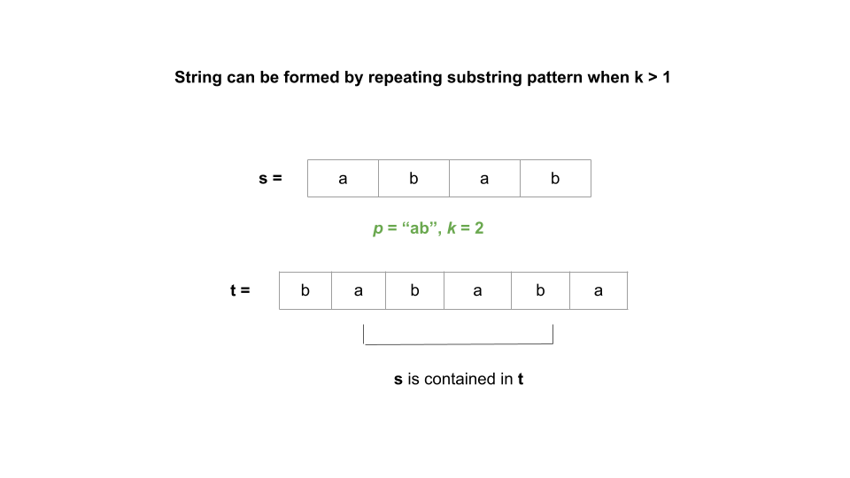

[TOC]

## Solution

---

### Overview

Given a string `s`, our task is to check whether it can be constructed by taking a substring of it and appending multiple copies of the substring together.

---

### Approach 1: Using Divisors

#### Intuition

We may realize that it is impossible to construct `s` by repeating substrings whose length is not a divisor of the length of `s`.

We only need to look at substrings where the length divides `n`, where `n` is the length of `s`. Another thing that we can notice is that the substring would need to be a prefix of `s`, otherwise there would be an immediate mismatch.

For each prefix of length `i` that divides `n`, we would concatenate the prefix $n / i$ times to generate another string. If this string generated by repeated substrings equals `s`, we return `true`.

If no prefix is found that when repeated equals `s`, we return `false`.

#### Algorithm

1. Create an integer variable `n` equal to the length of `s`.
2. Iterate over all the prefix substrings of length $i = 1$ to $n / 2$:
- If `i` divides `n`, we declare an empty string `pattern`. Use an inner loop that iterates $n / i$ times to concatenate the substring formed from the first `i` characters of `s`.
- If `pattern` equals `s`, we return `true`.
3. There is no substring that can be repeated to form `s`. As a result, we return `false`.

#### Implementation

```python
class Solution:
    def repeatedSubstringPattern(self, s: str) -> bool:
        n = len(s)
        for i in range(1, n // 2 + 1):
            if n % i == 0:
                pattern = s[:i] * (n // i)
                if s == pattern:
                    return True
        return False
```

#### Complexity Analysis

Here $n$ is the length of `s`.

* Time complexity: $O(n \cdot \sqrt{n})$.
- A number `n` can have a maximum of $2 \cdot \sqrt{n}$ number of divisors. As a result, we would execute the inner loop that concatenates the substring $O(\sqrt{n})$ times. In the inner loop, we concatenate a substring of length `i` for $n / i$ times to generate a string of length `n`, which would require $O(n)$ time for each iteration. As a result, it would take $O(n \cdot \sqrt{n})$ in total.

* Space complexity: $O(n)$.
- We used another string variable, `pattern`, which is initialized to an empty string before the inner loop iteration and grows up to a length of $n$ after the inner loop iteration.

---

### Approach 2: String Concatenation

> Note: This is a very advanced approach and might not be expected in an interview.

#### Intuition

Consider a string $S = "helloworld"$. Now, given another string $T = "lloworldhe"$, can we figure out if `T` is a rotated version of `S`? By rotated version, we mean taking `S` and shifting it any number of spaces (with wrap around). For example, if $S = "abc"$ and we shifted it to the left once, we would have `"bca"`.

Yes, we check if `T` is a rotated version of `S` by checking if it is a substring of $S + S$. This is because $S + S$ contains all of the rotations of `S`.

Let's try to use this fact to solve our problem.

We consider every rotation of string `S` such that it's rotated by `k` units (where `k < s.length`) to the left. Specifically, we're looking at strings `elloworldh`, `lloworldhe`, `loworldhel`, etc.

If a string can be constructed by taking a substring of it and appending multiple copies of the substring together, **it must be a rotation of itself**. However, it would be inefficient to check all rotations.

Let $t = s + s$. We can easily and efficiently check all possible rotations by removing the first and last character of `t`, then checking if `s` is a substring of `t`.

We can prove that the solution works mathematically.

Let's assume $s = p * k$ where `p` is a pattern that has been repeated `k` times. If there is no repeating pattern in `s`, `k` would be `1` and $p = s$. If there is a repeating pattern, then `k > 1`.

If we concatenate `s` twice, i.e., form another string `t` where $t = s + s$ and remove the first and last character from it, `t` would look like $t = (head + p * (k - 1)) + (p * (k - 1) + tail)$ where `head` is `p` without first character, `tail` is `p` without last character and $p * (k - 1)$ denotes `p` repeated $k - 1$ times.

As a result, $t = head + p * (2k - 2) + tail$. We now have 2 possibilities: either $k = 1$ and the answer is false, or `k > 1` and the answer is true.

If $k = 1$, then $2k - 2 = 0$ and $t = head + tail$. Remember, `head` is equal to `p` with the first character removed, and `tail` is equal to `p` with the last character removed. We can simplify this as `t` is equal to $p + p$ with the first and last characters removed. Now, `s` cannot possibly be a substring of `t` because $s = p$ and we removed the first and last character.
- Thus, if $k = 1$, then `s` cannot be a substring of `t` and the answer is false. Here's a visual representation where $k = 1$:



- If `k > 1`, then $2k - 2$ is some nonzero integer `x`. This means $t = head + p * x + tail$.
- Remember: by definition, $s = p * k$. This means that as long as $x \ge k$, `s` must be contained within $p * x$, and thus within `t`.
- We have $x = 2k - 2$, so the inequality becomes $2k - 2 \ge k$. We can rearrange this to $k \ge 2$, which is the same thing as `k > 1`.
- In conclusion, if `k > 1`, it implies two things: first, the answer to the problem is true. Second, $x \ge k$ and thus `s` must be a substring of $p * x$, and thus a substring of `t`. Here's a visual representation where `k > 1`:



So, concatenate `s` twice and then remove the first and last characters from it. The answer to the problem is the answer to "does this new string contain `s` as a substring"?

#### Algorithm

1. Create a string variable `t` and set it to $s + s$.
2. If the substring formed by removing the first and last character of `t` contains `s`, we return `true`. Otherwise, return `false`. Note in our implementation, the `substr` function in `C++` and the `substring` method in `Java` both take two parameters. In both languages, the first parameter is the initial index from which our substring begins, while the second parameter works differently. It is the length of the substring in `C++` and the index of the last character in `Java`.

#### Implementation

```python
class Solution:
    def repeatedSubstringPattern(self, s: str) -> bool:
        t = s + s
        if s in t[1:-1]:
            return True
        return False
```

#### Complexity Analysis

Here $n$ is the length of `s`.

* Time complexity: $O(n)$.
- It takes $O(n)$ time to form string `t` followed by its substring by eliminating the first and final character.
- Due to implementation differences of the underlying methods, finding `s` in `t` takes $O(n^2)$ in `Java` and `Python3` but $O(n)$ in `C++`. However, one can use algorithms like KMP to solve it in linear time.

* Space complexity: $O(n)$.
- We used a string variable `t` that takes $O(n)$ space.