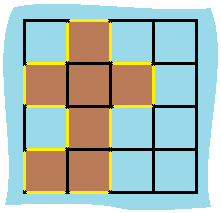

### 1. Description

You are given `row x col` `grid` representing a map where $\text{grid}[i][j] = 1$ represents land and $\text{grid}[i][j] = 0$ represents water.

Grid cells are connected **horizontally/vertically** (not diagonally). The `grid` is completely surrounded by water, and there is exactly one island (i.e., one or more connected land cells).

The island doesn't have "lakes", meaning the water inside isn't connected to the water around the island. One cell is a square with side length 1. The grid is rectangular, width and height don't exceed 100. Determine the perimeter of the island.

### 2. Function Contract

**Inputs**

- `grid`: A nonempty rectangular binary matrix containing exactly one orthogonally connected island.

**Return value**

- Return the number of unit edges separating a land cell from water or from the exterior of the grid.

Diagonal contact does not join cells and does not hide an edge.

### 3. Examples

#### Example 1

- **Input:** `grid = [[0,1,0,0],[1,1,1,0],[0,1,0,0],[1,1,0,0]]`
- **Output:** `16`
- **Explanation:** The perimeter is the 16 yellow stripes in the image above.
#### Example 2

- **Input:** `grid = [[1]]`
- **Output:** `4`
#### Example 3

- **Input:** `grid = [[1,0]]`
- **Output:** `4`

### 4. Constraints

- $row = \text{grid.length}$

- $col = \text{grid}[i].length$

- $1 \le row, col \le 100$

- $\text{grid}[i][j]$ is `0` or `1`.

- There is exactly one island in `grid`.