[TOC]

## Solution

---

### Approach 1: Simple Counting

**Intuition**

Go through every cell on the grid and whenever you are at cell
 `1` (land cell), look for surrounding (`UP`, `RIGHT`, `DOWN`, `LEFT`) cells. A land cell without any surrounding land cell will have a perimeter of `4`. Subtract `1` for each
 surrounding land cell.

 When you are at cell `0` (water cell), you don't need to do anything. Just proceed to another cell.

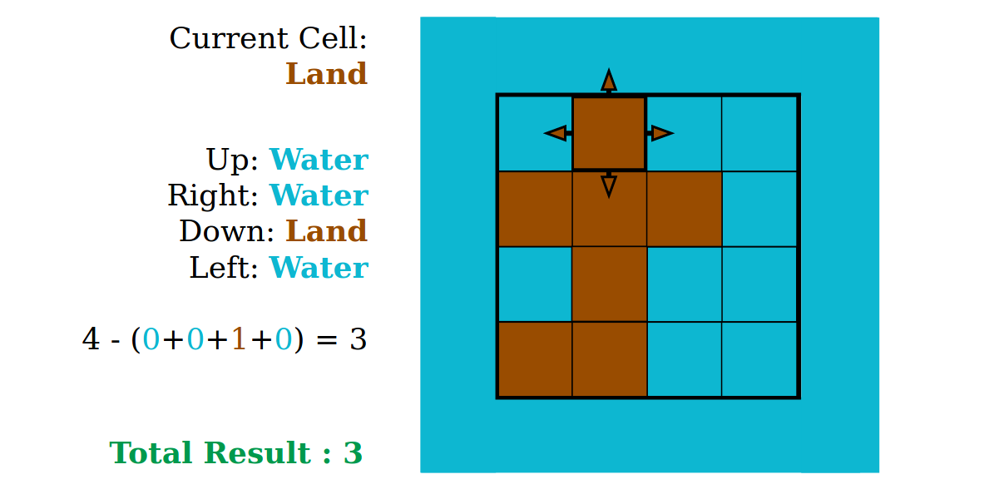


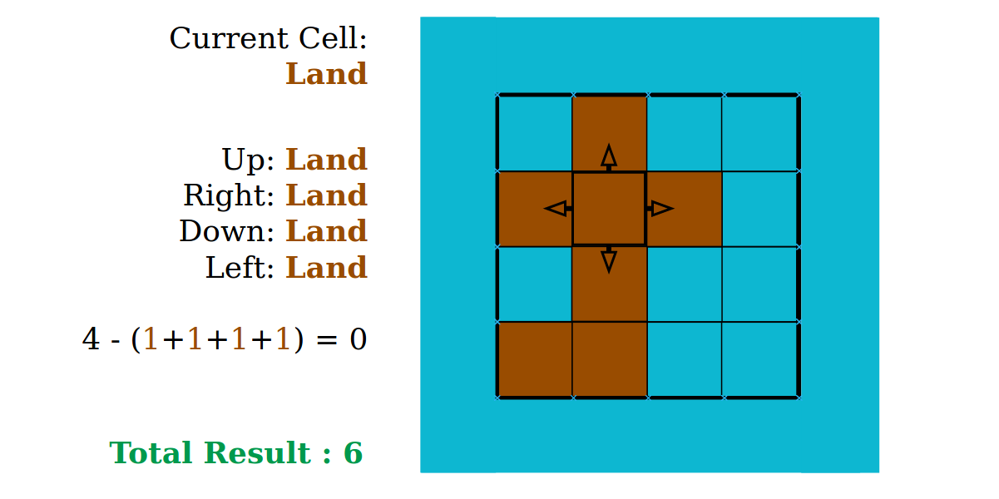

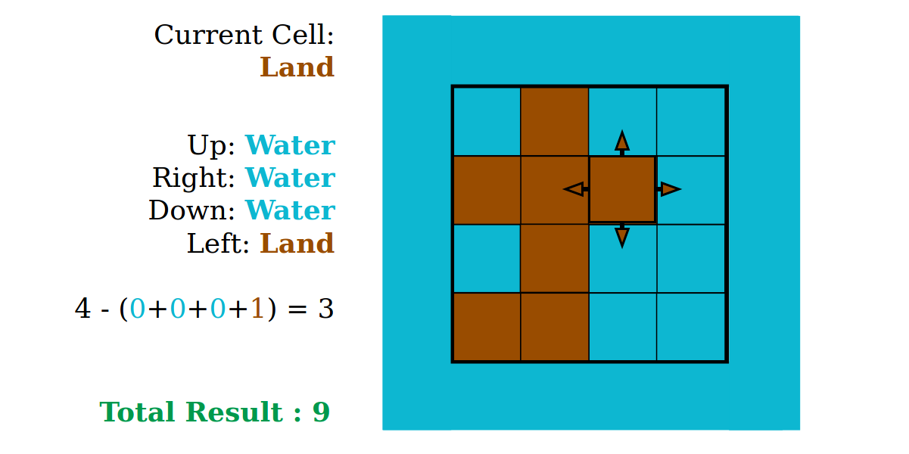

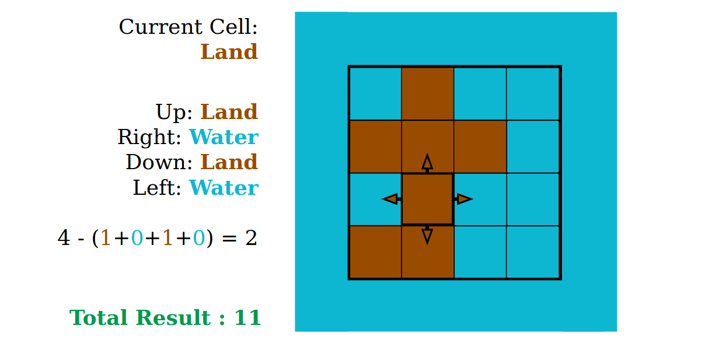


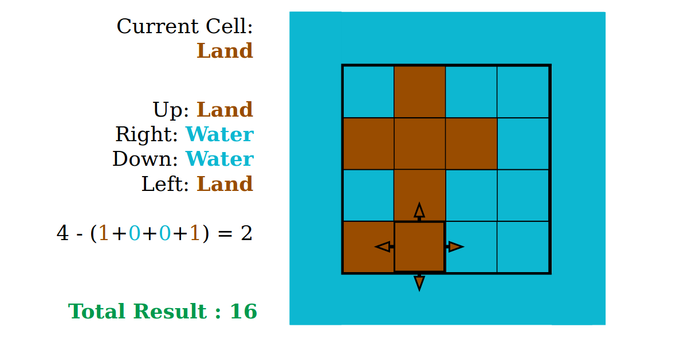

**Implementation**

```python
class Solution:
    def islandPerimeter(self, grid: List[List[int]]) -> int:

        rows = len(grid)
        cols = len(grid[0])

        result = 0

        for r in range(rows):
            for c in range(cols):
                if grid[r][c] == 1:
                    if r == 0:
                        up = 0
                    else:
                        up = grid[r-1][c]
                    if c == 0:
                        left = 0
                    else:
                        left = grid[r][c-1]
                    if r == rows-1:
                        down = 0
                    else:
                        down = grid[r+1][c]
                    if c == cols-1:
                        right = 0
                    else:
                        right = grid[r][c+1]

                    result += 4-(up+left+right+down)

        return result

```

**Complexity Analysis**

* Time complexity : $O(mn)$ where $m$ is the number of rows of the grid and $n$ is
the number of columns of the grid. Since two `for` loops  go through all
the cells on the grid, for a two-dimensional grid of size $m\times n$, the algorithm
would have to check $mn$ cells.

* Space complexity : $O(1)$. Only the `result` variable is updated and there is
no other space requirement.

<br />

---

### Approach 2: Better Counting

*Approach 2 has the same time and space complexity as Approach 1. Even though they
have the same time and space complexities, Approach 2 is slightly more efficient
than the Approach 1. Rather than checking 4 surrounding neighbors, we only need to check two neighbors (`LEFT` and `UP`) in Approach 2.*

**Intuition**

Since we are traversing the grid from left to right, and from top to bottom,
for each land cell we are currently at, we only need to check whether the
`LEFT` and `UP` cells are land cells with a slight modification on previous
approach.

* As you go through each cell on the grid, treat all the land cells as having a perimeter of `4` and add that up to the accumulated `result`.
* If that land cell has a neighboring land cell, remove `2` sides (one from each land cell) which will be touching between these two cells.
* If your current land cell has a `UP` land cell, subtract `2` from your accumulated `result`.
* If your current land cell has a `LEFT` land cell,
subtract `2` from your accumulated `result`.

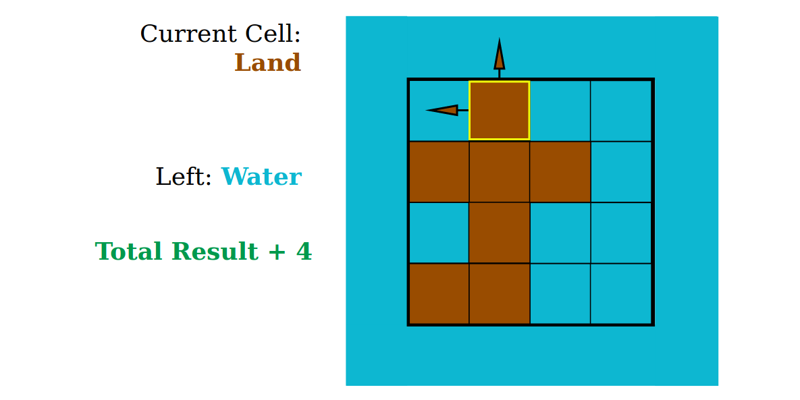

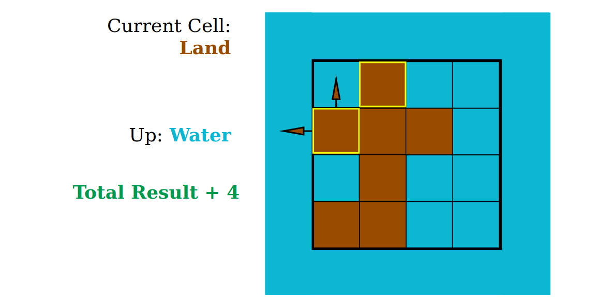

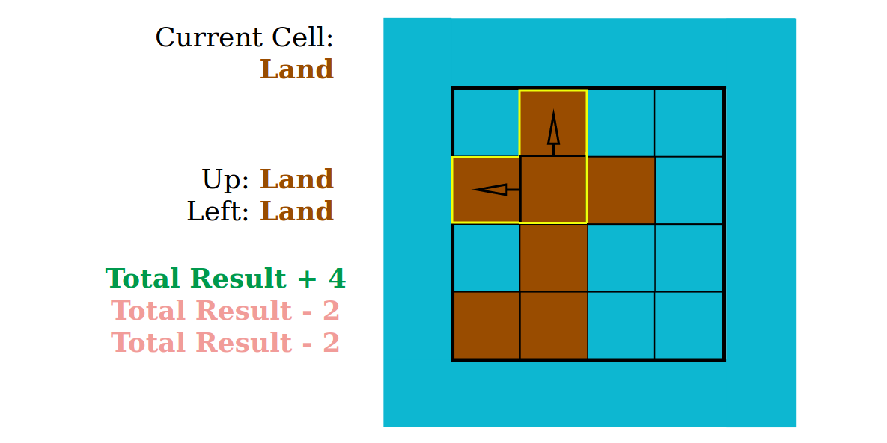

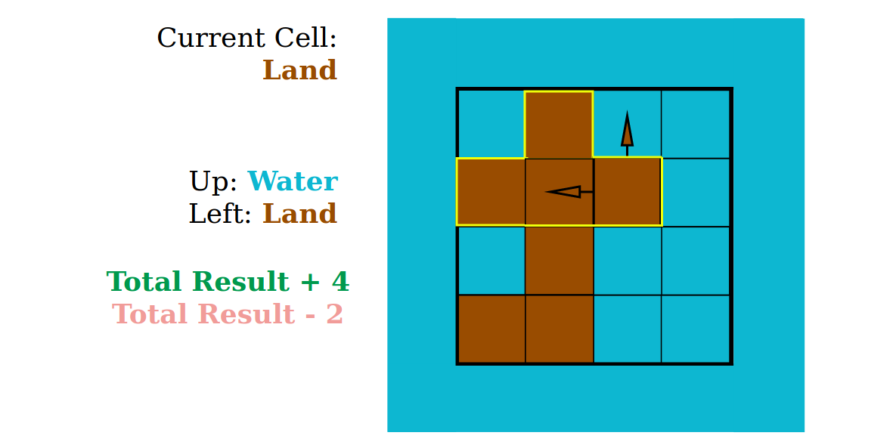

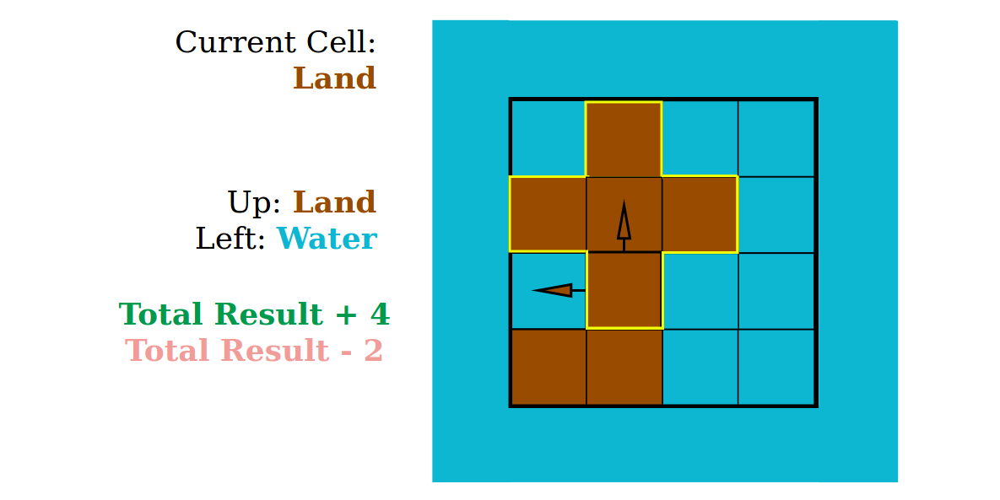

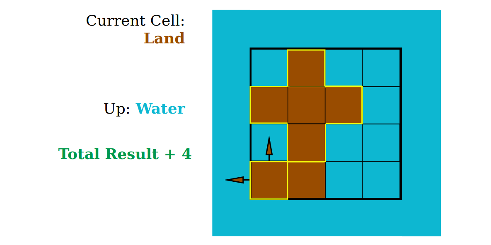

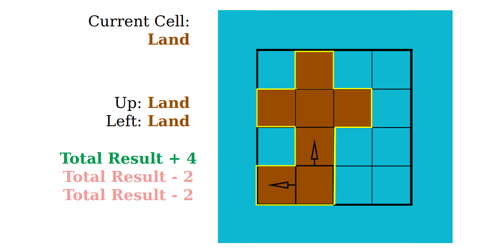

**Implementation**

```python
class Solution:
    def islandPerimeter(self, grid: List[List[int]]) -> int:
        rows = len(grid)
        cols = len(grid[0])

        result = 0

        for r in range(rows):
            for c in range(cols):
                if grid[r][c] == 1:
                    result += 4

                    if r > 0 and grid[r-1][c] == 1:
                        result -= 2

                    if c > 0 and grid[r][c-1] == 1:
                        result -= 2

        return result
```

**Complexity Analysis**

* Time complexity : $O(mn)$ where $m$ is the number of rows of the grid and $n$ is
the number of columns of the grid. Since two `for` loops  go through all
the cells on the grid, for a two-dimensional grid of size $m\times n$, the algorithm
would have to check $mn$ cells.

* Space complexity : $O(1)$. Only the `result` variable is updated and there is
no other space requirement.