## Solution

---

### Overview

> Rather than focusing on the debt relationships between each pair of individuals, we can direct our attention towards the **net balance** of each person. For instance, person 1 is owed $5$ by person 2, but owes $10$ to person 3 and $10$ to person 4. Therefore, person 1 owes a net $15$.

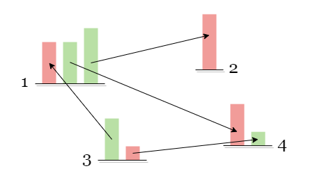

As a result, we can envision an "institution" independent of all persons. If a person has a positive balance, he can clear his debt by transferring his balance to the institution in one transaction. Likewise, if a person has a negative balance, he can also clear his debt by withdrawing the owed balance from the institution in a single transaction. Therefore, it would take a maximum of $n$ transactions to settle each person's debt.

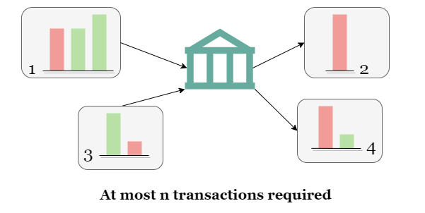

Additionally, we can even let one of the $n$ individuals act as the institution, so the other $n-1$ individuals can settle their debts in $n-1$ transactions. Since the total debt sum is 0, clearing the debts of the first $n-1$ individuals would automatically clear the debt of the $n^{th}$ person. Note that this idea applies to **any** group of people whose total debt sum is 0, not just all $n$ individuals as a group.

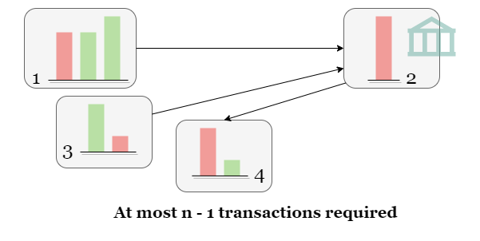

Consequently, our initial step involves calculating the **net balance** of each person from all transactions. If a person's total balance is not zero, we store his net balance in a list.

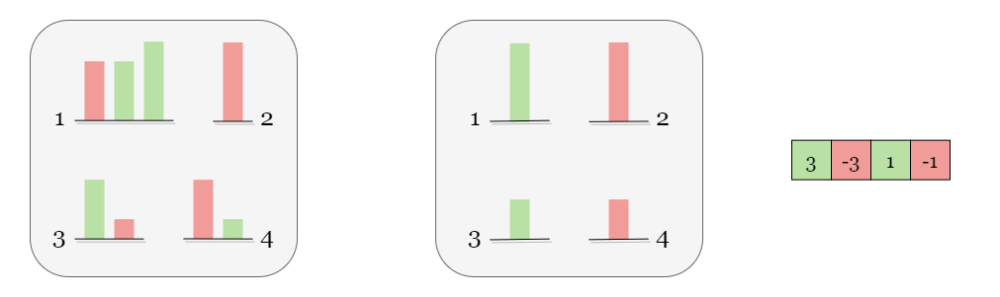

If the list is empty, it implies that all persons have zero debt, and the problem can be solved with 0 transactions. Otherwise, we will proceed with working on the list of net balances.

---

### Approach 1: Backtracking

#### Intuition

> If you are not familiar with recursion, please refer to our explore cards [Recursion Explore Card](https://leetcode.com/explore/featured/card/recursion-i/). We will focus on the usage in this article and not the implementation details.

Let's define a recursive function `dfs(cur)` as the minimum number of transactions required to settle the debts of all persons in the range `[cur:]` of the list. For instance, `dfs(0)` represents the minimum number of transactions to settle all the debts. `dfs(1)` represents the minimum number of transactions to settle the debts of all people except the first.

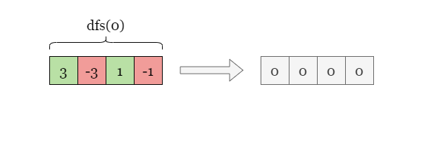

As depicted in the figure, the person `cur` has a net balance of $3$, we initiate a traversal of each person `nxt` from the subsequent position $cur + 1$ and attempt to transfer all of `cur`'s debt to `nxt`. After the transfer, `cur`'s debt is cleared, and we increment the number of transfers by 1. We then proceed to recursively process the next person $cur + 1$. In other words, $dfs(cur) = 1 + dfs(cur + 1)$.

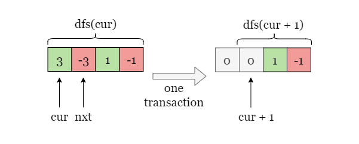

However, if person `cur` has zero balance, indicating that his debt has been cleared, and we proceed to the next person by calling $dfs(cur + 1)$ with no transaction required: $dfs(cur) = dfs(cur + 1)$.

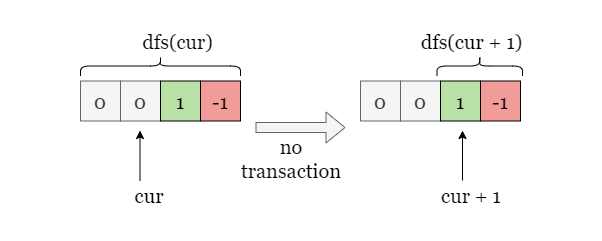

We can optimize the algorithm further by only attempting to transfer `cur`'s debt to individuals whose debts are non-zero and have the opposite sign to `cur`'s debt. For instance, if `cur`'s net balance is positive, we only consider individuals whose net balance is negative, and vice versa.

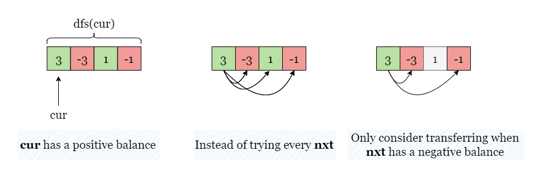

<br>

#### Algorithm

1) Create a hash map to store the **net balance** of each person.

2) Collect all non-zero net balance in an array $\text{balance}_{list}$.

3) Define a recursive function `dfs(cur)` to clear all balances in the range $\text{balance}_{list}[0 ~ cur]$:

4) Ignore `cur` if the balance is already 0. While $\text{balance}_{list}[cur] = 0$, proceed to the next person by incrementing `cur` by 1.

- If $cur = n$, return 0.
- Otherwise, set `cost` to a large integer like `inf`.

5) Traverse through the index of `nxt` from $cur + 1$, if $\text{balance}_{list}[nxt] * \text{balance}_{list}[cur] < 0$,
- add the balance of $\text{balance}_{list}[cur]$ to $\text{balance}_{list}[nxt]$: $\text{balance}_{list}[nxt] += \text{balance}_{list}[cur]$.
- recursively call $dfs(cur + 1)$ as $dfs(cur) = 1 + dfs(cur + 1)$.
- remove the previous transferred balance from `cur`: $\text{balance}_{list}[nxt] -= \text{balance}_{list}[cur]$ (backtrack).

6) Repeat from step 5 and keep tracking of the minimum number of operations of $cost = min(cost, 1 + dfs(cur + 1))$ encountered in the iteration. Return `cost` when the iteration is complete.

7) Return `dfs(0)`.

#### Implementation

```python
class Solution:
    def minTransfers(self, transactions: List[List[int]]) -> int:
        balance_map = collections.defaultdict(int)
        for a, b, amount in transactions:
            balance_map[a] += amount
            balance_map[b] -= amount

        balance_list = [amount for amount in balance_map.values() if amount]
        n = len(balance_list)

        def dfs(cur):
            while cur < n and not balance_list[cur]:
                cur += 1
            if cur == n:
                return 0
            cost = float('inf')
            for nxt in range(cur + 1, n):
                # If nxt is a valid recipient, do the following:
                # 1. add cur's balance to nxt.
                # 2. recursively call dfs(cur + 1).
                # 3. remove cur's balance from nxt.
                if balance_list[nxt] * balance_list[cur] < 0:
                    balance_list[nxt] += balance_list[cur]
                    cost = min(cost, 1 + dfs(cur + 1))
                    balance_list[nxt] -= balance_list[cur]
            return cost

        return dfs(0)
```

#### Complexity Analysis

Let $n$ be the length of `transactions`.

* Time complexity: $O((n - 1)!)$

- In `dfs(0)`, there exists a maximum of $n - 1$ persons as possible `nxt`, each of which leads to a recursive call to `dfs(1)`. Therefore, we have $\text{dfs}(0) \\= (n - 1) \cdot \text{dfs}(1) \\= (n - 1) \cdot ((n - 2) \cdot\text{dfs}(2)) \\= (n - 1) \cdot (n - 2) \cdot ((n - 3) \cdot\text{dfs}(3)) \\= ... \\= (n - 1)! \cdot\text{dfs}(n - 1)$

- $dfs(n - 1)$ can be determined in $O(1)$ time.

* Space complexity: $O(n)$
- Both $\text{balance}_{map}$ and $\text{balance}_{list}$ possess at most $n$ net balances.
- The space complexity of a recursive call relies on the maximum depth of the recursive call stack, which is equal to $n$. As each recursive call increments `cur` by 1, and each level consumes a constant amount of space.

<br/>

---

### Approach 2: Dynamic Programming

#### Intuition

> If you are not familiar with dynamic programming, please refer to our explore cards [Dynamic Programming Explore Card](https://leetcode.com/explore/featured/card/dynamic-programming/). We will focus on the usage in this article and not the implementation details.

In the earlier section on intuition, we discussed that for a group of `n` persons with a total balance of 0, only $n - 1$ transfers are needed to settle all debts. Therefore, this problem can be transformed into the question of **how many subgroups the balance list can be divided into such that the sum of balances in each subgroup is 0**.

As shown in the example below, the group of 4 requires 3 transactions. However, if we divide it into two subgroups of 0 balance, then we only need 1 transaction to settle each subgroup, resulting in a total of 2 transactions needed.

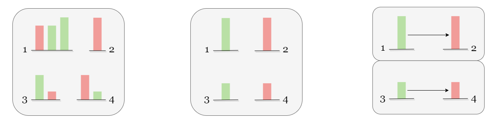

> In general, if we can divide $n$ persons into $m$ groups whose balance sum is 0, then it only takes $n - m$ transactions. Each group we create saves us one transaction.

Our initial step involves storing the **non-zero net balance** of each person in a list.


To save time and space, we use a binary number to indicate which people are in the group, with the lowest bit set to 1 to denote that the $0^{th}$ person is in the group, and so on. This method is often referred to as bitmask.

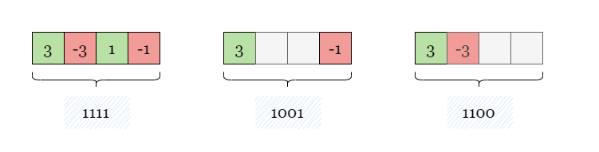

We get the optimal solution to the original problem by recursively searching for the optimal solutions to subproblems.

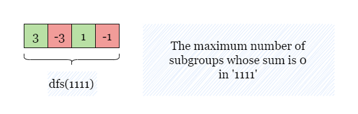

We remove one person from the current group at a time and recursively find the optimal solution for that subgroup. Taking the figure as an example, the current problem is the group that contains all four persons, represented by the binary number `1111`. Hence, we need to traverse four subgroups (`0111`, `1011`, `1101`, `1110`) and find the optimal solution for each of these subproblems.

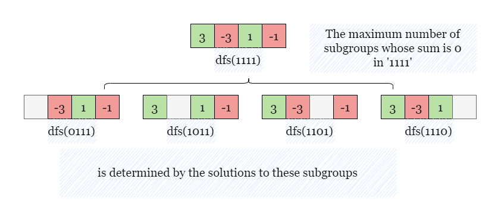

Once we obtain the optimal solution to the subproblems, an important step is still missing: if the total balance of the current group is zero, it means that the sum of each subproblem is not zero (since each subproblem is obtained by removing a non-zero balance from the current problem). Therefore, the non-zero part of the subproblem, plus the balance of the additional person in the current problem, make up an additional group whose sum is zero. Thus, the optimal solution to the current problem is the maximum optional solution to its subproblems **plus 1**. However, if the total balance of the current group is not zero, this property does not hold.

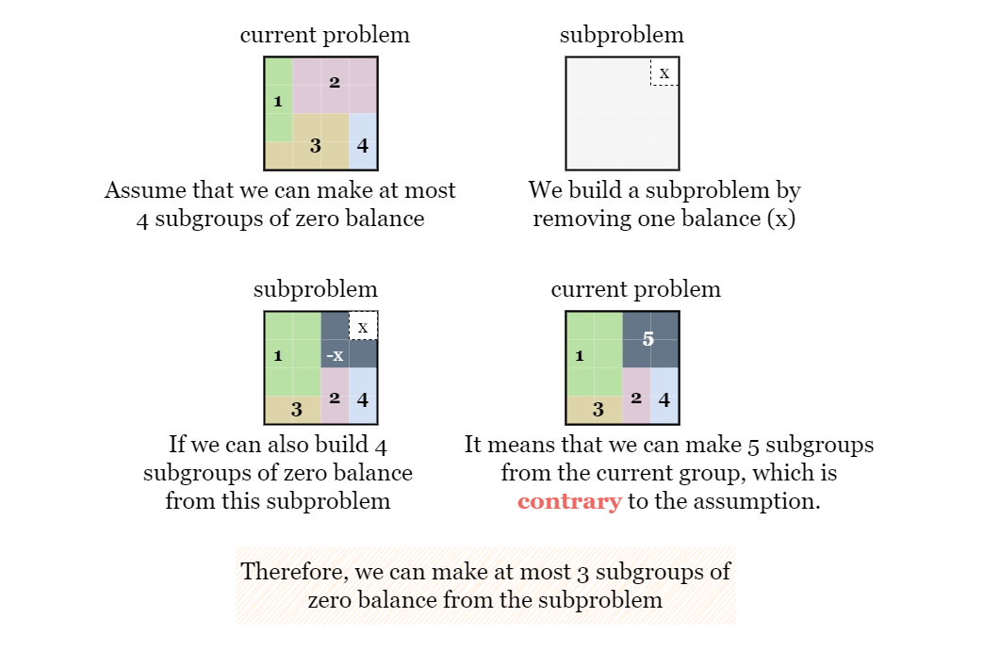

Therefore, as shown in the example below, if the current problem $1111 = (3, -3, 1, -1)$ has a total balance of `0`, thus `dfs(1111)` is one more than the maximum result from its subproblems `dfs(1110)`, `dfs(1101)`, `dfs(1011)`, and `dfs(0111)`.

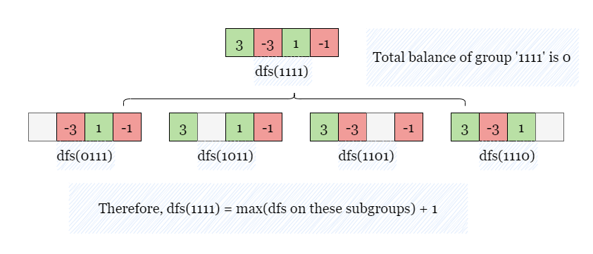

The maximum result of its subproblems is `1`, thus `dfs(1111)` is equal to $1 + 1$.

Additionally, we use memoization to store the maximum value obtained by each bitmask. This helps us avoid re-solving the same subproblems multiple times and significantly reduces the time complexity of the algorithm.

<br>

#### Algorithm

1) Create an array `memo` of length $2^n$, with all values initialized to -1, as memory.

2) Collect all non-zero net balances in the array $\text{balance}_{list}$.

3) Define a recursive function $dfs(\text{total}_{mask})$ to divide $\text{total}_{mask}$ into the largest possible number of subgroups whose sum is 0.
- If $memo[\text{total}_{mask}]$ is not equal to `-1`, return $memo[\text{total}_{mask}]$.
- For each bit $\text{cur}_{mask}$ in $\text{total}_{mask}$ that is 1, remove this bit and recursively call $dfs(\text{total}_{mask} ^ \text{cur}_{mask})$. Keep track of `answer`, the maximum result from these subproblems.
- If the sum of balances of $\text{total}_{mask}$ is zero, return $answer + 1$. Otherwise, return `answer`.

4) Return $n - dfs((1 << n) - 1)$.

#### Implementation

```python
class Solution:
    def minTransfers(self, transactions: List[List[int]]) -> int:
        balance_map = collections.defaultdict(int)
        for a, b, amount in transactions:
            balance_map[a] += amount
            balance_map[b] -= amount

        balance_list = [amount for amount in balance_map.values() if amount]
        n = len(balance_list)

        memo = [-1] * (1 << n)
        memo[0] = 0

        def dfs(total_mask):
            if memo[total_mask] != -1:
                return memo[total_mask]
            balance_sum, answer = 0, 0

            # Remove one person at a time in total_mask
            for i in range(n):
                cur_bit = 1 << i
                if total_mask & cur_bit:
                    balance_sum += balance_list[i]
                    answer = max(answer, dfs(total_mask ^ cur_bit))

            # If the total balance of total_mask is 0, increment answer by 1.
            memo[total_mask] = answer + (balance_sum == 0)
            return memo[total_mask]

        return n - dfs((1 << n) - 1)
```

#### Complexity Analysis

Let $n$ be the length of `transactions`.

* Time complexity: $O(n \cdot 2^n)$
- We build `memo`, an array of size $O(2^n)$ as memory, equal to the number of possible states. Each state is computed with a traverse through $\text{balance}_{list}$, which takes $O(n)$ time.

* Space complexity: $O(2^n)$
- The length of `memo` is $2^n$.
- The space complexity of a recursive call depends on the maximum depth of the recursive call stack, which is $n$. As each recursive call removes one set bit from $\text{total}_{mask}$. Therefore, at most $O(n)$ levels of recursion will be created, and each level consumes a constant amount of space.

<br/>