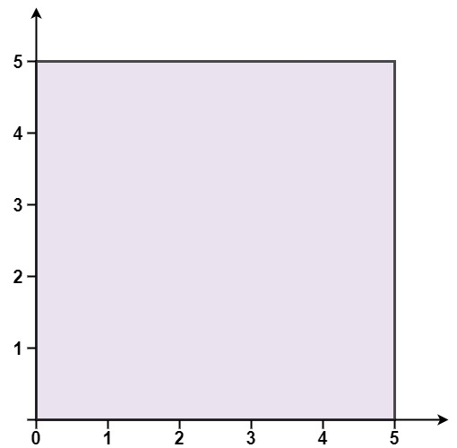
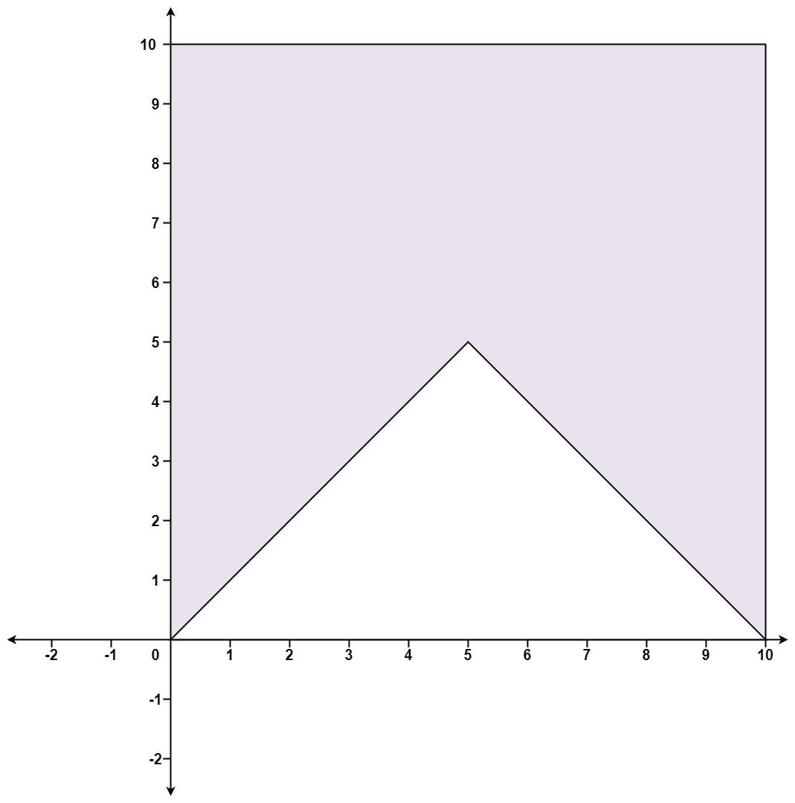

### 1. Description

You are given an array of points on the **X-Y** plane `points` where $\text{points}[i] = [x_{i}, y_{i}]$. The points form a polygon when joined sequentially.

Return `true` if this polygon is <a href="http://en.wikipedia.org/wiki/Convex_polygon" target="_blank">convex</a> and `false` otherwise.

You may assume the polygon formed by given points is always a <a href="http://en.wikipedia.org/wiki/Simple_polygon" target="_blank">simple polygon</a>. In other words, we ensure that exactly two edges intersect at each vertex and that edges otherwise don't intersect each other.

### 2. Function Contract

**Inputs**

- `points`: The unique polygon vertices $[x_{i}, y_{i}]$ in sequential boundary order.

**Return value**

- Return `True` if the polygon is convex; otherwise, return `False`.

The given order already defines the polygon boundary, including the closing edge from the final point back to the first.

### 3. Examples

#### Example 1

- **Input:** $points = [[0,0],[0,5],[5,5],[5,0]]$
- **Output:** `true`

#### Example 2

- **Input:** $points = [[0,0],[0,10],[10,10],[10,0],[5,5]]$
- **Output:** `false`

### 4. Constraints

- $3 \le \text{points.length} \le 10^{4}$

- $\text{points}[i].length = 2$

- $-10^{4} \le x_{i}, y_{i} \le 10^{4}$

- All the given points are **unique**.
