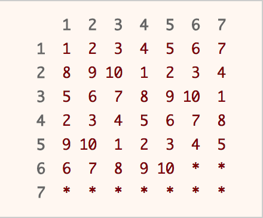

[TOC]

## Solution

---

### Approach 1: Rejection Sampling

**Intuition**

What if you could generate a random integer in the range 1 to 49? How would you generate a random integer in the range of 1 to 10? What would you do if the generated number is in the desired range? What if it is not?

**Algorithm**

This solution is based upon [Rejection Sampling](https://en.wikipedia.org/wiki/Rejection_sampling). The main idea is when you generate a number in the desired range, output that number immediately. If the number is out of the desired range, reject it and re-sample again. As each number in the desired range has the same probability of being chosen, a uniform distribution is produced.

Obviously, we have to run rand7() function at least twice, as there are not enough numbers in the range of 1 to 10. By running rand7() twice, we can get integers from 1 to 49 uniformly. Why?

<br/>

<p align="center">


<br/>

A table is used to illustrate the concept of rejection sampling. Calling rand7() twice will get us row and column index that corresponds to a unique position in the table above. Imagine that you are choosing a number randomly from the table above. If you hit a number, you return that number immediately. If you hit a * , you repeat the process again until you hit a number.
</p>

Since 49 is not a multiple of 10, we have to use rejection sampling. Our desired range is integers from 1 to 40, which we can return the answer immediately. If not (the integer falls between 41 to 49), we reject it and repeat the whole process again.

```cpp
class Solution {
public:
    int rand10() {
        int row, col, idx;
        do {
            row = rand7();
            col = rand7();
            idx = col + (row - 1) * 7;
        } while (idx > 40);
        return 1 + (idx - 1) % 10;
    }
};
```

**Complexity Analysis**

* Time Complexity: $O(1)$ average, but  $O(\infty)$ worst case.

The [expected value](https://en.wikipedia.org/wiki/Expected_value) $E$ for the number of calls to `rand7()` can be computed as follows:

Either we succeed in one try (with two `rand7()`), or we need to continue:

$E = \frac{40}{49}2 + (1-\frac{40}{49})(2+E)$

Solve it and we have

$E = \frac{49}{20} = 2.45$

* Space Complexity: $O(1)$.

<br/>

---

### Approach 2: Utilizing out-of-range samples

**Intuition**

There are a total of 2.45 calls to rand7() on average when using approach 1. Can we do better? Glad that you asked. In fact, we are able to improve average number of calls to rand7() by about 10%.

The idea is that we should not throw away the out-of-range samples, but instead use them to increase our chances of finding an in-range sample on the successive call to rand7.

**Algorithm**

Start by generating a random integer in the range 1 to 49 using the aforementioned method. In the event that we could not generate a number in the desired range (1 to 40), it is equally likely that each number of 41 to 49 would be chosen. In other words, we are able to obtain integers in the range of 1 to 9 uniformly. Now, run rand7() again to obtain integers in the range of 1 to 63 uniformly. Apply rejection sampling where the desired range is 1 to 60. If the generated number is in the desired range (1 to 60), we return the number. If it is not (61 to 63), we at least obtain integers of 1 to 3 uniformly. Run rand7() again to obtain integers in the range of 1 to 21 uniformly. The desired range is 1 to 20, and in the unlikely event we get a 21, we reject it and repeat the entire process again.

```cpp
class Solution {
public:
    int rand10() {
        int a, b, idx;
        while (true) {
            a = rand7();
            b = rand7();
            idx = b + (a - 1) * 7;
            if (idx <= 40)
                return 1 + (idx - 1) % 10;
            a = idx - 40;
            b = rand7();
            // get uniform dist from 1 - 63
            idx = b + (a - 1) * 7;
            if (idx <= 60)
                return 1 + (idx - 1) % 10;
            a = idx - 60;
            b = rand7();
            // get uniform dist from 1 - 21
            idx = b + (a - 1) * 7;
            if (idx <= 20)
                return 1 + (idx - 1) % 10;
        }
    }
};
```

**Complexity Analysis**

* Time Complexity: $O(1)$ average, but  $O(\infty)$ worst case.

The [expected value](https://en.wikipedia.org/wiki/Expected_value) $E$ for the number of calls to `rand7()` can be computed as follows (with some steps omitted due to tediousness):

Either we succeed in one try (with at most four `rand7()`), or we need to continue:

$$\begin{aligned}
E = \frac{40}{49}2 + (1-\frac{40}{49})\frac{60}{63}3 \&+ (1-\frac{40}{49})(1-\frac{60}{63})\frac{20}{21}4 \\
   \&+ (1-\frac{40}{49})(1-\frac{60}{63})(1-\frac{20}{21})(4+E)
\end{aligned}$$

$E = \frac{329}{150} \approx 2.19333$

* Space Complexity: $O(1)$.