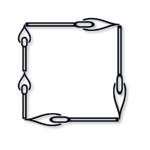

### 1. Description

You are given an integer array `matchsticks` where $\text{matchsticks}[i]$ is the length of the $i^{\text{th}}$ matchstick. You want to use **all the matchsticks** to make one square. You **should not break** any stick, but you can link them up, and each matchstick must be used **exactly one time**.

Return `true` if you can make this square and `false` otherwise.

### 2. Function Contract

**Inputs**

- `matchsticks`: the array of positive integer matchstick lengths

**Return value**

- Return `true` exactly when all sticks can be partitioned among four sides having the same total length; otherwise
  return `false`.

Each array entry represents a separate physical stick. Every entry must contribute to one side in full, without
splitting or leaving any stick unused.

### 3. Examples

#### Example 1

- **Input:** $matchsticks = [1,1,2,2,2]$
- **Output:** `true`
- **Explanation:** You can form a square with length 2, one side of the square came two sticks with length 1.

#### Example 2

- **Input:** $matchsticks = [3,3,3,3,4]$
- **Output:** `false`
- **Explanation:** You cannot find a way to form a square with all the matchsticks.

### 4. Constraints

- $1 \le \text{matchsticks.length} \le 15$

- $1 \le \text{matchsticks}[i] \le 10^{8}$
