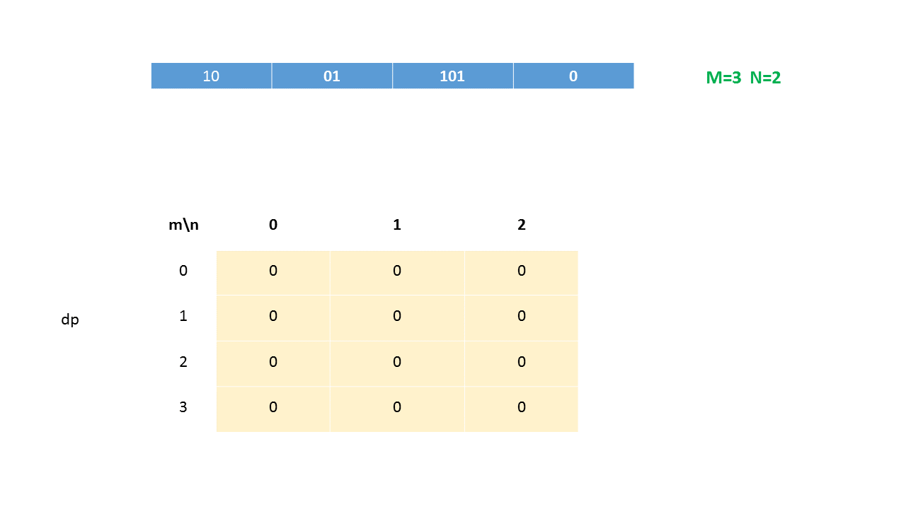
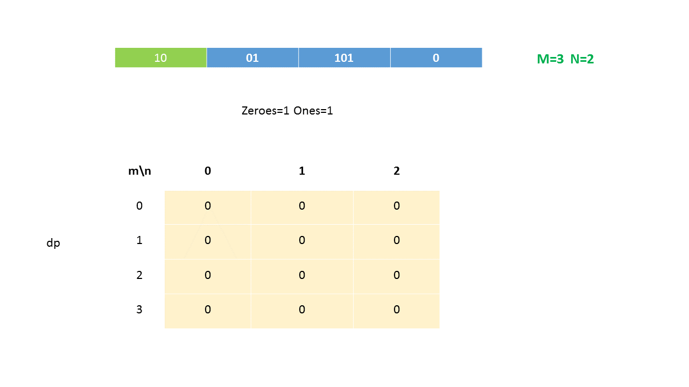
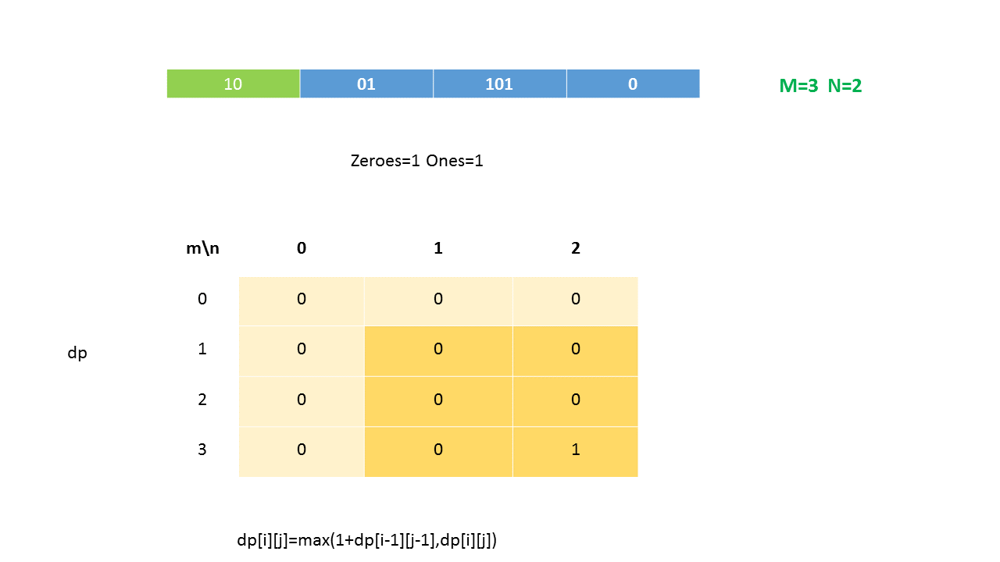
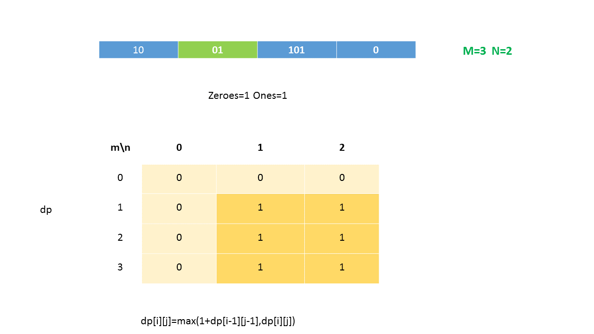
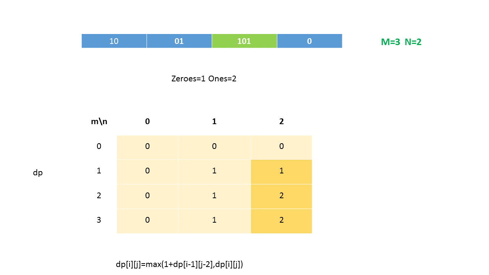
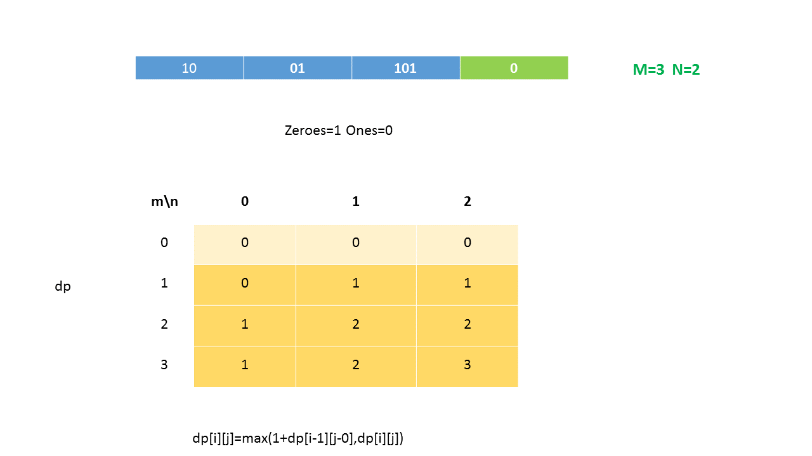
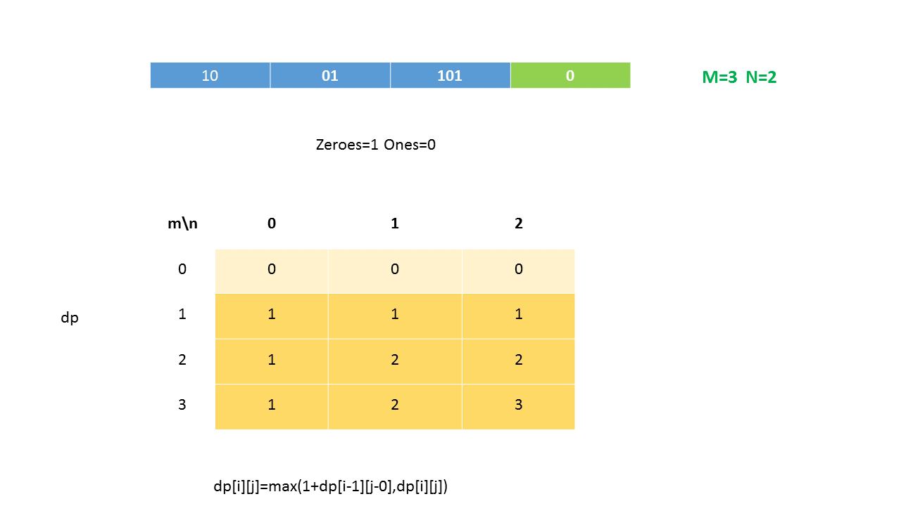
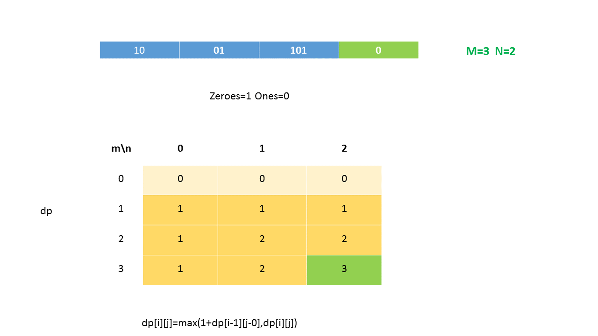

## Solution

---
### Approach #1 Brute Force [Time Limit Exceeded]

In the brute force approach we will consider every subset of $strs$ array and count the total number of zeroes and ones in that subset. The subset with zeroes less than equal to $m$ and ones less than equal to $n$ will be considered as the valid subsets. The maximum length subset among all valid subsets will be  our required subset.

Obviously, there are $2^n$ subsets possible for the list of length $n$ and here we are using int(32 bits) for iterating every subset. So this method will not work for the list having length greater than 32.

```java
public class Solution {
    public int findMaxForm(String[] strs, int m, int n) {
        int maxlen = 0;
        for (int i = 0; i < (1 << strs.length); i++) {
            int zeroes = 0, ones = 0, len = 0;
            for (int j = 0; j < strs.length; j++) {
                if ((i & (1 << j)) != 0) {
                    int[] count = countzeroesones(strs[j]);
                    zeroes += count[0];
                    ones += count[1];
                    len++;
                }
            }
            if (zeroes <= m && ones <= n)
                maxlen = Math.max(maxlen, len);
        }
        return maxlen;

    }
    public int[] countzeroesones(String s) {
        int[] c = new int[2];
        for (int i = 0; i < s.length(); i++) {
            c[s.charAt(i)-'0']++;
        }
        return c;
    }
}

```

**Complexity Analysis**

* Time complexity : $O(2^l*x)$. $2^l$ possible subsets, where $l$ is the length of the list $strs$ and $x$ is the average string length.

* Space complexity : $O(1)$. Constant Space required.

---
### Approach #2 Better Brute Force [Time Limit Exceeded]

**Algorithm**

In the previous approach we were considering every possible subset and then we were counting its zeroes and ones. We can limit the number of subsets by breaking the loop when total number of zeroes exceed $m$ or total number of ones exceed $n$. This will reduce little computation not the complexity.

```java
public class Solution {
    public int findMaxForm(String[] strs, int m, int n) {
        int maxlen = 0;
        for (int i = 0; i < (1 << strs.length); i++) {
            int zeroes = 0, ones = 0, len = 0;
            for (int j = 0; j < 32; j++) {
                if ((i & (1 << j)) != 0) {
                    int[] count = countzeroesones(strs[j]);
                    zeroes += count[0];
                    ones += count[1];
                    if (zeroes > m || ones > n)
                        break;
                    len++;
                }
            }
            if (zeroes <= m && ones <= n)
                maxlen = Math.max(maxlen, len);
        }
        return maxlen;
    }
    public int[] countzeroesones(String s) {
        int[] c = new int[2];
        for (int i = 0; i < s.length(); i++) {
            c[s.charAt(i)-'0']++;
        }
        return c;
    }
}

```

**Complexity Analysis**

* Time complexity : $O(2^l*x)$. $2^l$ possible subsets, where $l$ is the length of the list $strs$ and $x$ is the average string length.

* Space complexity : $O(1)$. Constant Space required.

---

### Approach #3 Using Recursion [Time Limit Exceeded]

**Algorithm**

In the above approaches we were considering every subset iteratively. The subset formation can also be done in a recursive manner. For this, we make use of a function `calculate(strs, i, ones, zeroes)`. This function takes the given list of strings $strs$ and gives the size of the largest subset with $ones$ 1's and $zeroes$  0's considering the strings lying after the $i^{th}$ index(including itself) in $strs$.

Now, in every function call of `calculate(...)`, we can:

1. Include the current string in the subset currently being considered. But if we include the current string, we'll need to deduct the number of 0's and 1's in the current string from the total available respective counts. Thus, we make a function call of the form $calculate(strs,i+1,zeroes-zeroes_{current\_string},ones-ones_{current\_string})$. We also need to increment the total number of strings considered so far by 1. We store the result obtained from this call(including the +1) in $taken$ variable.

2. Not include the current string in the current subset. In this case, we need not update the count of $ones$ and $zeroes$. Thus, the new function call takes the form $calculate(strs,i+1,zeroes,ones)$. The result obtained from this function call is stored in $notTaken$ variable.

The larger value out of $taken$ and $notTaken$ represents the required result to be returned for the current function call.

Thus, the function call $calculate(strs, 0, m, n)$ gives us the required maximum number of subsets possible satisfying the given constraints.

```java
public class Solution {
    public int findMaxForm(String[] strs, int m, int n) {
        return calculate(strs, 0, m, n);
    }
    public int calculate(String[] strs, int i, int zeroes, int ones) {
        if (i == strs.length)
            return 0;
        int[] count = countzeroesones(strs[i]);
        int taken = -1;
        if (zeroes - count[0] >= 0 && ones - count[1] >= 0)
            taken = calculate(strs, i + 1, zeroes - count[0], ones - count[1]) + 1;
        int not_taken = calculate(strs, i + 1, zeroes, ones);
        return Math.max(taken, not_taken);
    }
    public int[] countzeroesones(String s) {
        int[] c = new int[2];
        for (int i = 0; i < s.length(); i++) {
            c[s.charAt(i)-'0']++;
        }
        return c;
    }
}
```

**Complexity Analysis**
* Time complexity : $O(2^l*x)$. $2^l$ possible subsets, where $l$ is the length of the list $strs$ and $x$ is the average string length.

* Space complexity : $O(l)$. Depth of recursion tree grows upto $l$.

---
### Approach #4 Using Memoization [Accepted]

**Algorithm**

In the recursive approach just discussed, a lot of redundant function calls will be made taking the same values of $(i, zeroes, ones)$. This redundancy in the recursive tree can be pruned off by making use of a 3-D memoization array, $memo$.

$\text{memo}[i][j][k]$ is used to store the result obtained for the function call `calculate(strs, i, j, k)`. Or in other words, it stores the maximum number of subsets possible considering the strings starting from the $i^{th}$ index onwards, provided only $j$ 0's and $k$ 1's are available to be used.

Thus, whenever $\text{memo}[i][j][k]$ already contains a valid entry, we need not make use of the function calls again, but we can pick up the result directly from the $memo$ array.

The rest of the procedure remains the same as that of the recursive approach.

```java
public class Solution {
    public int findMaxForm(String[] strs, int m, int n) {
        int[][][] memo = new int[strs.length][m + 1][n + 1];
        return calculate(strs, 0, m, n, memo);
    }
    public int calculate(String[] strs, int i, int zeroes, int ones, int[][][] memo) {
        if (i == strs.length)
            return 0;
        if (memo[i][zeroes][ones] != 0)
            return memo[i][zeroes][ones];
        int[] count = countzeroesones(strs[i]);
        int taken = -1;
        if (zeroes - count[0] >= 0 && ones - count[1] >= 0)
            taken = calculate(strs, i + 1, zeroes - count[0], ones - count[1], memo) + 1;
        int not_taken = calculate(strs, i + 1, zeroes, ones, memo);
        memo[i][zeroes][ones] = Math.max(taken, not_taken);
        return memo[i][zeroes][ones];
    }
    public int[] countzeroesones(String s) {
        int[] c = new int[2];
        for (int i = 0; i < s.length(); i++) {
            c[s.charAt(i)-'0']++;
        }
        return c;
    }
}

```

**Complexity Analysis**

* Time complexity : $O(l*m*n)$. $memo$ array of size $l*m*n$ is filled, where $l$ is the length of $strs$, $m$ and $n$ are the number of zeroes and ones respectively.

* Space complexity : $O(l*m*n)$. 3D array $memo$ is used.

---
### Approach #5 Dynamic Programming [Accepted]

**Algorithm**

This problem can be solved by using 2-D Dynamic Programming. We can make use of a $dp$ array, such that an entry $\text{dp}[i][j]$ denotes the maximum number of strings that can be included in the subset given only $i$ 0's and $j$ 1's are available.

Now, let's look at the process by which we'll fill the $dp$ array. We traverse the given list of strings one by one. Suppose, at some point, we pick up any string $s_k$ consisting of $x$ zeroes and $y$ ones. Now, choosing to put this string in any of the subset possible by using the previous strings traversed so far will impact the element denoted by $\text{dp}[i][j]$ for $i$ and $j$ satisfying $x ≤ i ≤ m$, $y ≤ j ≤ n$. This is because for entries $\text{dp}[i][j]$ with $i < x$ or $j < y$, there won't be sufficient number of 1's and 0's available to accomodate the current string in any subset.

Thus, for every string encountered, we need to appropriately update the $dp$ entries within the correct range.

Further, while updating the $dp$ values, if we consider choosing the current string to be a part of the subset, the updated result will depend on whether it is profitable to include the current string in any subset or not. If included in the subset, the $\text{dp}[i][j]$ entry needs to be updated as $\text{dp}[i][j]=1 + dp[i - zeroes_{current\_string}][j - ones_{current\_string}]$, where the factor of +1 takes into account the number of elements in the current subset being increased due to a new entry.

But, it could be possible that the current string could be so long that it could be profitable not to include it in any of the subsets. Thus, the correct equation for $dp$ updation becomes:

$\text{dp}[i][j]= max(1+dp[i - zeroes_{current\_string}][j - ones_{current\_string}],\text{dp}[i][j])$

Thus, after the complete list of strings has been traversed, $\text{dp}[m][n]$ gives the required size of the largest subset.

Watch this animation for clear understanding:




















```java
public class Solution {
    public int findMaxForm(String[] strs, int m, int n) {
        int[][] dp = new int[m + 1][n + 1];
        for (String s: strs) {
            int[] count = countzeroesones(s);
            for (int zeroes = m; zeroes >= count[0]; zeroes--)
                for (int ones = n; ones >= count[1]; ones--)
                    dp[zeroes][ones] = Math.max(1 + dp[zeroes - count[0]][ones - count[1]], dp[zeroes][ones]);
        }
        return dp[m][n];
    }
    public int[] countzeroesones(String s) {
        int[] c = new int[2];
        for (int i = 0; i < s.length(); i++) {
            c[s.charAt(i)-'0']++;
        }
        return c;
    }
}

```

**Complexity Analysis**

* Time complexity : $O(l*m*n)$. Three nested loops are their, where $l$ is the length of $strs$, $m$ and $n$ are the number of zeroes and ones respectively.

* Space complexity : $O(m*n)$. $dp$ array of size $m*n$ is used.