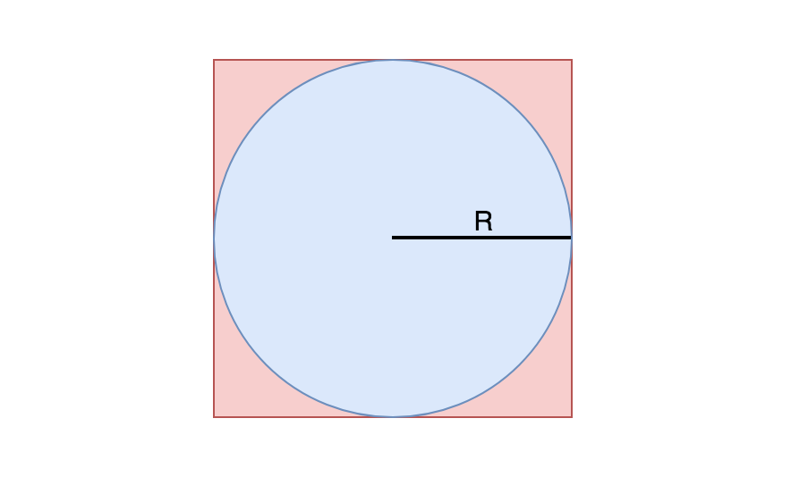

## Solution
---

### Approach 1: Rejection Sampling

**Intuition**

It is easy to generate a random point in a square. Could we use randomly generated points in a square to get random points in a circle? Which generated points could we use, and which ones would we need to toss away? How often would we generate points that we could use?

**Algorithm**

<p align="center">
    

A square of size length 2R overlaid with a circle of radius R.

</p>

To get uniform random points in a circle $C$ of radius $R$, we can generate uniform random points in the square $S$ of side length $2R$, keeping all of the points which are at most [euclidean distance](https://en.wikipedia.org/wiki/Euclidean_distance) $R$ from the center, and rejecting all which are farther away than that. This technique is called [rejection sampling](https://en.wikipedia.org/wiki/Rejection_sampling). Each possible location on the circle has the same probability of being generated, so the sampling of points will be uniformly distributed.

The area of the square is $(2R)^2 = 4R^2$ and the area of the circle is $\pi R^2 \approx  3.14R^2$. $\dfrac{3.14R^2}{4R^2} = \dfrac{3.14}{4} = .785$. Therefore, we will get a usable sample approximately $78.5\%$ of the time and the expected number of times that we will need to sample until we get a usable sample is $\dfrac{1}{.785} \approx 1.274$ times.

```cpp
class Solution {
public:
    double rad, xc, yc;
    //c++11 random floating point number generation
    mt19937 rng{random_device{}()};
    uniform_real_distribution<double> uni{0, 1};

    Solution(double radius, double x_center, double y_center) {
        rad = radius, xc = x_center, yc = y_center;
    }

    vector<double> randPoint() {
        double x0 = xc - rad;
        double y0 = yc - rad;

        while(true) {
            double xg = x0 + uni(rng) * 2 * rad;
            double yg = y0 + uni(rng) * 2 * rad;
            if (sqrt(pow((xg - xc), 2) + pow((yg - yc), 2)) <= rad)
                return {xg, yg};
        }
    }
};
```

**Complexity Analysis**

* Time Complexity: $O(1)$ on average. $O(\infty)$ worst case. (per $\text{randPoint}$ call)
* Space Complexity: $O(1)$.

<br/>

---

### Approach 2: Inverse Transform Sampling (Math)

**Disclaimer**

This solution relies on advanced math which is not expected knowledge for a coding interview. It is presented here only for educational purposes.

**Algorithm**

Assume that we are given a circle $C$ of radius $1$ that is centered at the [origin](https://en.wikipedia.org/wiki/Origin_(mathematics)), and our task is to sample uniform random points on this circle.

Lets imagine another circle $B$ of radius $\frac{1}{2}$ which is also centered at the origin.

The circumference of $C$ is twice the circumference of $B$, because the circumference of a circle is [directly proportional](https://en.wikipedia.org/wiki/Proportionality_(mathematics)#Direct_proportionality) to the radius. Also, the probability of sampling a point from a subregion in circle $C$ is directly proportional to the area of the subregion. Therefore, the probability of sampling a point on the perimeter of $C$ is twice that of sampling a point on the perimeter of $B$.

More generally, what is implied is that the sampling probability is directly proportional to the distance from the origin, from $0$ up to $R$. This can be modeled as a [probability density function](https://en.wikipedia.org/wiki/Probability_density_function) $f$, where $x$ is the distance from the origin and $f(x)$ is the relative sampling probability at $x$.

The area under any probability density function curve must be $1$. Therefore, the equation must be $f(x) = 2x$.

Using our probability density function $f$, we can compute the [cumulative distribution function](https://en.wikipedia.org/wiki/Cumulative_distribution_function) $F$, where $F(x)$ is the probability of sampling a point within a distance of $x$ from the origin.

The cumulative distribution function is the integral of the probability density function.

$F(x) = \int{f(x)} = \int{2x} = x^2$

Lastly, we can use our cumulative distribution function $F$ to compute the inverse cumulative distribution function $F^{-1}$, which accepts uniform random value between $0$ and $1$ and returns a random distance from origin in accordance with $f$. $^{[\dagger]}$

$$
\begin{aligned}
& F^{-1}(F(x)) = x \\
& F^{-1}(x^2) = x \\
& F^{-1}(x) = \sqrt{x}
\end{aligned}
$Now, to generate a uniform random point on$C$, we just need to compute a random distance$D$from origin using$F^{-1}$and a uniform random angle$\theta$over the range$[0, 2 \cdot PI)$$.

The points will be generated as [polar coordinates](https://en.wikipedia.org/wiki/Polar_coordinate_system). To convert to [cartesian coordinates](https://en.wikipedia.org/wiki/Cartesian_coordinate_system), we can use the following formulas.

$$
X = D \cdot \cos(\theta) \\
Y = D \cdot \sin(\theta)
$$

```cpp
class Solution {
public:
    double rad, xc, yc;
    //c++11 random floating point number generation
    mt19937 rng{random_device{}()};
    uniform_real_distribution<double> uni{0, 1};

    Solution(double radius, double x_center, double y_center) {
        rad = radius, xc = x_center, yc = y_center;
    }

    vector<double> randPoint() {
        double d = rad * sqrt(uni(rng));
        double theta = uni(rng) * (2 * M_PI);
        return {d * cos(theta) + xc, d * sin(theta) + yc};
    }
};
```

**Complexity Analysis**

* Time Complexity: $O(1)$ per $\text{randPoint}$ call.
* Space Complexity: $O(1)$

**Footnotes**

* 　$^{[\dagger]}$ This technique of using the inverse cumulative distribution function to sample numbers at random from the corresponding probability distribution is called [inverse transform sampling](https://en.wikipedia.org/wiki/Inverse_transform_sampling).
* This solution is inspired by  [this](https://stackoverflow.com/a/50746409) answer on Stack Overflow.