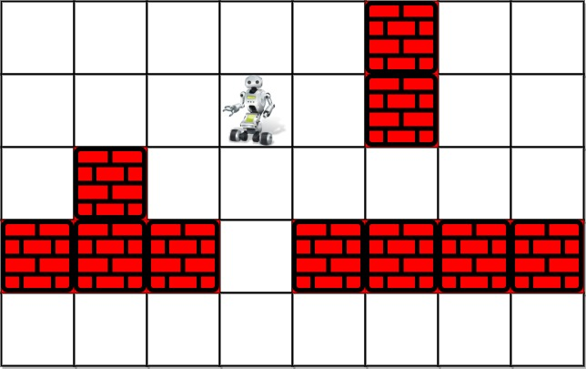

### 1. Description

You are controlling a robot that is located somewhere in a room. The room is modeled as an `m x n` binary grid where `0` represents a wall and `1` represents an empty slot.

The robot starts at an unknown location in the room that is guaranteed to be empty, and you do not have access to the grid, but you can move the robot using the given API `Robot`.

You are tasked to use the robot to clean the entire room (i.e., clean every empty cell in the room). The robot with the four given APIs can move forward, turn left, or turn right. Each turn is `90` degrees.

When the robot tries to move into a wall cell, its bumper sensor detects the obstacle, and it stays on the current cell.

Design an algorithm to clean the entire room using the following APIs:

```
interface Robot {
  // returns true if next cell is open and robot moves into the cell.
  // returns false if next cell is obstacle and robot stays on the current cell.
  boolean move();

  // Robot will stay on the same cell after calling turnLeft/turnRight.
  // Each turn will be 90 degrees.
  void turnLeft();
  void turnRight();

  // Clean the current cell.
  void clean();
}
```

### 2. Function Contract

**Inputs**

- `robot`: an opaque robot interface positioned on an empty room cell

The interface provides four operations:

- `robot.move()` attempts one forward step. It returns `True` after entering an open cell, or `False` when an
  obstacle blocks the step and the robot remains in place.
- `robot.turnLeft()` rotates the robot $90$ degrees left without changing its cell.
- `robot.turnRight()` rotates the robot $90$ degrees right without changing its cell.
- `robot.clean()` cleans the current cell.

**Return value**

- Return `None`; success is the side effect of cleaning every empty cell reachable from the starting position.

The solution must operate only through this interface and must not inspect the hidden grid.

### 3. Note

that the initial direction of the robot will be facing up. You can assume all four edges of the grid are all surrounded by a wall.

### 4. Custom Testing

The input is only given to initialize the room and the robot's position internally. You must solve this problem "blindfolded". In other words, you must control the robot using only the four mentioned APIs without knowing the room layout and the initial robot's position.

### 5. Examples

#### Example 1



- **Input:** $room = [[1,1,1,1,1,0,1,1],[1,1,1,1,1,0,1,1],[1,0,1,1,1,1,1,1],[0,0,0,1,0,0,0,0],[1,1,1,1,1,1,1,1]], row = 1, col = 3$
- **Output:** `Robot cleaned all rooms.`
- **Explanation:** All grids in the room are marked by either 0 or 1.
0 means the cell is blocked, while 1 means the cell is accessible.
The robot initially starts at the position of row=1, col=3.
From the top left corner, its position is one row below and three columns right.
#### Example 2

- **Input:** $room = [[1]], row = 0, col = 0$
- **Output:** `Robot cleaned all rooms.`

### 6. Constraints

- $m = \text{room.length}$

- $n = \text{room}[i].length$

- $1 \le m \le 100$

- $1 \le n \le 200$

- $\text{room}[i][j]$ is either `0` or `1`.

- $0 \le row < m$

- $0 \le col < n$

- $\text{room}[row][col] = 1$

- All the empty cells can be visited from the starting position.