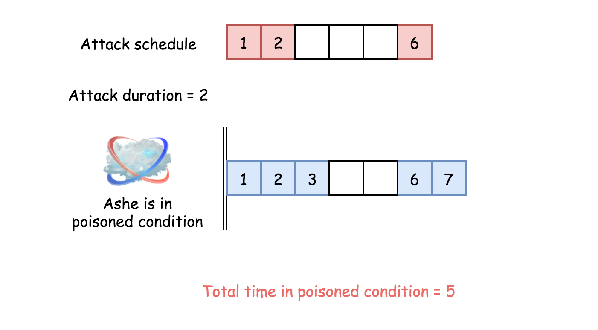

## Solution

---

### Approach 1: One pass

**Intuition**

The problem is an example of merge interval questions which are now [quite popular in Google](https://leetcode.com/discuss/interview-question/280433/Google-or-Phone-screen-or-Program-scheduling).

Typically such problems could be solved in a linear time in the case of sorted input, like [here](https://leetcode.com/articles/insert-interval/), and in $\mathcal{O}(N \log N)$ time otherwise, [here is an example](https://leetcode.com/articles/merge-intervals/).

Here one deals with a sorted input, and the problem could be solved in one pass with a constant space. The idea is straightforward: consider only the interval between two attacks. Ashe spends in a poisoned condition the whole time interval if this interval is shorter than the poisoning time duration `duration`, and `duration` otherwise.

**Algorithm**

- Initiate total time in poisoned condition $total = 0$.

- Iterate over `timeSeries` list. At each step add to the total time the minimum between interval length and the poisoning time duration `duration`.

- Return $total + duration$ to take the last attack into account.

**Implementation**



```python
class Solution:
    def findPoisonedDuration(self, timeSeries: List[int], duration: int) -> int:
        n = len(timeSeries)
        if n == 0:
            return 0

        total = 0
        for i in range(n - 1):
            total += min(timeSeries[i + 1] - timeSeries[i], duration)
        return total + duration
```

**Complexity Analysis**

* Time complexity: $\mathcal{O}(N)$, where N is the length of the input list since we iterate the entire list.

* Space complexity: $\mathcal{O}(1)$, it's a constant space solution.