[TOC]

## Summary

You are given two arrays (without duplicates): $nums1$ and $nums2$ where $nums1$’s elements are subset of $nums2$. Find all the
next greater numbers for $nums1$'s elements in the corresponding places of $nums2$.

The Next Greater Number of a number $x$ in $nums1$ is the first greater number to its right in $nums2$. If it does not exist, output $\text{-1}$ for
this number.

## Solution

---
### Approach 1: Brute Force

**Algorithm**

In this method, we pick up every element of the $nums1$ array (say $\text{nums1}[i]$) and then search for its own occurence in the $nums2$ array (which is
indicated by setting $found$ to $True$). After this, we look linearly for a number in $nums2$ which is greater than $\text{nums1}[i]$, which
is also added to the $res$ array to be returned. If no such element is found, we put a $\text{-1}$ at the corresponding location.

**Implementation**

```python
# Python3
class Solution:
    def nextGreaterElement(self, nums1, nums2):
        res = [-1] * len(nums1)
        for i, num1 in enumerate(nums1):
            found = False
            for j, num2 in enumerate(nums2):
                if found and num2 > num1:
                    res[i] = num2
                    break

                if num2 == num1:
                    found = True

        return res
```

**Complexity Analysis**

* Time complexity: $O(m \cdot n)$. The complete $nums2$ array (of size $n$) needs to be scanned for all the $m$ elements of $nums1$ in the worst case.

* Space complexity: $O(1)$. We do not count the space required to create the output array. Other than that, only constant space is used.

---

### Approach 2: Better Brute Force

**Algorithm**

Instead of searching for the occurence of $\text{nums1}[i]$ linearly in the $nums2$ array, we can make use of a hashmap $hash$ to store
the elements of $nums2$ in the form of $(element, index)$. By doing this, we can find $\text{nums1}[i]$'s index in $nums2$ array directly and
then continue to search for the next larger element in a linear fashion.

**Implementation**

```python
class Solution:
    def nextGreaterElement(
        self, nums1: List[int], nums2: List[int]
    ) -> List[int]:
        hash_table = {num: i for i, num in enumerate(nums2)}

        res = [0] * len(nums1)
        for i, num in enumerate(nums1):
            j = hash_table[num] + 1
            while j < len(nums2):
                if num < nums2[j]:
                    res[i] = nums2[j]
                    break
                j += 1
            else:
                res[i] = -1

        return res
```

**Complexity Analysis**

* Time complexity: $O(m \cdot n)$. The whole $nums2$ array, of length $n$, needs to be scanned for all the $m$ elements of $nums1$ in the worst case. However, in practice, this algorithm will be faster than the previous one, since here we don't need to scan $nums2$ to find the position of $\text{nums1}[i]$ element.

* Space complexity: $O(n)$. A hashmap $hash$ of size $n$ is used, where $n$ refers to the length of the $nums2$ array.

---

### Approach 3: Using Stack

**Algorithm**

In this approach, we make use of pre-processing first so as to make the results easily available later on.
We make use of a stack ($stack$) and a hashmap ($map$). $map$ is used to store the result for every posssible number in $nums2$ in
the form of $(element, next\_greater\_element)$. Now, we will look at how to make entries in $map$.

We iterate over the $nums2$ array from the left to right. We push every element $\text{nums2}[i]$ on the stack if it is less than the previous element on the top of the stack
($\text{stack}[top]$). No entry is made in $map$ for such $\text{nums2}[i]$'s right now. This happens because
the $\text{nums2}[i]$'s encountered so far are coming in a descending order.

If we encounter an element $\text{nums2}[i]$ such that $\text{nums2}[i]$ > $\text{stack}[top]$, we keep on popping all the elements
from $\text{stack}[top]$ until we encounter $\text{stack}[k]$ such that $\text{stack}[k]$ ≥ $\text{nums2}[i]$. For every element popped out of the stack
$\text{stack}[j]$, we put the popped element along with its next greater number (result) into the hashmap $map$, in the form
$(\text{stack}[j], \text{nums2}[i])$. Now, the
next greater element for all elements $\text{stack}[j]$, such that $k$ < $j$ ≤ $top$ is $\text{nums2}[i]$ (since this larger element caused all the
$\text{stack}[j]$'s to be popped out). We stop popping the elements at $\text{stack}[k]$ because this $\text{nums2}[i]$ can't act as the next greater element
for the next elements on the stack.

Thus, an element is popped out of the stack whenever a next greater element is found for it. Therefore, the elements remaining in the stack are the
ones for which no next greater element exists in the $nums2$ array. Thus, at the end of the iteration over $nums2$, we pop the remaining
elements from the $stack$ and put their entries in $hash$ with a $\text{-1}$ as their corresponding results.

Then, we can simply iterate over the $nums1$ array to find the corresponding results from $map$ directly.

The following animation makes the method clear:

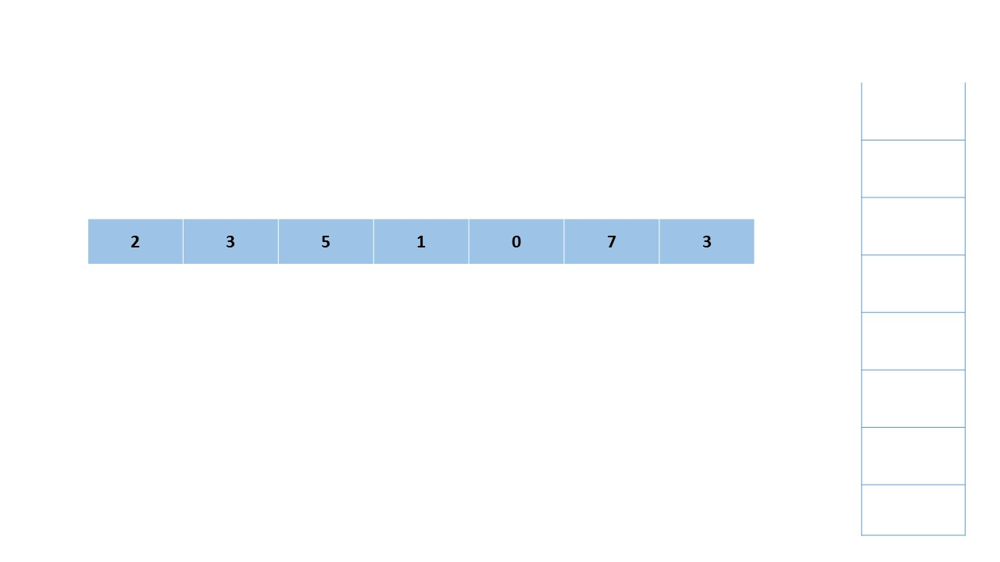

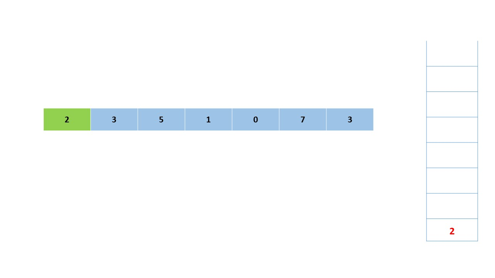

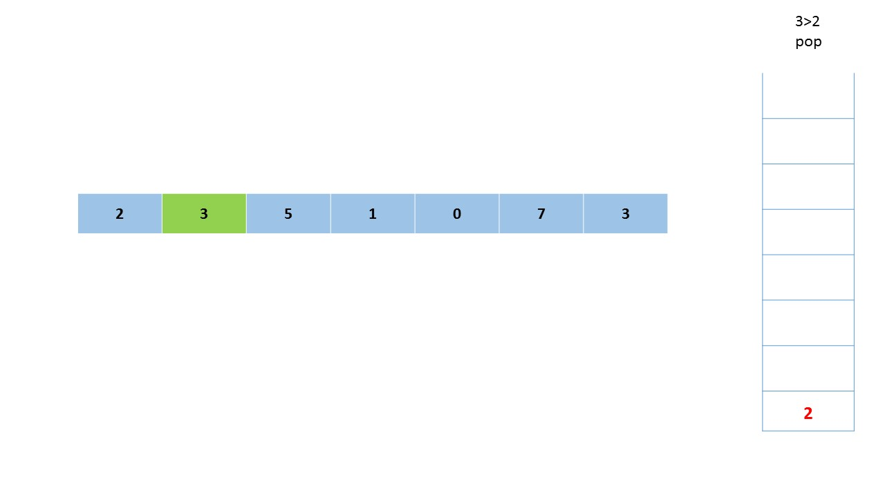

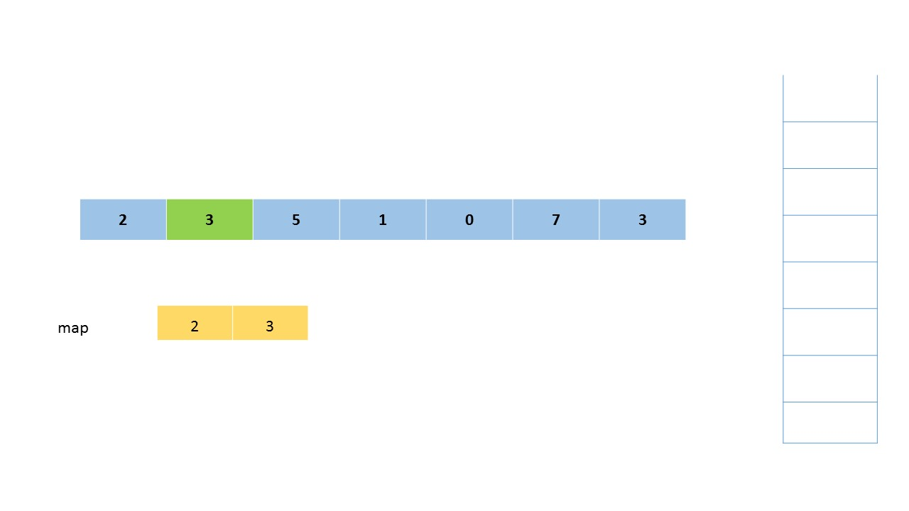

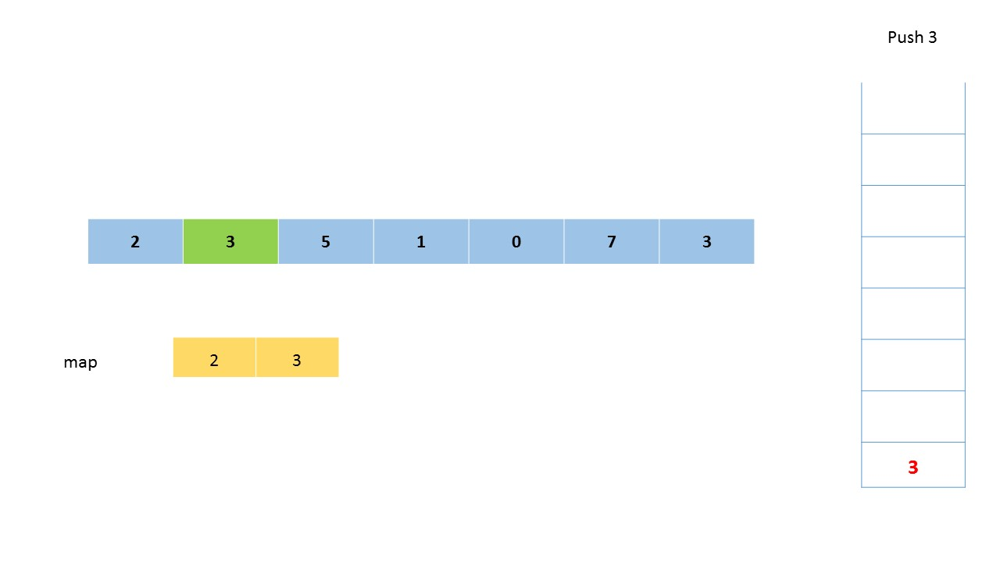

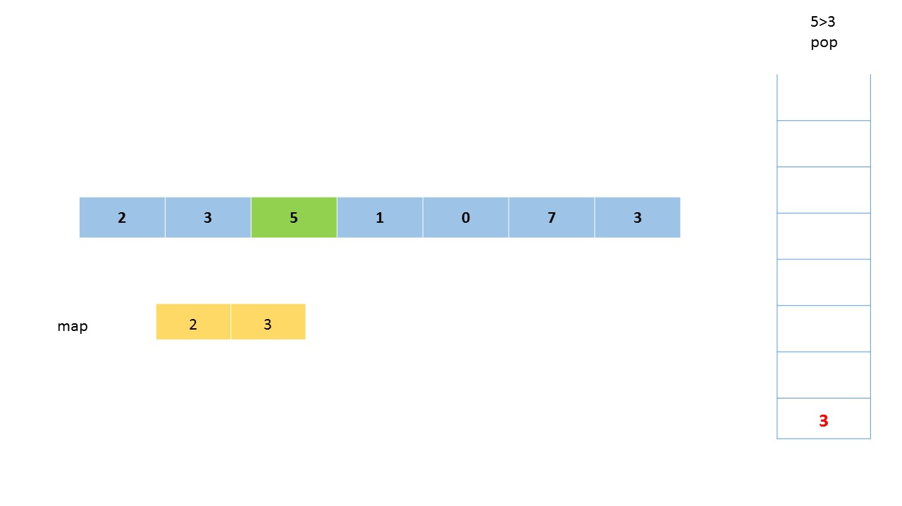


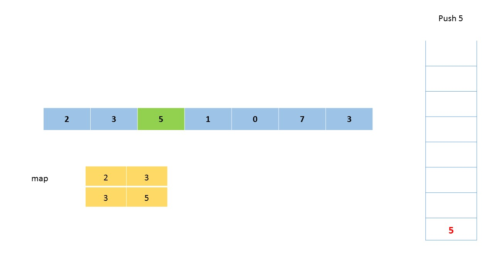

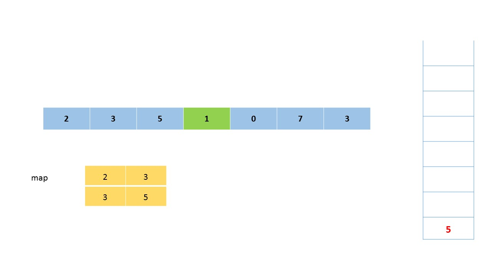

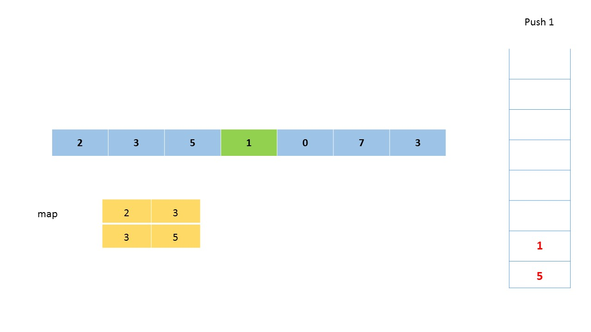


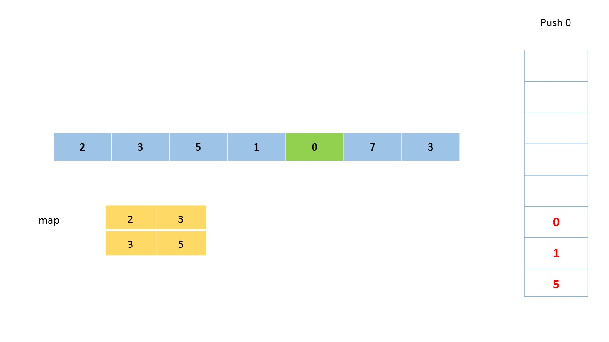


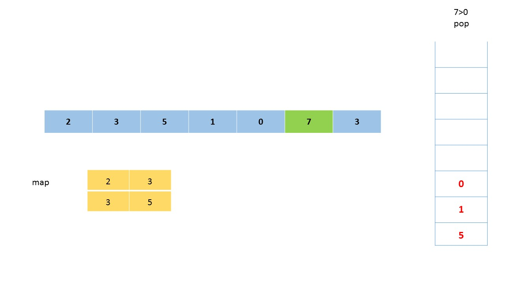

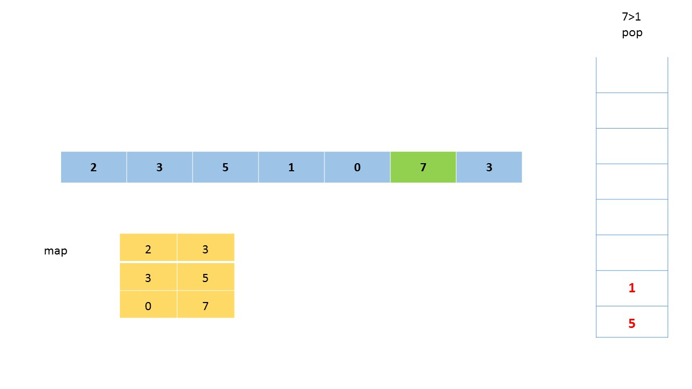

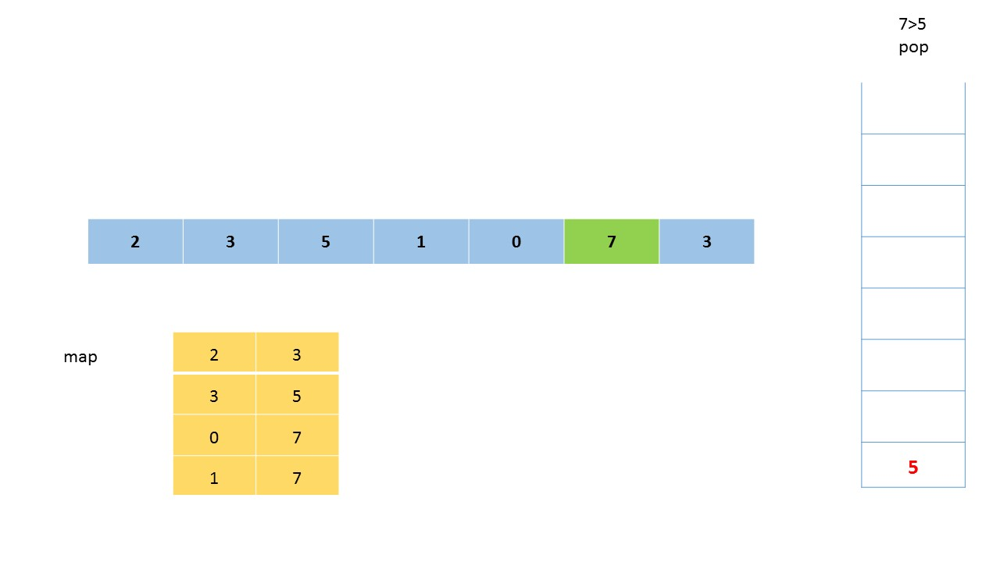

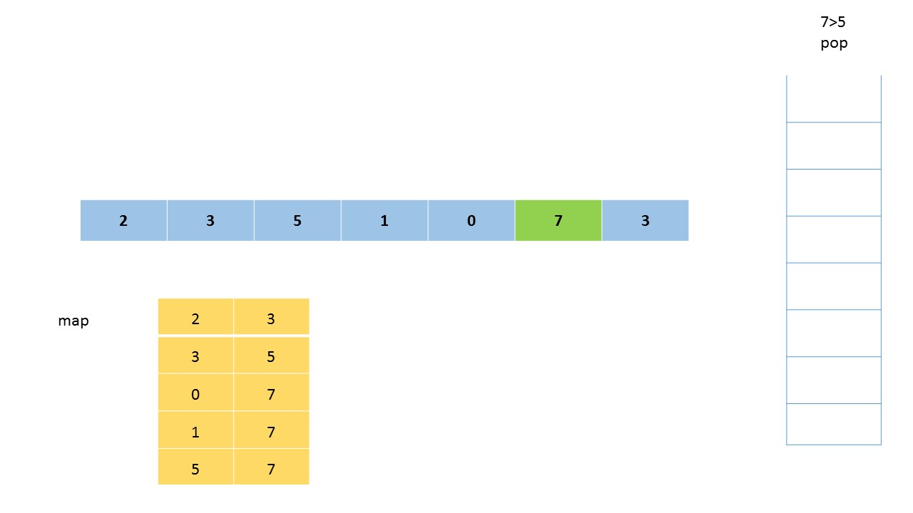

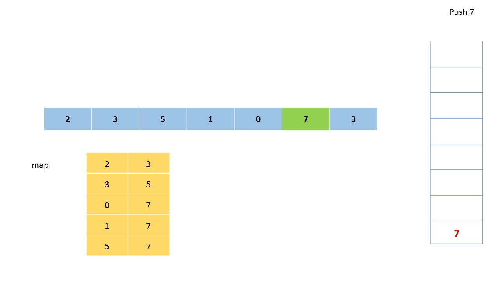


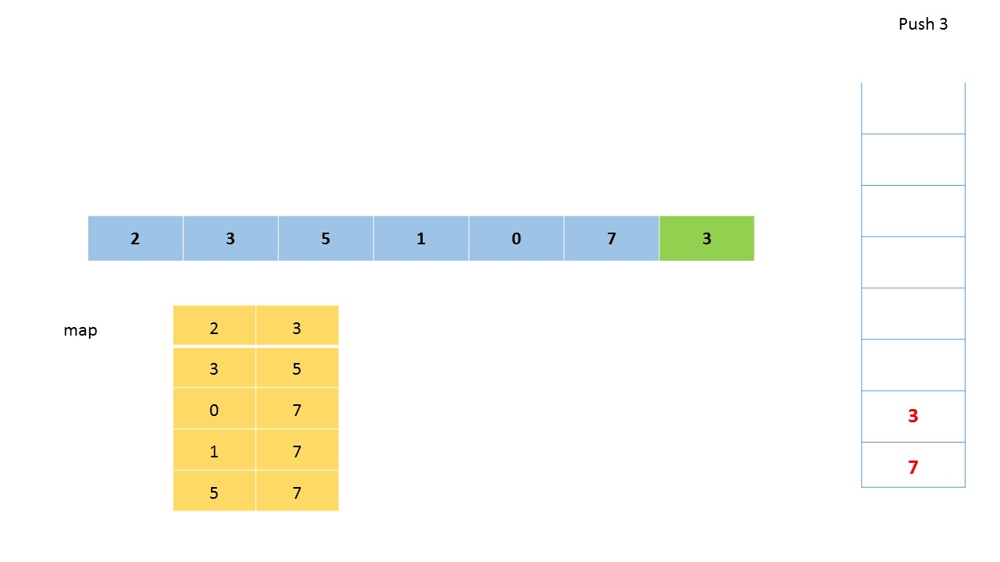

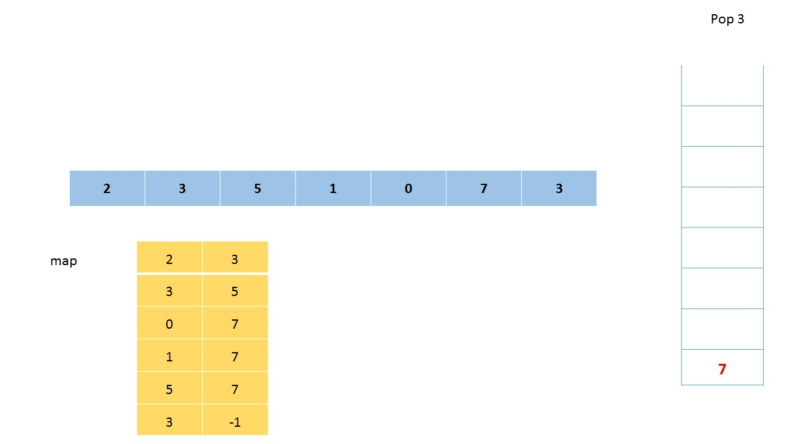

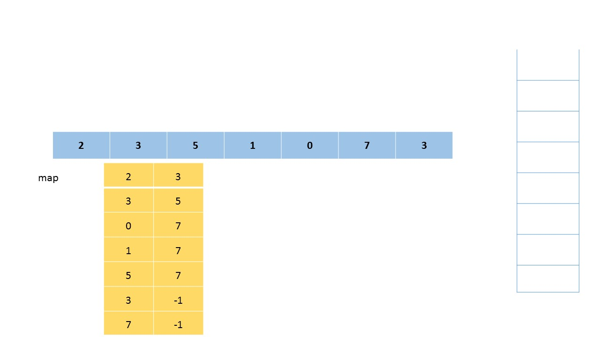

<br>

> Note; the animation includes duplicate elements although the problem constraints state that there won't be duplicates. The algorithm works the same regardless, and the animation is only used to demonstrate the algorithm.

**Implementation**

```python
class Solution:
    def nextGreaterElement(self, nums1, nums2):
        stack = []
        hashmap = {}

        for num in nums2:
            while stack and num > stack[-1]:
                hashmap[stack.pop()] = num
            stack.append(num)

        return [hashmap.get(i, -1) for i in nums1]
```

**Complexity Analysis**

Let $n$ and $m$ represent the length of the $nums2$ and $nums1$ array respectively.

* Time complexity: $O(n)$. The entire $nums2$ array (of size $n$) is scanned only once. Each of the stack's $n$ elements are pushed and popped exactly once. The $nums1$ array is also scanned only once. All together this requires $O(n + n + m)$ time.  Since $nums1$ must be a subset of $nums2$, we know $m$ must be less than or equal to $n$.  Therefore, the time complexity can be simplified to $O(n)$.

* Space complexity: $O(n)$. $map$ will store $n$ key-value pairs while $stack$ will contain at most $n$ elements at any given time.