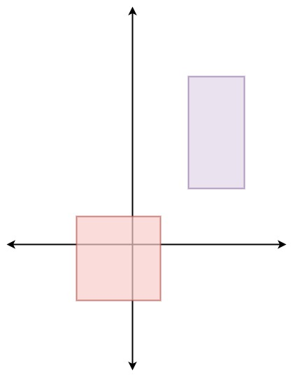

### 1. Description

You are given an array of non-overlapping axis-aligned rectangles `rects` where $\text{rects}[i] = [a_{i}, b_{i}, x_{i}, y_{i}]$ indicates that $(a_{i}, b_{i})$ is the bottom-left corner point of the $$i^{\text{th}}$$ rectangle and $(x_{i}, y_{i})$ is the top-right corner point of the $$i^{\text{th}}$$ rectangle. Design an algorithm to pick a random integer point inside the space covered by one of the given rectangles. A point on the perimeter of a rectangle is included in the space covered by the rectangle.

Any integer point inside the space covered by one of the given rectangles should be equally likely to be returned.

### 2. Function Contract

- `n`: Input parameter.
- Returns expected result.

### 3. Note

that an integer point is a point that has integer coordinates.

Implement the `Solution` class:

- `Solution(int[][] rects)` Initializes the object with the given rectangles `rects`.

- `int[] pick()` Returns a random integer point `[u, v]` inside the space covered by one of the given rectangles.

### 4. Examples

#### Example 1



```
**Input**
["Solution", "pick", "pick", "pick", "pick", "pick"]
[[[[-2, -2, 1, 1], [2, 2, 4, 6]]], [], [], [], [], []]
**Output**
[null, [1, -2], [1, -1], [-1, -2], [-2, -2], [0, 0]]

**Explanation**
Solution solution = new Solution([[-2, -2, 1, 1], [2, 2, 4, 6]]);
solution.pick(); // return [1, -2]
solution.pick(); // return [1, -1]
solution.pick(); // return [-1, -2]
solution.pick(); // return [-2, -2]
solution.pick(); // return [0, 0]
```

### 5. Constraints

- $1 \le \text{rects.length} \le 100$

- $\text{rects}[i].length = 4$

- $-10^{9} \le a_{i} < x_{i} \le 10^{9}$

- $-10^{9} \le b_{i} < y_{i} \le 10^{9}$

- $x_{i} - a_{i} \le 2000$

- $y_{i} - b_{i} \le 2000$

- All the rectangles do not overlap.

- At most $10^{4}$ calls will be made to `pick`.