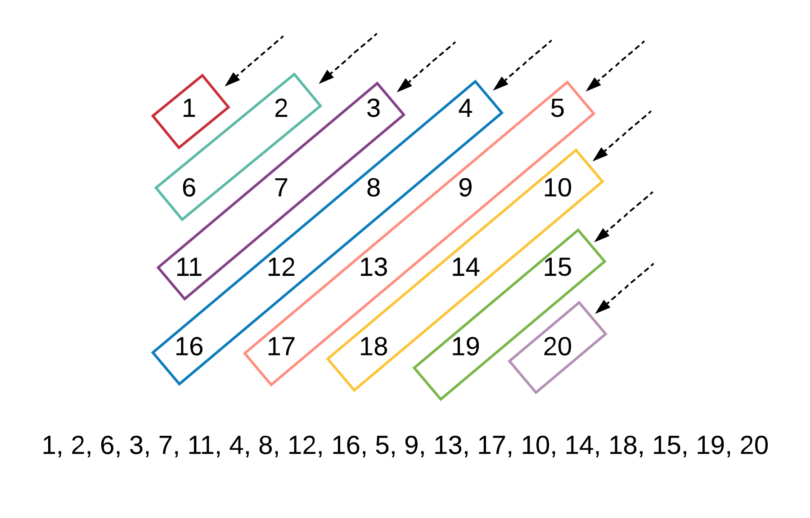
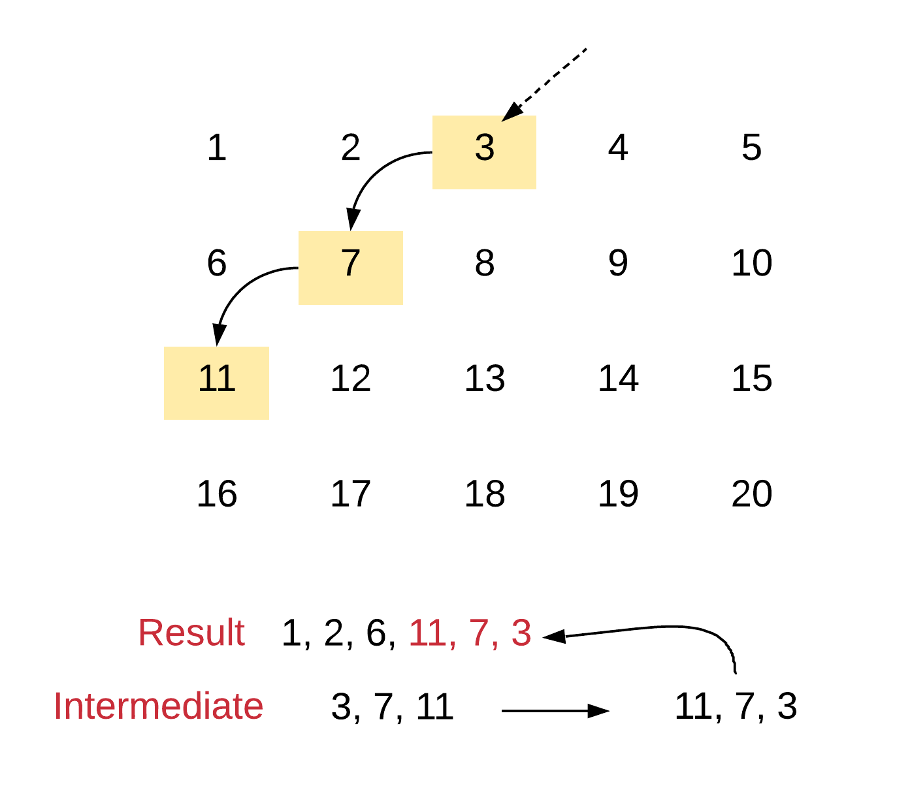
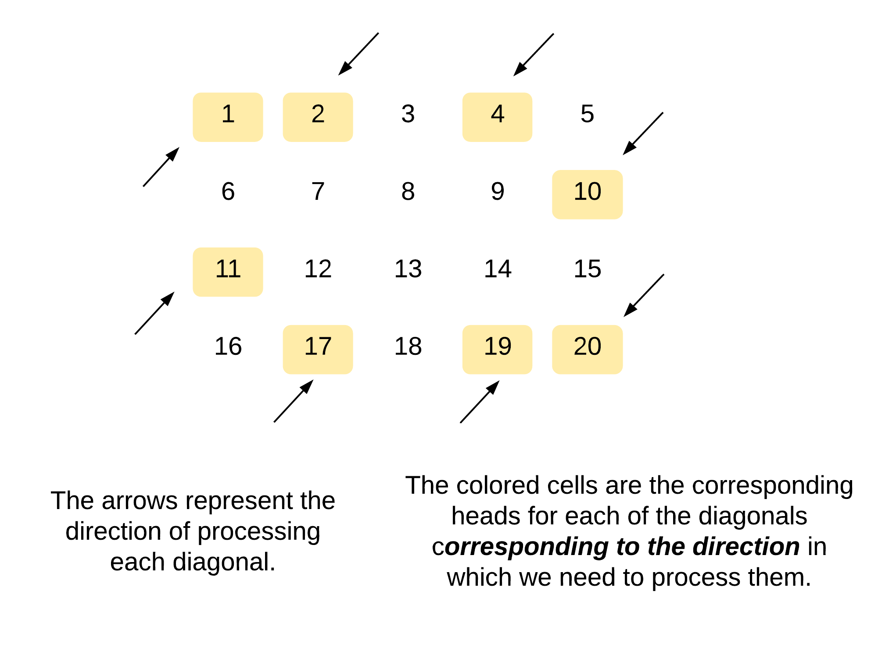
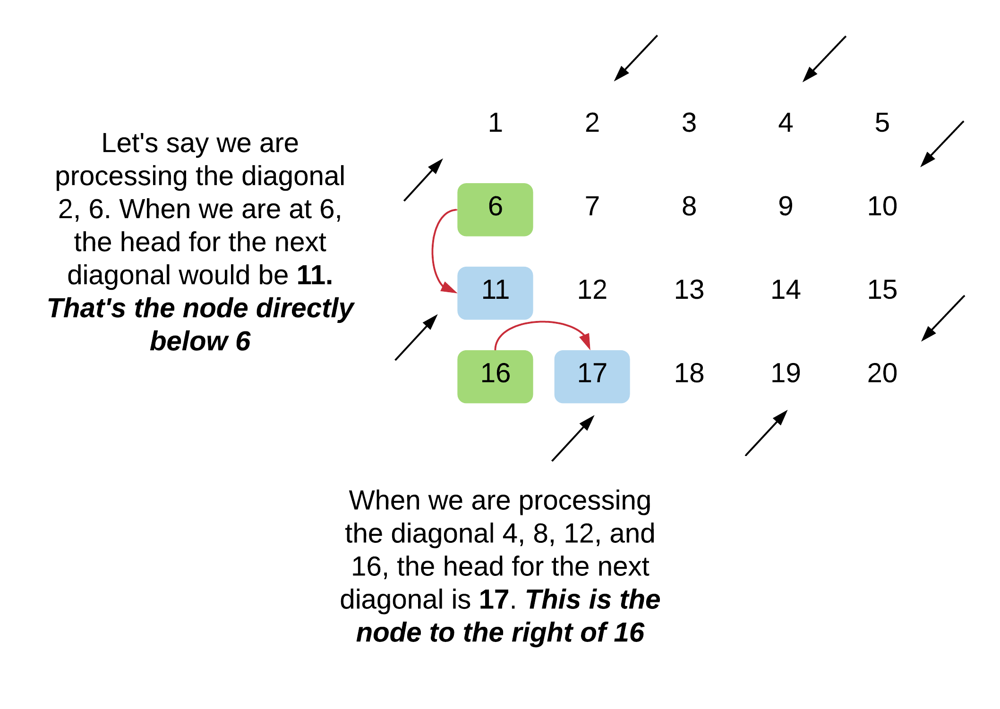
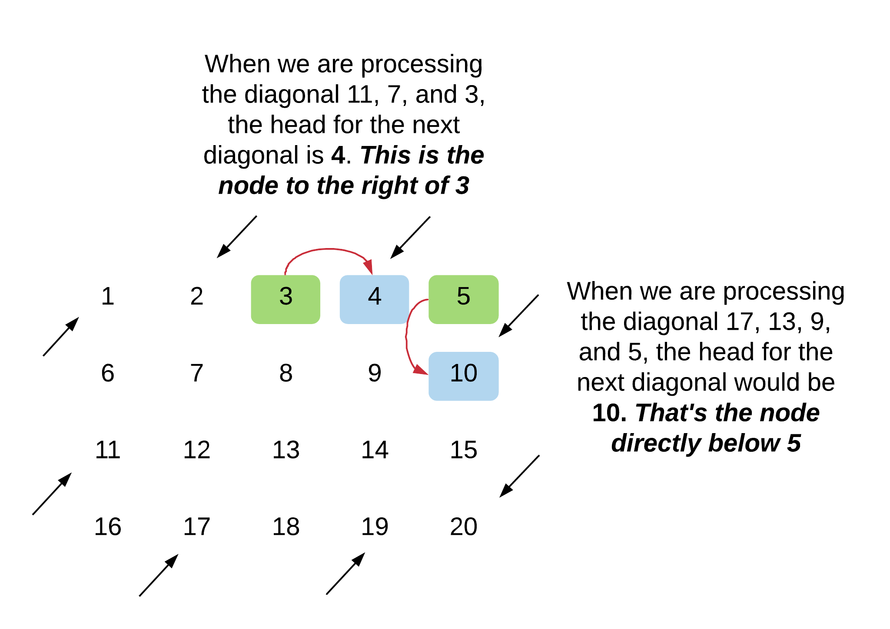

[TOC]

## Solution

### Approach 1: Diagonal Iteration and Reversal

**Intuition**

A common strategy for solving a lot of programming problem is to first solve a stripped down, simpler version of them and then think what needs to be changed to achieve the original goal. Our first approach to this problem is also based on this very idea. So, instead of thinking about the zig-zag pattern of printing for the diagonals, let's say the problem statement simply asked us to print out the contents of the matrix, one diagonal after the other starting from the first element. Let's see what this problem would look like.

<center>

</center>

The first row and the last column in this problem would serve as the starting point for the corresponding diagonal. Given an element inside a diagonal, say $[i, j]$, we can either go up the diagonal by going one row up and one column ahead i.e. $[i - 1, j + 1]$ or, we can go down the diagonal by going one row down and one column to the left i.e. $[i + 1, j - 1]$. *Note* that this applies to diagonals that go from `right to left` only. The math would change for the ones that go from left to right.

This is a simple problem to solve, right? The only difference between this one and the original problem is that some of the diagonals are not printed in the right order. That's all we need to fix to get the right solution!

> We simply need to reverse the odd numbered diagonals before we add the elements to the final result array. So, for e.g. the third diagonal starting from the left would be [3, 7, 11] and before we add these elements to the final result array, we simply reverse them i.e. [11, 7, 3].

**Algorithm**

1. Initialize a `result` array that we will eventually return.
2. We would have an outer loop that will go over each of the diagonals one by one. As mentioned before, the elements in the first row and the last column would actually be the heads of their corresponding diagonals.
3. We then have an inner while loop that iterates over all the elements in the diagonal. We can calculate the number of elements in the corresponding diagonal by doing some math but we can simply iterate until one of the indices goes out of bounds.
4. For each diagonal we will need a new list or dynamic array like data structure since we don't know what size to allocate. Again, we can do some math and calculate the size of that particular diagonal and allocate memory; but it's not necessary for this explanation.
5. For odd numbered diagonals, we simply need to add the elements in our intermediary array, in reverse order to the final result array.

    <center>
    
    </center>

```python
class Solution:

    def findDiagonalOrder(self, matrix: List[List[int]]) -> List[int]:

        # Check for empty matrices
        if not matrix or not matrix[0]:
            return []

        # Variables to track the size of the matrix
        N, M = len(matrix), len(matrix[0])

        # The two arrays as explained in the algorithm
        result, intermediate = [], []

        # We have to go over all the elements in the first
        # row and the last column to cover all possible diagonals
        for d in range(N + M - 1):

            # Clear the intermediate array everytime we start
            # to process another diagonal
            intermediate.clear()

            # We need to figure out the "head" of this diagonal
            # The elements in the first row and the last column
            # are the respective heads.
            r, c = 0 if d < M else d - M + 1, d if d < M else M - 1

            # Iterate until one of the indices goes out of scope
            # Take note of the index math to go down the diagonal
            while r < N and c > -1:
                intermediate.append(matrix[r][c])
                r += 1
                c -= 1

            # Reverse even numbered diagonals. The
            # article says we have to reverse odd
            # numbered articles but here, the numbering
            # is starting from 0 :P
            if d % 2 == 0:
                result.extend(intermediate[::-1])
            else:
                result.extend(intermediate)
        return result
```

**Complexity Analysis**

* Time Complexity: $O(N \cdot M)$ considering the array has $N$ rows and $M$ columns. An important thing to remember is that for all the odd numbered diagonals, we will be processing the elements twice since we have to reverse the elements before adding to the result array. Additionally, to save space, we have to `clear` the intermediate array before we process a new diagonal. That operation also takes $O(K)$ where $K$ is the size of that array. So, we will be processing all the elements of the array at least twice. But, as far as the asymptotic complexity is concerned, it remains the same.
* Space Complexity: $O(min(N, M))$ since the extra space is occupied by the intermediate arrays we use for storing diagonal elements and the maximum it can occupy is the equal to the minimum of $N$ and $M$. Remember, the diagonal can only extend till one of its indices goes out of scope.
<br>
<br>

---
### Approach 2: Simulation

**Intuition**

This approach simply and plainly does what the problem statement asks us to do. It's pure simulation. However, in order to implement this simulation, we need to understand the walking patterns inside the array. Basically, in the previous approach, figuring out the `head` of the diagonal was pretty easy. In this case, it won't be that easy. We need to figure out two things for each diagonal:

1. The direction in which we want to process it's elements and
2. The head or the starting point for the diagonal `depending upon its direction`.

Let's see these two things annotated on a sample matrix.

<center>

</center>

Now that we know what two things we need to figure out, let's get to the part where we actually do it! The direction is pretty straightforward. We can simply use a boolean variable and keep alternating it to figure out the direction for a diagonal. That part is sorted. The slightly tricky part is figuring out the head of the next diagonal.

The good part is, we already know the `end` of the previous diagonal. We can use that information to figure out the head of the next diagonal.

**Next head when going UP**<br>
Let's look at the two scenarios that we may come across when we are at the tail end of a downwards diagonal and we want to find the head of the next diagonal.

<center>

</center>

So, the general rule that we will be following when we want to find the head for an upwards going diagonal is that:

> The head would be the node directly below the tail of the previous diagonal. Unless the tail lies in the last row of the matrix in which case the head would be the node right next to the tail.

**Next head when going DOWN** <br>
Let's look at the two scenarios that we may come across when we are at the tail end of an upwards diagonal and we want to find the head of the next diagonal.

<center>

</center>

So, the general rule that we will be following when we want to find the head for a downwards going diagonal is that:

> The head would be the node to the right of the tail of the previous diagonal. Unless the tail lies in the last column of the matrix in which case the head would be the node directly below the tail.

**Algorithm**

1. Initialize a boolean variable called `direction` which will tell us whether the current diagonal is an upwards or downwards going. Based on the current direction and the tail, we will determine the head of the next diagonal. Initially the direction would be `1` which would indicate `up`. We will keep alternating this value from one iteration to the next.
2. Assuming we know the head of a diagonal, say $\text{matrix}[i][j]$, we will use the direction to progress along the diagonal and process its elements.
- For an upwards going diagonal, the next element in the diagonal would be $matrix[i - 1][j + 1]$
- For a downwards going diagonal, the next element would be $matrix[i + 1][j - 1]$.
3. We keep processing the elements of the current diagonal until we go out of the boundaries of the matrix.
4. Now, given that we know the tail of the diagonal (the last node before we went out of bounds), let's see how we can find the next head. Note that in the following pseudocode, the `direction` is for the current diagonal and we are trying to find the head of the next diagonal. So, if the direction is `up`, it means the next diagonal would be going down and vice-versa.
    <pre>
   tail = [i, j]
   if direction == up, then {
      if [i, j + 1] is within bounds, then {
          next_head = [i, j + 1]
      } else {
          next_head = [i + 1, j]
      }
   } else {
      if [i + 1, j] is within bounds, then {
          next_head = [i + 1, j]
      } else {
          next_head = [i, j + 1]
      }
   }</pre>

5. We keep processing the elements of a diagonal and once the current diagonal ends, we use the current direction and the tail element to find the next head and we switch over to processing the next diagonal. Also remember to flip the direction bit.

```python
class Solution:

    def findDiagonalOrder(self, matrix: List[List[int]]) -> List[int]:

        # Check for an empty matrix
        if not matrix or not matrix[0]:
            return []

        # The dimensions of the matrix
        N, M = len(matrix), len(matrix[0])

        # Incides that will help us progress through
        # the matrix, one element at a time.
        row, column = 0, 0

        # As explained in the article, this is the variable
        # that helps us keep track of what direction we are
        # processing the current diaonal
        direction = 1

        # Final result array that will contain all the elements
        # of the matrix
        result = []

        # The uber while loop which will help us iterate over all
        # the elements in the array.
        while row < N and column < M:

            # First and foremost, add the current element to
            # the result matrix.
            result.append(matrix[row][column])

            # Move along in the current diagonal depending upon
            # the current direction.[i, j] -> [i - 1, j + 1] if
            # going up and [i, j] -> [i + 1][j - 1] if going down.
            new_row = row + (-1 if direction == 1 else 1)
            new_column = column + (1 if direction == 1 else -1)

            # Checking if the next element in the diagonal is within the
            # bounds of the matrix or not. If it's not within the bounds,
            # we have to find the next head.
            if new_row < 0 or new_row == N or new_column < 0 or new_column == M:

                # If the current diagonal was going in the upwards
                # direction.
                if direction:

                    # For an upwards going diagonal having [i, j] as its tail
                    # If [i, j + 1] is within bounds, then it becomes
                    # the next head. Otherwise, the element directly below
                    # i.e. the element [i + 1, j] becomes the next head
                    row += (column == M - 1)
                    column += (column < M - 1)
                else:

                    # For a downwards going diagonal having [i, j] as its tail
                    # if [i + 1, j] is within bounds, then it becomes
                    # the next head. Otherwise, the element directly below
                    # i.e. the element [i, j + 1] becomes the next head
                    column += (row == N - 1)
                    row += (row < N - 1)

                # Flip the direction
                direction = 1 - direction
            else:
                row = new_row
                column = new_column

        return result
```

**Complexity Analysis**

* Time Complexity: $O(N \cdot M)$ since we process each element of the matrix exactly once.
* Space Complexity: $O(1)$ since we don't make use of any additional data structure. Note that the space occupied by the output array doesn't count towards the space complexity since that is a requirement of the problem itself. Space complexity comprises any `additional` space that we may have used to get to build the final array. For the previous solution, it was the intermediate arrays. In this solution, we don't have any additional space apart from a couple of variables.
<br>
<br>