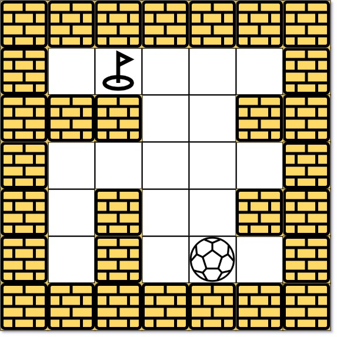
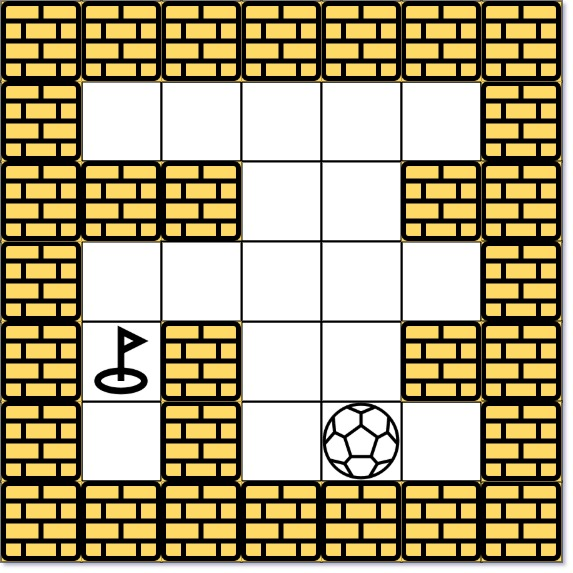

### 1. Description

There is a ball in a `maze` with empty spaces (represented as `0`) and walls (represented as `1`). The ball can go through the empty spaces by rolling **up, down, left or right**, but it won't stop rolling until hitting a wall. When the ball stops, it could choose the next direction (must be different from last chosen direction). There is also a hole in this maze. The ball will drop into the hole if it rolls onto the hole.

Given the `m x n` `maze`, the ball's position `ball` and the hole's position `hole`, where $ball = [\text{ball}_{row}, \text{ball}_{col}]$ and $hole = [\text{hole}_{row}, \text{hole}_{col}]$, return *a string *`instructions`* of all the instructions that the ball should follow to drop in the hole with the **shortest distance** possible*. If there are multiple valid instructions, return the **lexicographically minimum** one. If the ball can't drop in the hole, return `"impossible"`.

If there is a way for the ball to drop in the hole, the answer `instructions` should contain the characters `'u'` (i.e., up), `'d'` (i.e., down), `'l'` (i.e., left), and `'r'` (i.e., right).

The **distance** is the number of **empty spaces** traveled by the ball from the start position (excluded) to the destination (included).

You may assume that **the borders of the maze are all walls** (see examples).

### 2. Function Contract

**Inputs**

- `maze`: a rectangular binary matrix where `0` is an empty space and `1` is a wall
- `ball`: the ball's initial empty cell as `[row, column]`
- `hole`: the distinct empty cell that catches the ball as `[row, column]`

**Return value**

- Return the lexicographically smallest instruction string among all routes with minimum traveled distance, or
  `"impossible"` if the hole is unreachable.

Each instruction character commits the ball to a complete roll. A wall normally ends that roll, but encountering
the hole ends the entire route immediately. The instruction alphabet is `u` for up, `d` for down, `l` for left, and
`r` for right.

### 3. Examples

#### Example 1

- **Input:** $maze = [[0,0,0,0,0],[1,1,0,0,1],[0,0,0,0,0],[0,1,0,0,1],[0,1,0,0,0]], ball = [4,3], hole = [0,1]$
- **Output:** `"lul"`
- **Explanation:** There are two shortest ways for the ball to drop into the hole.
The first way is left -> up -> left, represented by "lul".
The second way is up -> left, represented by 'ul'.
Both ways have shortest distance 6, but the first way is lexicographically smaller because 'l' < 'u'. So the output is "lul".
#### Example 2

- **Input:** $maze = [[0,0,0,0,0],[1,1,0,0,1],[0,0,0,0,0],[0,1,0,0,1],[0,1,0,0,0]], ball = [4,3], hole = [3,0]$
- **Output:** `"impossible"`
- **Explanation:** The ball cannot reach the hole.
#### Example 3

- **Input:** $maze = [[0,0,0,0,0,0,0],[0,0,1,0,0,1,0],[0,0,0,0,1,0,0],[0,0,0,0,0,0,1]], ball = [0,4], hole = [3,5]$
- **Output:** `"dldr"`

### 4. Constraints

- $m = \text{maze.length}$

- $n = \text{maze}[i].length$

- $1 \le m, n \le 100$

- $\text{maze}[i][j]$ is `0` or `1`.

- $\text{ball.length} = 2$

- $\text{hole.length} = 2$

- $0 \le \text{ball}_{row}, \text{hole}_{row} \le m$

- $0 \le \text{ball}_{col}, \text{hole}_{col} \le n$

- Both the ball and the hole exist in an empty space, and they will not be in the same position initially.

- The maze contains **at least 2 empty spaces**.