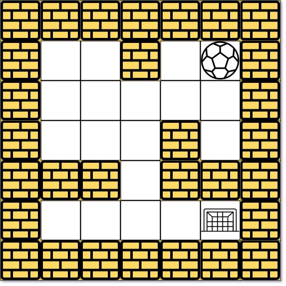
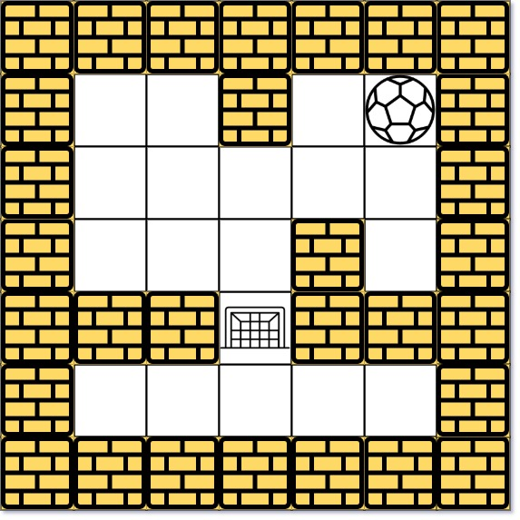

### 1. Description

There is a ball in a `maze` with empty spaces (represented as `0`) and walls (represented as `1`). The ball can go through the empty spaces by rolling **up, down, left or right**, but it won't stop rolling until hitting a wall. When the ball stops, it could choose the next direction.

Given the `m x n` `maze`, the ball's `start` position and the `destination`, where $start = [\text{start}_{row}, \text{start}_{col}]$ and $destination = [\text{destination}_{row}, \text{destination}_{col}]$, return *the shortest **distance** for the ball to stop at the destination*. If the ball cannot stop at `destination`, return `-1`.

The **distance** is the number of **empty spaces** traveled by the ball from the start position (excluded) to the destination (included).

You may assume that **the borders of the maze are all walls** (see examples).

### 2. Function Contract

**Inputs**

- `maze`: a rectangular matrix where `0` is an empty space and `1` is a wall
- `start`: the ball's initial empty cell as `[row, column]`
- `destination`: the distinct empty cell where the ball must stop

**Return value**

- Return the minimum number of empty spaces traveled by a route that stops at `destination`; return `-1` when no
  such route exists.

Each chosen direction is committed until a wall stops the ball. Intermediate cells crossed during that roll are not
decision points, and reaching `destination` while still rolling is not sufficient.

### 3. Examples

#### Example 1

- **Input:** $maze = [[0,0,1,0,0],[0,0,0,0,0],[0,0,0,1,0],[1,1,0,1,1],[0,0,0,0,0]], start = [0,4], destination = [4,4]$
- **Output:** `12`
- **Explanation:** One possible way is : left -> down -> left -> down -> right -> down -> right.
The length of the path is 1 + 1 + 3 + 1 + 2 + 2 + 2 = 12.
#### Example 2

- **Input:** $maze = [[0,0,1,0,0],[0,0,0,0,0],[0,0,0,1,0],[1,1,0,1,1],[0,0,0,0,0]], start = [0,4], destination = [3,2]$
- **Output:** `-1`
- **Explanation:** There is no way for the ball to stop at the destination. Notice that you can pass through the destination but you cannot stop there.
#### Example 3

- **Input:** $maze = [[0,0,0,0,0],[1,1,0,0,1],[0,0,0,0,0],[0,1,0,0,1],[0,1,0,0,0]], start = [4,3], destination = [0,1]$
- **Output:** `-1`

### 4. Constraints

- $m = \text{maze.length}$

- $n = \text{maze}[i].length$

- $1 \le m, n \le 100$

- $\text{maze}[i][j]$ is `0` or `1`.

- $\text{start.length} = 2$

- $\text{destination.length} = 2$

- $0 \le \text{start}_{row}, \text{destination}_{row} < m$

- $0 \le \text{start}_{col}, \text{destination}_{col} < n$

- Both the ball and the destination exist in an empty space, and they will not be in the same position initially.

- The maze contains **at least 2 empty spaces**.