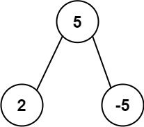

## Description

Given the `root` of a binary tree, return the most frequent **subtree sum**. If there is a tie, return all the values with the highest frequency in any order.

The **subtree sum** of a node is defined as the sum of all the node values formed by the subtree rooted at that node (including the node itself).
### Function Contract

- `n`: Input parameter.
- Returns expected result.

### Examples

#### Example 1

- **Input:** `root = [5,2,-3]`
- **Output:** `[2,-3,4]`
#### Example 2

- **Input:** `root = [5,2,-5]`
- **Output:** `[2]`
### Constraints

- The number of nodes in the tree is in the range $[1, 10^{4}]$.

- $-10^{5} \le \text{Node.val} \le 10^{5}$