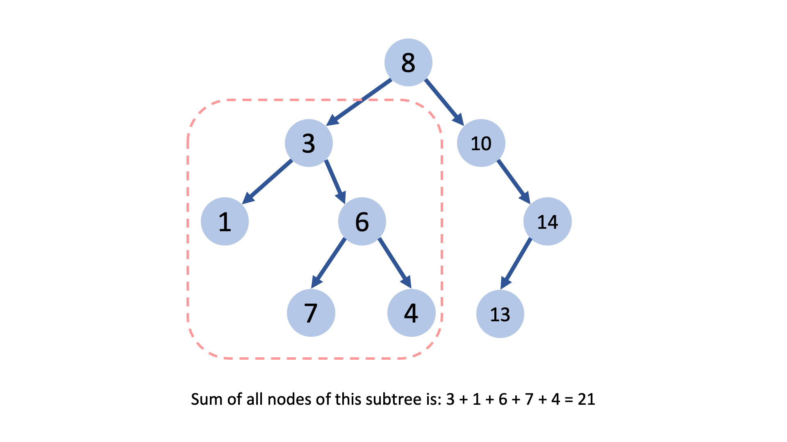
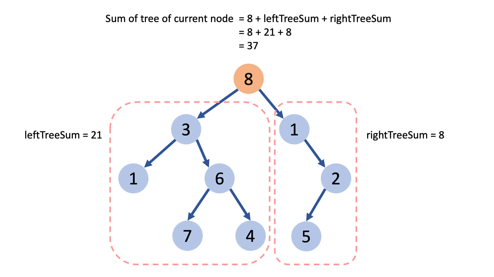
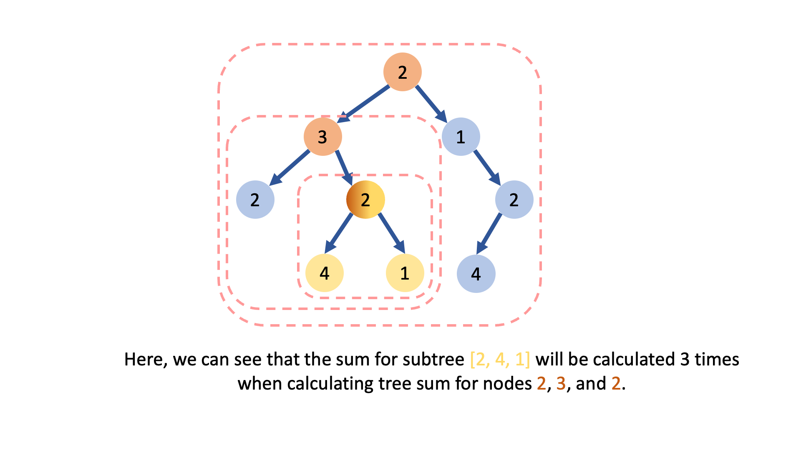

[TOC]

## Solution

---

### Overview

In this problem, we have to return the array of sums of subtrees with maximum frequency.
And a subtree sum is the sum of all nodes of a subtree.



Let's go from naive to an optimized approach for finding the frequency of all subtree sums in a given tree.

---

### Approach 1: Pre-Order Traversal

#### Intuition

We have to find the sum of all subtrees.
So, we can think of traversing the given tree in pre-order (i.e. root first, then left and right children), and for each node, we find the sum of the subtree where the current node is the root node.

**Now, how we can find the sum of all nodes of a tree, provided we have a root node?**
Remember one thing, thinking recursively is the most easy way to solve tree problems.

Here, if we had the sum of left and right subtrees of the current root, then we can say the current subtree's sum will be:
$current root's value + left subtree sum + right subtree sum$



Thus, we can recursively find the sum of the left and right subtrees of the given node and return the current node's tree's sum.
We also need some base conditions to stop the recursion. The base condition is simply the case where we can get the result without doing any computation.

**Can you tell what will be the sum of nodes of an empty tree?**
Exactly it can be considered 0 as there are no nodes present. Thus, this is our base case.

Thus, our pseudocode for finding sum of all nodes of a subtree will look like:

```
int findTreeSum(TreeNode root) {
    // Base condition.
    if !root {
        return 0
    }

    // Current root's tree's sum will be, current root's value + left subtree sum + right subtree sum.
    return root.val + findTreeSum(root.left) + findTreeSum(root.right)
}
```

Let's now look at this slideshow to better understand this.

!?!../Documents/508/slideshow1.json:960,540!?!

<br />

#### Algorithm

1. Initialize variables:
- `sumFreq`, hashmap to store frequency count of all sums.
- `maxFreq`, variable to store the maximum frequency.
- `maxFreqSums`, array to store values of all different sums whose frequency is maximum.

2. Iterate over each node of the given tree using pre-order traversal:
- Calculate the current node's subtree's sum as discussed above.
- Increment the sum's frequency in `sumFreq`.
- If the current subtree's sum's frequency is greater than `maxFreq`, store it's frequency in `maxFreq`.

3. Iterate over `sumFreq` map, and push all sums in `maxFreqSums` array whose frequency is equal to `maxFreq`.

4. Return `maxFreqSums` array.

!?!../Documents/508/slideshow2.json:960,540!?!

<br />

#### Implementation

```python
class Solution:
    def findFrequentTreeSum(self, root: Optional[TreeNode]) -> List[int]:
        self.sum_freq = {}
        self.max_freq = 0

        def find_tree_sum(root):
            if not root:
                return 0
            # Current root's tree's sum.
            return root.val + find_tree_sum(root.left) + find_tree_sum(root.right)

        def pre_order_traversal(root):
            if not root:
                return

            # Find current node's tree's sum.
            curr_sum = find_tree_sum(root)
            self.sum_freq[curr_sum] = self.sum_freq.get(curr_sum, 0) + 1
            self.max_freq = max(self.max_freq, self.sum_freq[curr_sum])

            # Iterate on left and right subtrees and find their sums.
            pre_order_traversal(root.left)
            pre_order_traversal(root.right)

        # Traverse on all nodes one by one, and find it's tree's sum.
        pre_order_traversal(root)
        max_freq_sums = []
        for sum in self.sum_freq:
            if self.sum_freq[sum] == self.max_freq:
                max_freq_sums.append(sum)

        return max_freq_sums
```

#### Complexity Analysis

Here, $N$ is the number of nodes in the binary tree.

* Time complexity: $O(N^{2})$.
  - We iterate over each node of the tree and then calculate the sum of the node's subtree.
  - For finding the sum of a subtree, we traverse each node of that subtree, in worst-case, tree can be skew thus it is $$\mathcal{O}(N)$$ time operation. Thus, for finding the sum of subtree for $N$ nodes, it will take $$\mathcal{O}(N^2)$$ time.
  - In the end we traverse on all the unique sums, and as there are $N$ subtrees, $N$ different sums are possible, thus in worst-case we will iterate on $N$ elements.
  - Thus, overall we take $$\mathcal{O}(N^2 + N)$=$\mathcal{O}(N^2)$$ time.

* Space complexity: $O(N)$.
  - Our hashmap, stores all different possible subtree sums. There are $N$ nodes, which means $N$ different subtrees are possible with different sums, thus requiring $$\mathcal{O}(N)$$ space.
  - Both function's recursion call stack can take at most $$\mathcal{O}(N)$$ space in case of a skew tree. Thus, in the worst-case scenario, the recursive stack space used will be $$\mathcal{O}(N + N)$=$\mathcal{O}(N)$$.

---

### Approach 2: Post-Order Traversal

#### Intuition

One thing we can notice is that we will repeatedly traverse to the same set of nodes again and again while traversing in the pre-order direction.
Because a smaller subtree can be part of bigger subtrees.



Now imagine if there were hundreds of layers. The smaller subtree will be traversed a lot of times.

We know, that if we had the sum of left and right subtrees of the current root, then we can say the current subtree's sum will be:
$current root's value + left subtree sum + right subtree sum$.

So instead of going from root to child nodes, and repeatedly calculating the sum of the subtree of child nodes,
we can traverse to child nodes first and then use the sum of the child node's subtree to get the sum of the current node's subtree.

Look at this slideshow to better understand this.

!?!../Documents/508/slideshow3.json:960,540!?!

<br />

#### Algorithm

1. Initialize variables:
- `sumFreq`, hashmap to store frequency count of all sums.
- `maxFreq`, variable to store the maximum frequency.
- `maxFreqSums`, array to store values of all different sums whose frequency is maximum.

2. Iterate over each node of the given tree using post-order traversal:
- Using the left and right child's tree's sum, calculate the current node's tree's sum.
- Increment the sum's frequency in `sumFreq`.
- If the current subtree's sum's frequency is greater than `maxFreq`, update `maxFreq` as this frequency.

3. Iterate over `sumFreq` map, and push all sums in the `maxFreqSums` array whose frequency is equal to `maxFreq`.

4. Return `maxFreqSums` array.

#### Implementation

```python
class Solution:
    def findFrequentTreeSum(self, root: Optional[TreeNode]) -> List[int]:
        self.sum_freq = {}
        self.max_freq = 0

        def sub_tree_sum(root) -> int:
            if not root:
                return 0

            # Get left and right subtree's sum.
            left_subtree_sum = sub_tree_sum(root.left)
            right_subtree_sum = sub_tree_sum(root.right)

            # Use child's tree's sums to get current root's tree's sum
            curr_sum = root.val + left_subtree_sum + right_subtree_sum

            self.sum_freq[curr_sum] = self.sum_freq.get(curr_sum, 0) + 1
            self.max_freq = max(self.max_freq, self.sum_freq[curr_sum])
            return curr_sum

        # Traverse on all nodes one by one, and find it's tree's sum.
        sub_tree_sum(root)
        max_freq_sums = []
        for sum in self.sum_freq:
            if self.sum_freq[sum] == self.max_freq:
                max_freq_sums.append(sum)

        return max_freq_sums
```

#### Complexity Analysis

Here, $N$ is the number of nodes in the binary tree.

* Time complexity: $O(N)$.
  - We iterate over each node of the tree only once and find its subtree sum in $$\mathcal{O}(1)$$ time. Thus, it takes $$\mathcal{O}(N)$$ time to find all the subtree sums of a tree with $N$ nodes.
  - In the end we traverse on all the unique sums, and as there are $N$ subtrees, $N$ different sums are possible, thus in worst-case we will iterate on $N$ elements.
  - Thus, overall we take $$\mathcal{O}(N + N)$=$\mathcal{O}(N)$$ time.

* Space complexity: $O(N)$.
  - We use a hashmap to store all different possible subtree sums. There are $N$ nodes, which means $N$ different subtrees are possible with different sums, thus requiring $$\mathcal{O}(N)$$ space.
  - Recursion call stack can also take at most $$\mathcal{O}(N)$$ space in case of a skew tree.
  - Thus, overall we require $$\mathcal{O}(N + N)$=$\mathcal{O}(N)$$ extra space.