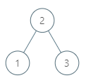
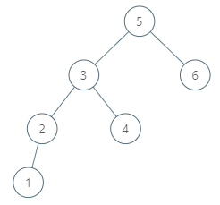

## Description

Given a `node` in a binary search tree, return *the in-order successor of that node in the BST*. If that node has no in-order successor, return `null`.

The successor of a `node` is the node with the smallest key greater than `node.val`.

You will have direct access to the node but not to the root of the tree. Each node will have a reference to its parent node. Below is the definition for `Node`:

class Node {
public int val;
public Node left;
public Node right;
public Node parent;
}
```
### Function Contract

**Input**

- `node`: the selected node in a binary search tree with unique values

**Return value**

- Return the successor `Node` itself, or `None` if `node` is last in inorder order.

Each `Node` contains these fields:

- `val`: its integer key
- `left`: its left child or `None`
- `right`: its right child or `None`
- `parent`: its parent or `None` at the root

The caller supplies `node`, not the tree root. Returning only the successor's value does not satisfy the contract.

### Examples
#### Example 1

```
- **Input:** $tree = [2,1,3], node = 1$
- **Output:** `2`
- **Explanation:** 1's in-order successor node is 2. Note that both the node and the return value is of Node type.
#### Example 2



- **Input:** $tree = [5,3,6,2,4,null,null,1], node = 6$
- **Output:** `null`
- **Explanation:** There is no in-order successor of the current node, so the answer is null.
### Constraints

- The number of nodes in the tree is in the range $[1, 10^{4}]$.

- $-10^{5} \le \text{Node.val} \le 10^{5}$

- All Nodes will have unique values.

**Follow up:** Could you solve it without looking up any of the node's values?