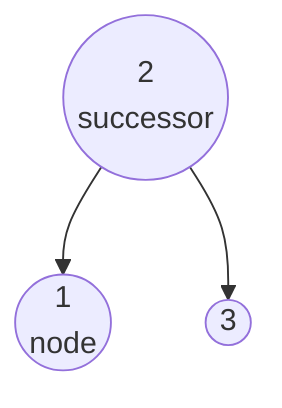
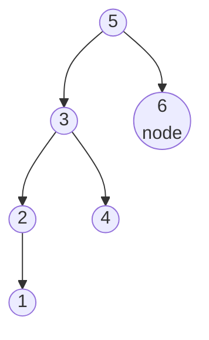

## Examples

**Example 1**

- Input: `tree = [2,1,3], node = 1`
- Output: `2`
- **Explanation:** The node whose value is `2` immediately follows the selected node whose value is `1` in inorder
  order. Both the input and the returned result are `Node` objects.

The first source diagram has the following tree structure:

**Example 2**

- Input: `tree = [5,3,6,2,4,null,null,1], node = 6`
- Output: `null`
- **Explanation:** The selected node whose value is `6` is last in inorder order, so it has no successor.

The second source diagram has the following tree structure:

