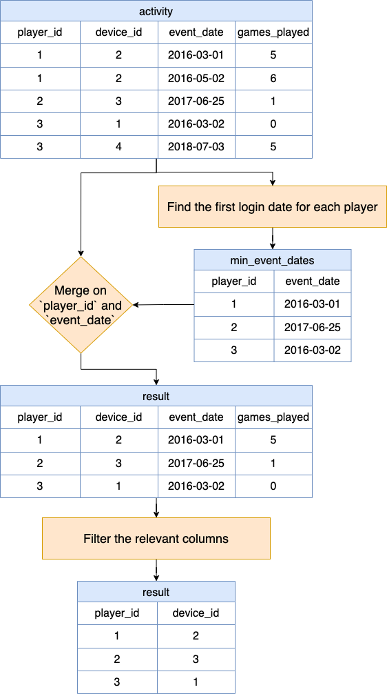

# Solution
---

### Overview

> **Problem reference:** Write a solution to report the device that is first logged in for each player. Return the result table in any order.

---

## pandas

### Approach 1: Using `groupby` and `merge`

**Visualization of approach 1**



#### Intuition

Let's break the approach into steps using the following input `activity` DataFrame:

<table>
    <tr>
        <th>player_id</th>
        <th>device_id</th>
        <th>event_date</th>
        <th>games_played</th>
    </tr>
    <tr>
        <td>1</td>
        <td>2</td>
        <td>2016-03-01</td>
        <td>5</td>
    </tr>
    <tr>
        <td>1</td>
        <td>2</td>
        <td>2016-05-02</td>
        <td>6</td>
    </tr>
    <tr>
        <td>2</td>
        <td>3</td>
        <td>2017-06-25</td>
        <td>1</td>
    </tr>
    <tr>
        <td>3</td>
        <td>1</td>
        <td>2016-03-02</td>
        <td>0</td>
    </tr>
    <tr>
        <td>3</td>
        <td>4</td>
        <td>2018-07-03</td>
        <td>5</td>
    </tr>
</table>
<br>

1. **Finding the First Log-In Date for Each Player**

   In the first step, we are interested in finding the first date each player logged in. We achieve this by grouping the data by $'\text{player}_{id}'$ and then using the `min()` function to find the earliest $'\text{event}_{date}'$ for each player. The $\text{reset}_{index}()$ function is called to convert the series object returned by the `groupby()` method back into a DataFrame.

   ```python
   min_event_dates = activity.groupby('player_id')['event_date'].min().reset_index()
   ```

<table>
    <tr>
        <th>player_id</th>
        <th>event_date</th>
    </tr>
    <tr>
        <td>1</td>
        <td>2016-03-01</td>
    </tr>
    <tr>
        <td>2</td>
        <td>2017-06-25</td>
    </tr>
    <tr>
        <td>3</td>
        <td>2016-03-02</td>
    </tr>
</table>
<br>

2. **Identifying the Device Used on the First Log-In Date**

   Now that we have the earliest log-in date for each player, we want to find out which device they used on that date. To do this, we perform a merge operation on the original dataset using both $'\text{player}_{id}'$ and $'\text{event}_{date}'$. This merge operation will give us the rows from the original dataset where the $'\text{player}_{id}'$ and $'\text{event}_{date}'$ match those in our `min_event_dates` DataFrame, effectively giving us the device ID used on the first log-in date.

   ```python
   result = pd.merge(activity, min_event_dates, on=['player_id', 'event_date'])
   ```

<table>
    <tr>
        <th>player_id</th>
        <th>device_id</th>
        <th>event_date</th>
        <th>games_played</th>
    </tr>
    <tr>
        <td>1</td>
        <td>2</td>
        <td>2016-03-01</td>
        <td>5</td>
    </tr>
    <tr>
        <td>2</td>
        <td>3</td>
        <td>2017-06-25</td>
        <td>1</td>
    </tr>
    <tr>
        <td>3</td>
        <td>1</td>
        <td>2016-03-02</td>
        <td>0</td>
    </tr>
</table>
<br>

3. **Filtering the Relevant Columns**

   After merging, our result DataFrame contains all columns from the original dataset. Since we are only interested in $'\text{player}_{id}'$ and $'\text{device}_{id}'$, we filter the DataFrame to keep only these two columns.

   ```python
   result = result[['player_id', 'device_id']]
   ```

<table>
    <tr>
        <th>player_id</th>
        <th>device_id</th>
    </tr>
    <tr>
        <td>1</td>
        <td>2</td>
    </tr>
    <tr>
        <td>2</td>
        <td>3</td>
    </tr>
    <tr>
        <td>3</td>
        <td>1</td>
    </tr>
</table>
<br>

4. **Returning the Result**

   Finally, we return the `result` DataFrame, which now contains the $'\text{player}_{id}'$ and the $'\text{device}_{id}'$ used on their first log-in date.

   ```python
   return result
   ```

#### Implementation

```python
import pandas as pd

def game_analysis(activity: pd.DataFrame) -> pd.DataFrame:
    # Step 1: Find the earliest event_date for each player
    min_event_dates = activity.groupby('player_id')['event_date'].min().reset_index()

    # Step 2: Merge the earliest event_dates with the original dataset to get the device_ids for those dates
    result = pd.merge(activity, min_event_dates, on=['player_id', 'event_date'])

    # Step 3: Keep only the required columns in the result
    result = result[['player_id', 'device_id']]

    # Step 4: Return the result
    return result
```

### Approach 2: Using `idxmin`

#### Intuition

An alternate approach to solving this problem could involve using the `idxmin` method to get the index of the first login date for each player, and then using these indices to fetch the corresponding rows from the original DataFrame. Here's how you can do this:

1. **Finding the Index of the First Log-In Date**

   In the first step, we group the data by $'\text{player}_{id}'$ and find the index of the earliest $'\text{event}_{date}'$ using `idxmin()`. This method returns the index of the first occurrence of the minimum value in each group.

   ```python
   idx = activity.groupby('player_id')['event_date'].idxmin()
   ```

2. **Getting the Corresponding Rows from the Original DataFrame**

   Next, we use the `loc` method with the indices obtained in step 1 to get the rows corresponding to the first login date from the original DataFrame. We select only the $'\text{player}_{id}'$ and $'\text{device}_{id}'$ columns to form our result.

   ```python
   result = activity.loc[idx][['player_id', 'device_id']]
   ```

3. **Returning the Result**

   Finally, we return the `result` DataFrame, which now contains the $'\text{player}_{id}'$ and the $'\text{device}_{id}'$ used on their first log-in date.

   ```python
   return result
   ```

This approach is somewhat more straightforward because it directly finds the index of the first login date in a single step, and then uses these indices to get the desired rows from the DataFrame. It avoids the need for a merge operation, which can sometimes be more computationally intensive.

#### Implementation

```python
import pandas as pd

def game_analysis(activity: pd.DataFrame) -> pd.DataFrame:
    # Step 1: Find the index of the first login date for each player
    idx = activity.groupby('player_id')['event_date'].idxmin()

    # Step 2: Use the index to get the corresponding rows from the original DataFrame
    result = activity.loc[idx][['player_id', 'device_id']]

    # Step 3: Return the result
    return result
```

---

## Database

In part I of the five-part Game Play Analysis problem series, namely [511. Game Play Analysis I](https://leetcode.com/problems/game-play-analysis-i/), we were tasked with reporting the *first login date* for each player. Different approaches were possible (as usual), but the most straightforward approach was to use `MIN()` in conjunction with `GROUP BY`:

```sql
SELECT
  A.player_id,
  MIN(A.event_date) AS first_login
FROM
  Activity A
GROUP BY
  A.player_id;
```

What made this solution somewhat straightforward was that we could use the aggregate function `MIN()` without any complications. We could apply it to each subgroup created by `GROUP BY`. But we can't use that to our advantage in this problem. Why?

We are asked to report the **device** that is first logged in for each player, which is different from, but inextricably linked to, the *first login date* for each player (i.e., the primary datum we were asked to report on previously). How can we get at this piece of data effectively?

### Approach 1: Subquery and multi-value use of the `IN` comparison operator

#### Intuition

As noted in the overview above, each $\text{device}_{id}$ will be linked to the earliest $\text{event}_{date}$ for each player. Since $(\text{player}_{id}, \text{event}_{date})$ is the primary key of the `Activity` table, if we could find all rows containing this tuple where the $\text{event}_{date}$ was the earliest $\text{event}_{date}$ linked to each player, then we could simply extract the $\text{device}_{id}$ from all such rows. This approach has the added benefit that we can use our previous work as well.

#### Algorithm

1. Select a single tuple for each player, namely $(\text{player}_{id}, \text{event}_{date})$, where $\text{event}_{date}$ is the earliest occurring $\text{event}_{date}$ for the player in question.
2. Identify all rows in the `Activity` table whose $\text{player}_{id}$ and $\text{event}_{date}$ values match those in the tuple described above, and select the corresponding $\text{player}_{id}$ and $\text{device}_{id}$ values from these rows.

#### Implementation

```sql
SELECT
  A1.player_id,
  A1.device_id
FROM
  Activity A1
WHERE
  (A1.player_id, A1.event_date) IN (
    SELECT
      A2.player_id,
      MIN(A2.event_date)
    FROM
      Activity A2
    GROUP BY
      A2.player_id
  );
```

**Note:** This solution takes advantage of the fact that `IN()` in MySQL [can be used to compare row constructors](https://dev.mysql.com/doc/refman/8.0/en/comparison-operators.html#operator_in) (i.e., `SELECT ... WHERE (col1, col2) IN ((val1a, val2a), (val1b, val2b), ...)`). This may not be possible in all DBMS (as [this thread](https://dba.stackexchange.com/q/34266/197404) notes). A workaround could be to use a [common table expression](https://dev.mysql.com/doc/refman/8.0/en/with.html) (CTE) and `INNER JOIN` instead:

```sql
WITH
  min_data AS (
    SELECT
      A.player_id,
      MIN(A.event_date) AS event_date
    FROM
      Activity A
    GROUP BY
      A.player_id
  )
SELECT
  A2.player_id,
  A2.device_id
FROM
  Activity A2
  INNER JOIN min_data M ON M.player_id = A2.player_id
  AND M.event_date = A2.event_date;
```

---

### Approach 2: Window functions

#### Intuition

As noted in the overview to this problem, the $\text{device}_{id}$ we need to ultimately report will be linked to the first login date for each player. If we could rank rows specific to each player by earliest login date, then we could "pluck out" whatever $\text{device}_{id}$ is linked to the row containing the earliest occurring $\text{event}_{date}$ for each player.

#### Algorithm

1. Use a CTE to clearly identify the intermediate result set from which ranked rows will be picked.
2. Rank rows specific to each player by using a sensible window function for ranking purposes. We use `RANK()` below, but either $\text{DENSE}_{RANK}()$ or $\text{ROW}_{NUMBER}()$ would work just as well in this case.
3. Select the $\text{player}_{id}$ and $\text{device}_{id}$ from the $\text{ranked}_{logins}$ CTE where the ranking (i.e., `rnk`) is `1`.

#### Implementation

```sql
WITH
  ranked_logins AS (
    SELECT
      A.player_id,
      A.device_id,
      RANK() OVER (
        PARTITION BY
          A.player_id
        ORDER BY
          A.event_date
      ) AS rnk
    FROM
      Activity A
  )
SELECT
  RL.player_id,
  RL.device_id
FROM
  ranked_logins RL
WHERE
  RL.rnk = 1;
```

**Note:** It is quite possible to use other window functions such as $\text{FIRST}_{VALUE}()$:

```sql
SELECT DISTINCT
  A.player_id,
  FIRST_VALUE(A.device_id) OVER (
    PARTITION BY
      A.player_id
    ORDER BY
      A.event_date
  ) AS device_id
FROM
  Activity A;
```

Or $\text{LAST}_{VALUE}()$:

```sql
SELECT DISTINCT
  A.player_id,
  LAST_VALUE(A.device_id) OVER (
    PARTITION BY
      A.player_id
    ORDER BY
      A.event_date DESC RANGE BETWEEN UNBOUNDED PRECEDING
      AND UNBOUNDED FOLLOWING
  ) AS device_id
FROM
  Activity A;
```

We prefer `RANK()`, $\text{DENSE}_{RANK}()$, or $\text{ROW}_{NUMBER}()$ for various reasons (simplicity being the main one).

---

### Database Conclusion

We prefer Approach 1 due to its simplicity, performance, and the fact that it builds on work previously done in Part I of the Game Play Analysis problem series (i.e., [511. Game Play Analysis I](https://leetcode.com/problems/game-play-analysis-i/)). Approach 2 is valuable as well as it presents a somewhat simplified context within which to learn more about common table expressions and window functions and how they can make challenging problems more manageable.