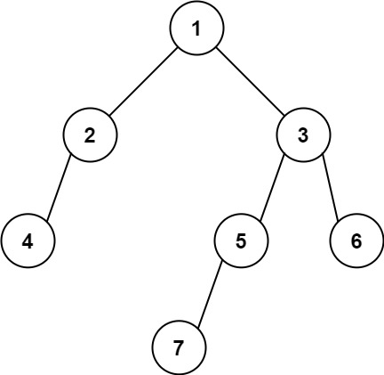

### 1. Description

Given the `root` of a binary tree, return the leftmost value in the last row of the tree.

### 2. Function Contract

**Methods**

- `TreeNode(val=0, left=None, right=None)`: Initializes the data structure.
- `findBottomLeftValue(root: Optional[TreeNode]) -> `int``: Executes operation.

### 3. Examples

#### Example 1

- **Input:** `root = [2,1,3]`
- **Output:** `1`

#### Example 2

- **Input:** `root = [1,2,3,4,null,5,6,null,null,7]`
- **Output:** `7`

### 4. Constraints

- The number of nodes in the tree is in the range $[1, 10^{4}]$.

- $-2^{31} \le \text{Node.val} \le 2^{31} - 1$
