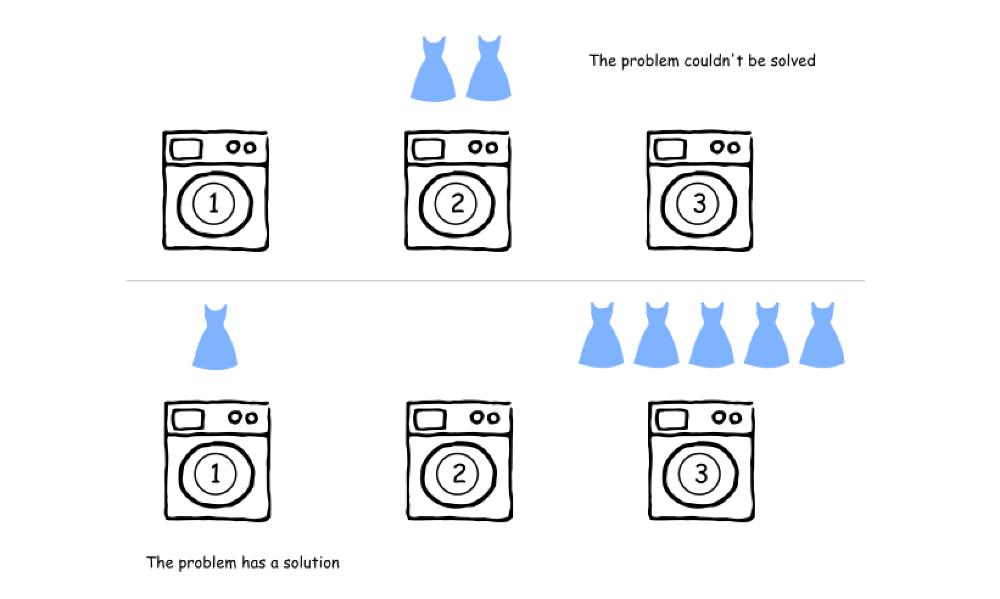
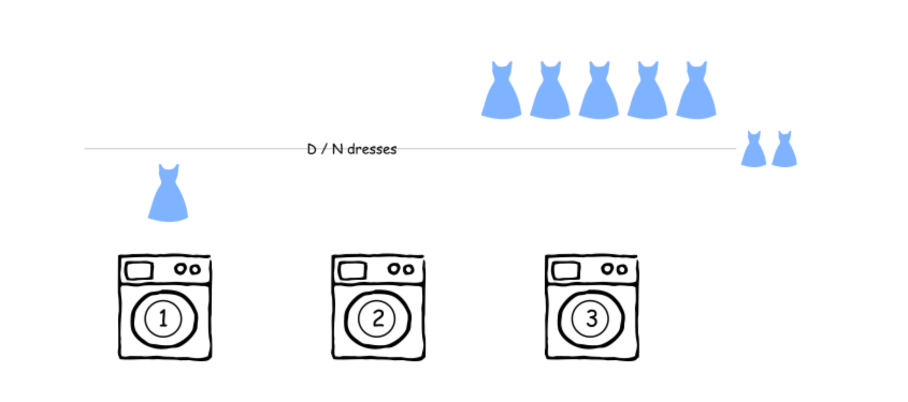
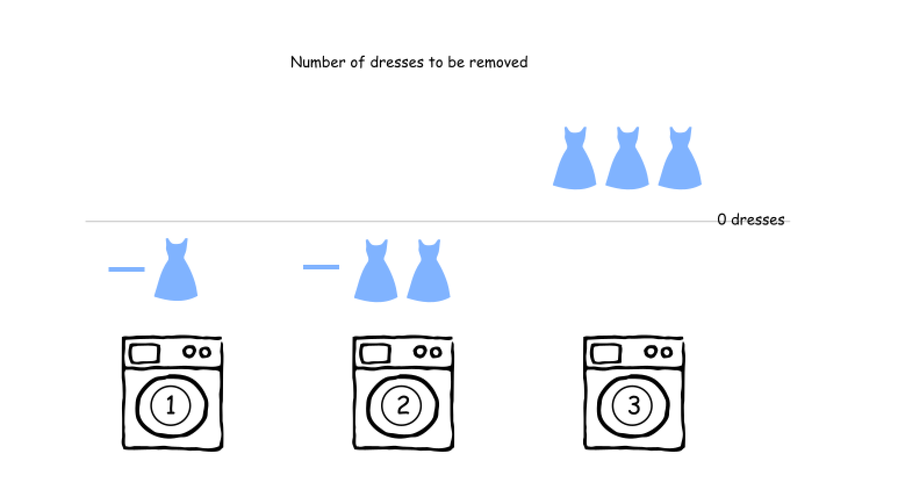
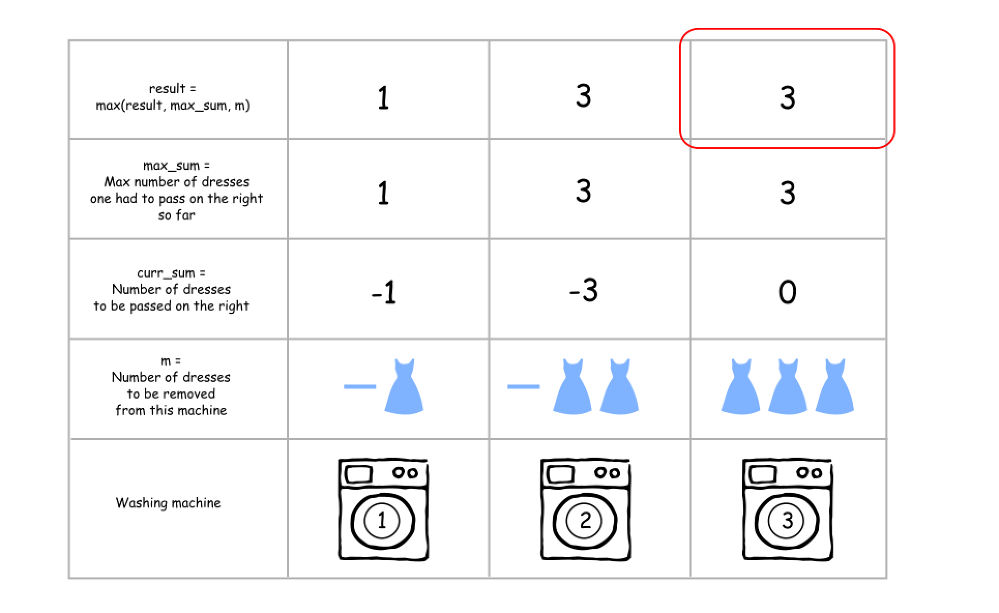
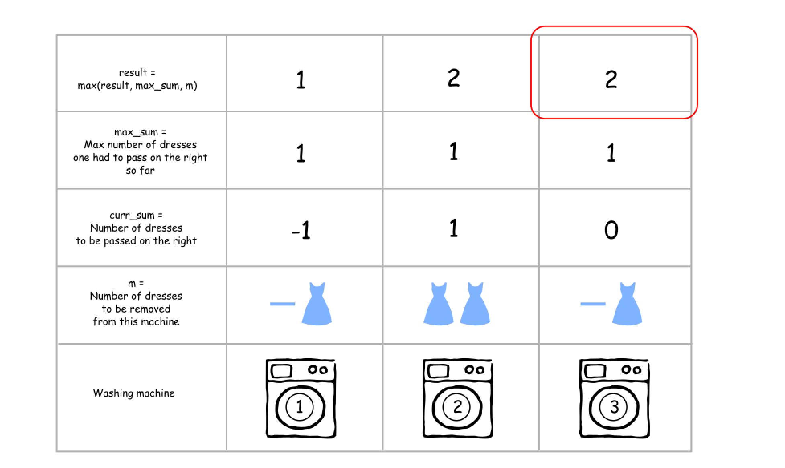
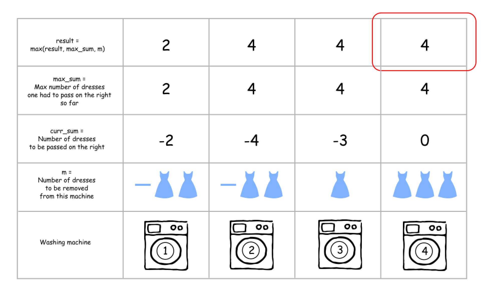

[TOC]

## Solution

---

### Approach 1: Greedy.

**Intuition**

This greedy problem is very similar to [Gas station problem](https://leetcode.com/articles/gas-station/) and could be solved in linear time as well.

> First of all - could the problem be solved or not?

Yes, if the dresses could be divided into `N` equal parts where `N` is the number of machines. In other words, `N` should be a divisor of the number of dresses `D`.



Now it's easy to compute the number of dresses that each machine should have: $D / N$. The starting numbers of dresses in the machines move around this $D / N$ average value.



The standard ML trick is to normalize the data so that the average value would be zero. For that, one could replace the actual number of dresses in the machine with the number of dresses to be removed. This number could be negative if one actually needs _to add_ the dresses to the machine.



As for the [gas station problem](https://leetcode.com/articles/gas-station), one starts from the beginning and checks the standard set for such problems: the current element, the current sum, and the maximum sum seen so far :

- `m`. Number of dresses to be removed from the current machine.

- $\text{curr}_{sum}$. Number of dresses to be passed on the right.

- $\text{max}_{sum}$. Maximum number of dresses one had to pass on the right at this point or before.

It's quite obvious that the result at each point is a maximum between $\text{max}_{sum}$ and `m`, i.e. one has to compare the cumulative and the local maximums.

Here are three different examples.

- `[1, 0, 5]`. The cumulative maximum is equal to the local one.



- `[0, 3, 0]`. The local maximum wins over the cumulative one.



- `[0, 0, 3, 5]`. The cumulative maximum wins over the local one.



**Algorithm**

Here is the algorithm.

1. Check if the problem could be solved: `len(machines)` should be a divisor of `sum(machines)`. Otherwise, the answer is `-1`.

2. Compute the number of dresses each machine should finally have: $dresses_{per\_machine} = sum(machines)/len(machines)$.

3. [Normalize](https://en.wikipedia.org/wiki/Normalization#Technology_and_computer_science) the problem by replacing the _number of dresses_ in each machine by the _number of dresses to be removed_ from this machine (could be negative).

4. Initiate $\text{curr}_{sum}$, $\text{max}_{sum}$, and `res` as zero.

5. Iterate over all machines `m in machines`:

- Update $\text{curr}_{sum}$ and $\text{max}_{sum}$ at each step: $\text{curr}_{sum} += m$, $\text{max}_{sum} = max(\text{max}_{sum}, abs(\text{curr}_{sum}))$.

- Update result $res = max(res, \text{max}_{sum}, m)$.

6. Return `res`.

**Implementation**

```python
class Solution:
    def findMinMoves(self, machines: List[int]) -> int:
        n = len(machines)
        dress_total = sum(machines)
        if dress_total % n != 0:
            return -1

        dress_per_machine = dress_total // n
        for i in range(n):
            # Change the number of dresses in the machines to
            # the number of dresses to be removed from this machine
            # (could be negative)
            machines[i] -= dress_per_machine

        # curr_sum is the number of dresses to move at this point,
        # max_sum is the max number of dresses to move at this point or before,
        # m is the number of dresses to move out from the current machine.
        curr_sum = max_sum = res = 0
        for m in machines:
            curr_sum += m
            max_sum = max(max_sum, abs(curr_sum))
            res = max(res, max_sum, m)
        return res
```

**Complexity Analysis**

* Time complexity: $\mathcal{O}(N)$ since there is a three-level iteration over the input array.

* Space complexity: $\mathcal{O}(1)$ since it's a constant space solution.