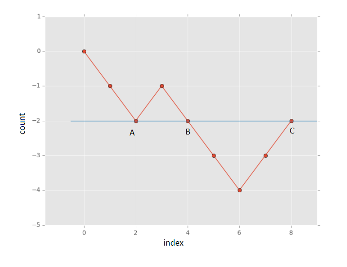
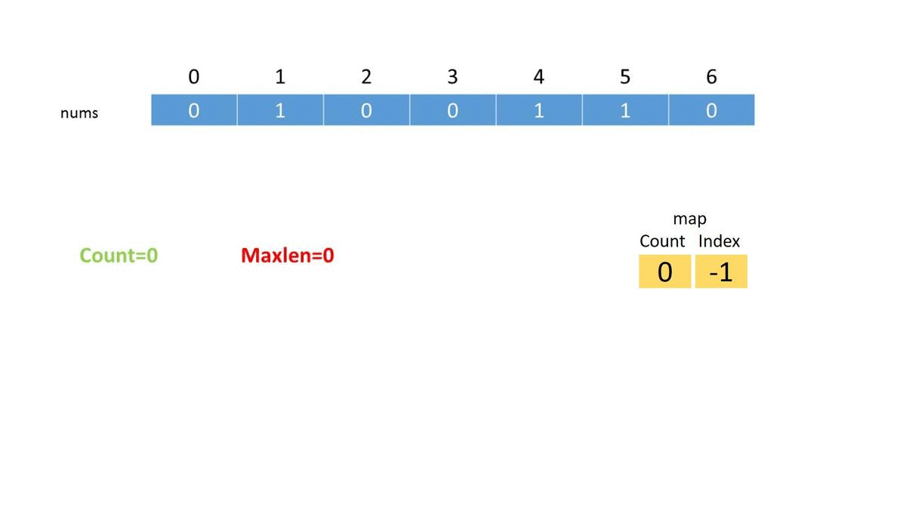
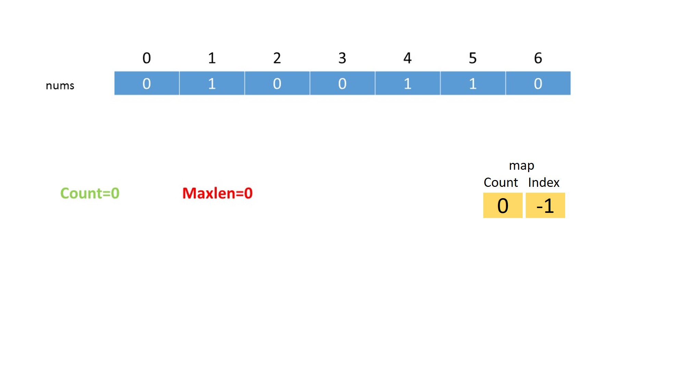
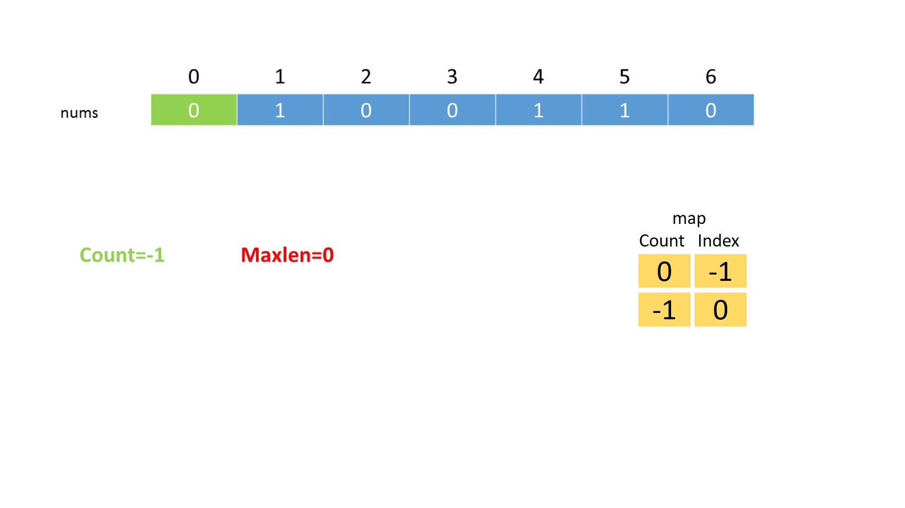
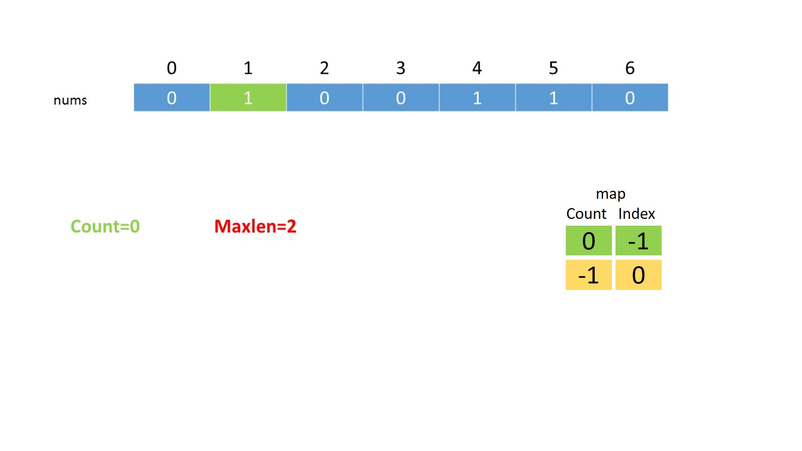
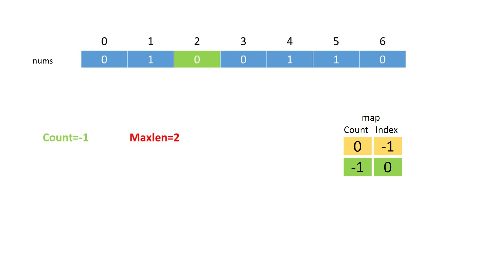
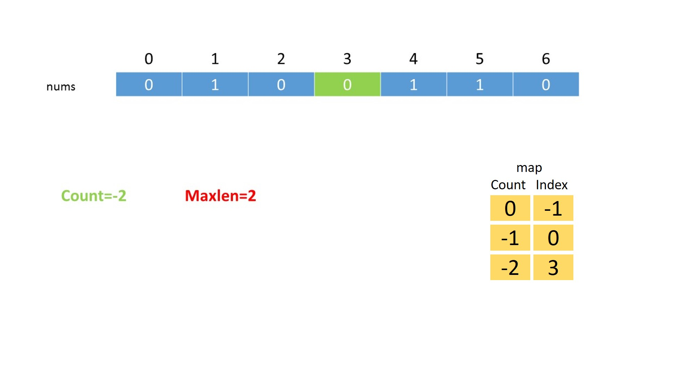
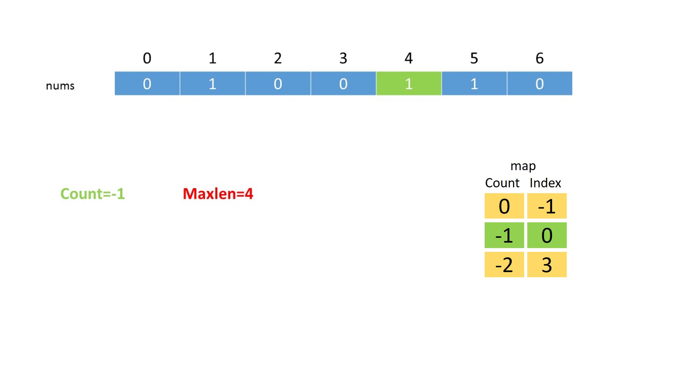
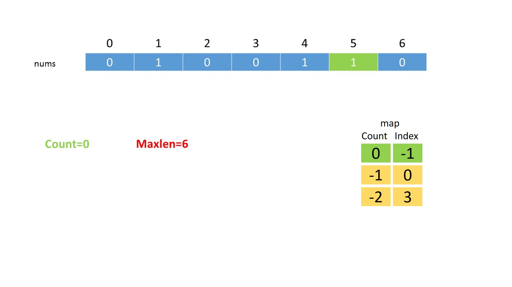
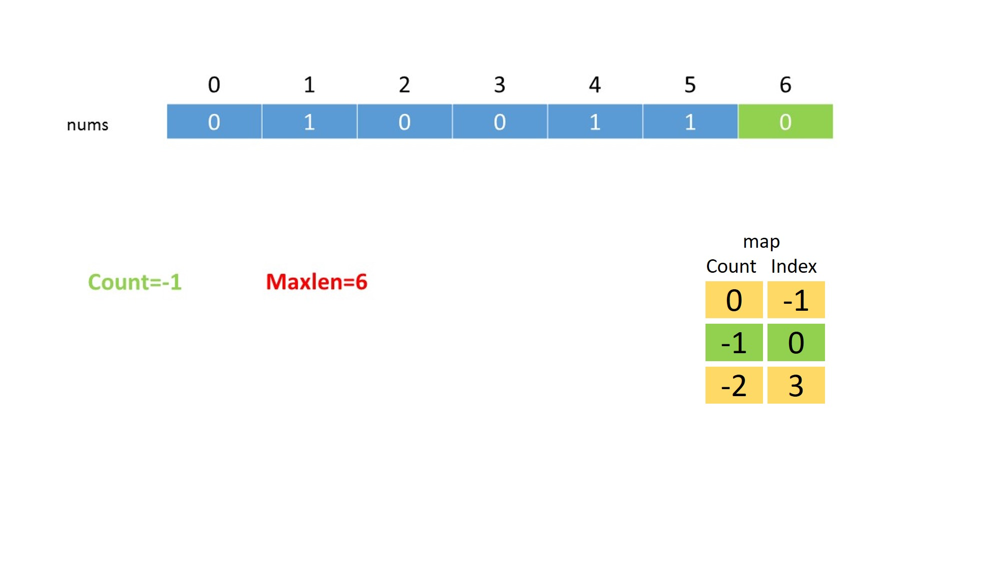

[TOC]

## Solution

---
### Approach #1 Brute Force [Time Limit Exceeded]

#### Algorithm

The brute force approach is really simple. We consider every possible subarray within the given array and count the number of zeros and ones in each subarray. Then, we find out the maximum size subarray with equal no. of zeros and ones out of them.

#### Implementation

```java

public class Solution {

    public int findMaxLength(int[] nums) {
        int maxlen = 0;
        for (int start = 0; start < nums.length; start++) {
            int zeroes = 0, ones = 0;
            for (int end = start; end < nums.length; end++) {
                if (nums[end] == 0) {
                    zeroes++;
                } else {
                    ones++;
                }
                if (zeroes == ones) {
                    maxlen = Math.max(maxlen, end - start + 1);
                }
            }
        }
        return maxlen;
    }
}

```

#### Complexity Analysis

* Time complexity : $O(n^2)$. We consider every possible subarray by traversing over the complete array for every start point possible.

* Space complexity : $O(1)$. Only two variables $zeroes$ and $ones$ are required.

---

### Approach #2 Using Hash Map [Accepted]

#### Algorithm

Imagine a `count` variable, which is used to store the relative number of ones and zeros encountered so far while traversing the array. The `count` variable is incremented by one for every $\text{1}$ encountered and the same is decremented by one for every $\text{0}$ encountered.

We start traversing the array from the beginning. If at any moment, the $count$ becomes zero, it implies that we've encountered an equal number of zeros and ones from the beginning till the current index of the array($i$). Not only this, another point to be noted is that if we encounter the same $count$ twice (for any value, not just 0) while traversing the array, it means that the number of zeros and ones are equal between the indices corresponding to the equal $count$ values. The following figure illustrates the observation for the sequence `[0 0 1 0 0 0 1 1]`:



In the above figure, the subarrays between (A,B), (B,C), and (A,C) (lying between indices corresponding to $count = -2$) have an equal number of zeros and ones.

Another point to be noted is that the largest subarray is the one between the points (A, C). Thus, if we keep a track of the indices corresponding to the same $count$ values that lie farthest apart, we can determine the size of the largest subarray with equal no. of zeros and ones easily.

We can use a hash map that maps values of `count` to the first index where that `count` was seen. We maintain the value of `count` and at each index, if we have seen the same value of `count` before, it means the subarray starting from where we saw that value of `count` and ending at the current index has an equal number of 0s and 1s. Otherwise, we put `count` in the map for future iterations.

The following animation depicts the process:
<!---->

















#### Implementation

```python
class Solution:
    def findMaxLength(self, nums: List[int]) -> int:
        dic = {}
        dic[0] = -1
        ans = 0
        count = 0

        for i in range(len(nums)):
            if nums[i] == 1:
                count += 1
            else:
                count -= 1

            if count in dic:
                ans = max(ans, i - dic[count])
            else:
                dic[count] = i

        return ans
```

#### Complexity Analysis

* Time complexity : $O(n)$. The entire array is traversed only once.

* Space complexity : $O(n)$. Maximum size of the HashMap $map$ will be $\text{n}$, if all the elements are either 1 or 0.