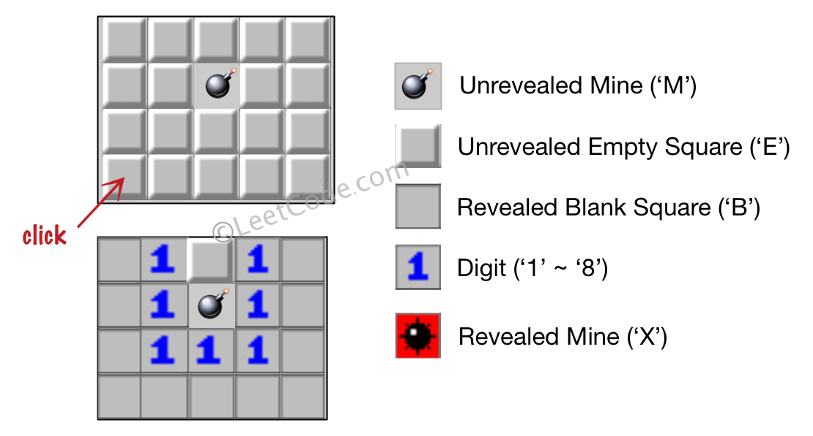
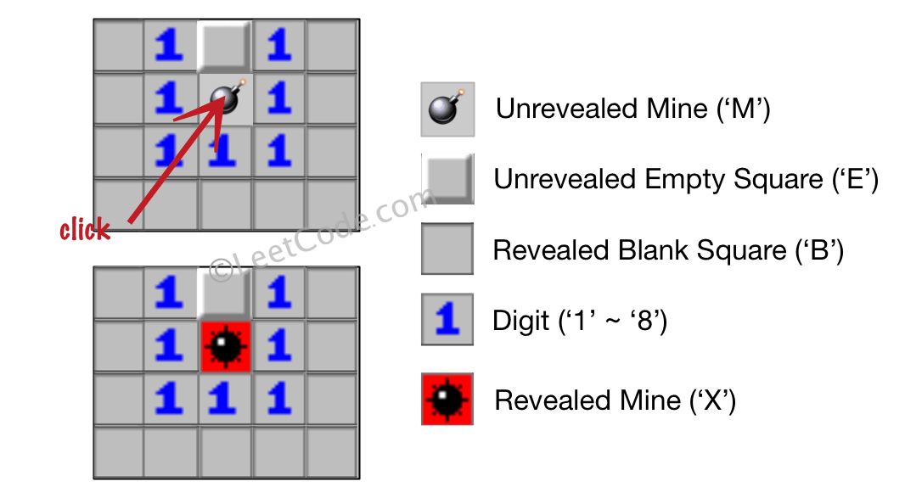

### 1. Description

Let's play the minesweeper game (<a href="https://en.wikipedia.org/wiki/Minesweeper_(video_game)" target="_blank">Wikipedia</a>, <a href="http://minesweeperonline.com" target="_blank">online game</a>)!

You are given an `m x n` char matrix `board` representing the game board where:

- `'M'` represents an unrevealed mine,

- `'E'` represents an unrevealed empty square,

- `'B'` represents a revealed blank square that has no adjacent mines (i.e., above, below, left, right, and all 4 diagonals),

- digit (`'1'` to `'8'`) represents how many mines are adjacent to this revealed square, and

- `'X'` represents a revealed mine.

You are also given an integer array `click` where $click = [\text{click}_{r}, \text{click}_{c}]$ represents the next click position among all the unrevealed squares (`'M'` or `'E'`).

Return *the board after revealing this position according to the following rules*:

- If a mine `'M'` is revealed, then the game is over. You should change it to `'X'`.

- If an empty square `'E'` with no adjacent mines is revealed, then change it to a revealed blank `'B'` and all of its adjacent unrevealed squares should be revealed recursively.

- If an empty square `'E'` with at least one adjacent mine is revealed, then change it to a digit (`'1'` to `'8'`) representing the number of adjacent mines.

- Return the board when no more squares will be revealed.

### 2. Function Contract

- `n`: Input parameter.
- Returns expected result.

### 3. Examples

#### Example 1

- **Input:** $board = [["E","E","E","E","E"],["E","E","M","E","E"],["E","E","E","E","E"],["E","E","E","E","E"]], click = [3,0]$
- **Output:** `[["B","1","E","1","B"],["B","1","M","1","B"],["B","1","1","1","B"],["B","B","B","B","B"]]`
#### Example 2

- **Input:** $board = [["B","1","E","1","B"],["B","1","M","1","B"],["B","1","1","1","B"],["B","B","B","B","B"]], click = [1,2]$
- **Output:** `[["B","1","E","1","B"],["B","1","X","1","B"],["B","1","1","1","B"],["B","B","B","B","B"]]`

### 4. Constraints

- $m = \text{board.length}$

- $n = \text{board}[i].length$

- $1 \le m, n \le 50$

- $\text{board}[i][j]$ is either `'M'`, `'E'`, `'B'`, or a digit from `'1'` to `'8'`.

- $\text{click.length} = 2$

- $0 \le \text{click}_{r} < m$

- $0 \le \text{click}_{c} < n$

- $board[\text{click}_{r}][\text{click}_{c}]$ is either `'M'` or `'E'`.