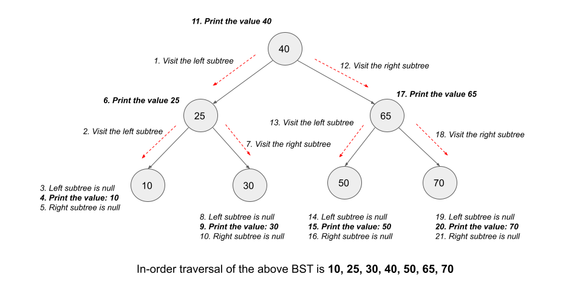

[TOC]

## Solution

---

### Overview

Given the `root` of a Binary Search Tree (BST).

Our task is to return the minimum absolute difference between the values of any two different nodes in the tree.

---

### Approach 1: Depth First Search

#### Intuition

Let's try to solve a simpler problem first. Given a sorted array of integers, find the minimum difference between any two integers in the array. To solve this problem, we don't need to check every pair of integers. Instead, checking the difference between every two consecutive integers would work. This is because the array is sorted. We will make use of this to solve our original problem.

In the original problem, we have some integer values (i.e. node values), and we need to find the minimum difference between any two values. Thus, the original problem is similar to the problem we discussed above if we keep those values in the sorted order.

To get all the node values we can use a graph traversal algorithm like depth-first search (DFS).

In DFS, we use a recursive function to explore nodes as far as possible along each branch. Upon reaching the end of a branch, we backtrack to the next branch and continue exploring.

Once we encounter an unvisited node, we will take one of its neighbor nodes (if exists) as the next node on this branch. Recursively call the function to take the next node as the 'starting node' and solve the subproblem.

If you are new to Depth First Search, please see our [Leetcode Explore Card](https://leetcode.com/explore/featured/card/graph/619/depth-first-search-in-graph/3882/) for more information on it!

After gathering all of the node values into a list of integers, we sort the list and compare the difference between every two consecutive integers to determine the minimum difference between the values.

#### Algorithm

1. Create a list of integers `nodeValues` to store the node values.

2. Perform the DFS traversal over the given binary search tree. We call `dfs(root)` where `dfs` is a recursive method that takes `TreeNode node` as a parameter. We perform the following in this method:

- If `node` is `null`, return.

- Add the current node's value, `node.val`, in the `nodeValues` list.

- Recursively perform DFS from `node.left`.

- Recursively perform DFS from `node.right`.

3. Sort the `nodeValues` list.

4. Create an integer variable `minDifference` and initialize it to infinity.

5. Iterate over `inorderNodes` starting from index `1`, and for each element at index `i`, find the difference with the element at index $i - 1$ and update the variable `minDifference` accordingly.

6. Return `minDifference`.

#### Implementation

```python
class Solution:
    def getMinimumDifference(self, root: Optional[TreeNode]) -> int:
        nodeValues = []

        def dfs(node):
            if node is None:
                return
            nodeValues.append(node.val)
            dfs(node.left)
            dfs(node.right)

        dfs(root)

        nodeValues.sort()
        minDifference = 1e9
        for i in range(1, len(nodeValues)):
            minDifference = min(minDifference, nodeValues[i] - nodeValues[i-1])

        return minDifference
```

#### Complexity Analysis

Here, $n$ is the number of nodes in the given binary search tree.

* Time complexity: $O(n \cdot \log n)$

- We traverse once over each node of the BST using DFS traversal which takes $O(n)$ time.

- We take $O(n \cdot \log n)$ time to sort a list of $n$ elements.

- We iterate over the list of size $n$ elements to find the minimum difference which also takes $O(n)$ time.

* Space complexity: $O(n)$

- The DFS traversal is recursive and would take some space to store the stack calls. The maximum number of active stack calls at a time would be the tree's height, which in the worst case would be $O(n)$ when the tree is a straight line.

- We also need a list of size $O(n)$ to store the values of all the nodes.

---

### Approach 2: In-order Traversal Using List

#### Intuition

In the previous approach, we found all the values and then sorted them. This would work for any binary tree. However, we are given a binary search tree, which we didn't take advantage of. A unique property of a binary search tree is that an **inorder traversal handles the nodes in sorted order.** This allows us to skip the sorting at the end.

The in-order traversal works by visiting the left subtree of a node first, then handling the node itself and finally visiting the right subtree. Since all the nodes in the left subtree are lesser than the current node's value and all nodes in the right subtree are greater than the current node's value, it generates a sorted list of values.

Here's a visual representation of how inorder traversal works in a BST:



As you can see, we continue to move towards the left node until we no longer can, then handle the current node and repeat the process with the right node as the new starting node.

#### Algorithm

1. Create a list of integers `inorderNodes` to store the node values.

2. Perform the inorder traversal of the binary search tree (BST). Call `inorderTraversal(root)` where `inorderTraversal` is a recursive method that takes `TreeNode node` as a parameter. We perform the following in this method:

- If `node` is `null`, return.

- Recursively perform the in-order traversal for `node.left`.

- Add the current node's value, `node.val`, in the `inorderNodes` list.

- Recursively perform the in-order traversal for `node.right`.

3. Create an integer variable `minDifference` and initialize it to infinity.

4. Iterate over `inorderNodes` starting from index `1`, and for each element at index `i`, find the difference with the element at index $i - 1$ and update the variable `minDifference` accordingly.

5. Return `minDifference`.

#### Implementation

```python
class Solution:
    def getMinimumDifference(self, root: Optional[TreeNode]) -> int:
        inorderNodes = []

        def inorder(node):
            if node is None:
                return
            inorder(node.left)
            inorderNodes.append(node.val)
            inorder(node.right)

        inorder(root)
        minDifference = 1e9
        for i in range(1, len(inorderNodes)):
            minDifference = min(minDifference, inorderNodes[i] - inorderNodes[i-1])

        return minDifference
```

#### Complexity Analysis

Here, $n$ is the number of nodes in the given binary search tree.

* Time complexity: $O(n)$

- We traverse once over each node of the BST using in-order traversal which takes $O(n)$ time.

- We iterate over the list of size $n$ elements to find the minimum difference which also takes $O(n)$ time.

* Space complexity: $O(n)$

- The in-order traversal is recursive and would take some space to store the stack calls. The maximum number of active stack calls at a time would be the tree's height, which in the worst case would be $O(n)$ when the tree is a straight line.

- We also need a list of size $O(n)$ to store the values of all the nodes.

---

### Approach 3: In-order Traversal Without List

#### Intuition

As we can notice in the previous approach, we only need the immediate in-order predecessor of any node to calculate the minimum difference. The rest of the nodes will not be needed and are stored unnecessarily in the list.

Thus, we can avoid storing elements in a list if we can find the difference between consecutive nodes on the fly during in-order traversal. For each node in the tree, we need the previous node we have handled, and then we can find the difference. This can be done using another variable `prevNode` that will store the value of the node we handled previously in the in-order traversal. This way, we don't have to store the elements in an array and at the same time, don't have to re-iterate over the nodes again.

#### Algorithm

1. Create an answer variable `minDifference` and initialize it to infinity.

2. Create a `TreeNode` variable `prevNode` to keep track of the previous node we have traversed. Initialize it to `null`.

3. Perform the inorder traversal of the binary search tree (BST). Call `inorderTraversal(root)` where `inorderTraversal` is a recursive method that takes `TreeNode node` as a parameter. We perform the following in this method:

- If `node` is `null`, return.

- Recursively perform the in-order traversal for `node.left`.

- We handle `node` now. We check its difference with the previously visited node `prevNode`. If $prevNode \neq null$, it means we have visited a node previously and hence, we try to update `minDifference` using $minDifference = min(minDifference, \text{node.val} - \text{prevNode.val})$.

- Recursively perform the in-order traversal for `node.right`.

4. Return `minDifference`.

#### Implementation

```python
class Solution:
    def getMinimumDifference(self, root: Optional[TreeNode]) -> int:
        self.minDistance = 1e9
        # Initially, it will be null.
        self.prevNode = None

        def inorder(node):
            if node is None:
                return
            inorder(node.left)
            # Find the difference with the previous value if it is there.
            if self.prevNode is not None:
                self.minDistance = min(self.minDistance, node.val - self.prevNode)
            self.prevNode = node.val
            inorder(node.right)

        inorder(root)
        return self.minDistance
```

#### Complexity Analysis

Here, $n$ is the number of nodes in the given binary search tree.

* Time complexity: $O(n)$

- We traverse once over each node of the BST using in-order traversal which takes $O(n)$ time.

* Space complexity: $O(n)$

- The in-order traversal is recursive and would take some space to store the stack calls. The maximum number of active stack calls at a time would be the tree's height, which in the worst case would be $O(n)$ when the tree is a straight line.

- Note that this space complexity is only for the worst-case scenario, and in the average case we have greatly improved our space complexity since we don't need to create a list to store all the nodes.