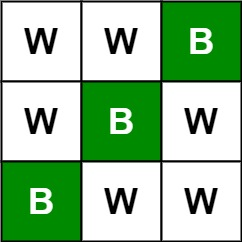
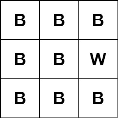

## Description

Given an `m x n` `picture` consisting of black `'B'` and white `'W'` pixels, return *the number of **black** lonely pixels*.

A black lonely pixel is a character `'B'` that located at a specific position where the same row and same column don't have **any other** black pixels.
### Function Contract

**Input**

- `picture`: a nonempty rectangular matrix containing only `"B"` and `"W"`

**Return value**

- Return the number of coordinates `(row, column)` whose cell is black and whose row and column each contain exactly
  one black pixel.

### Examples

#### Example 1

- **Input:** $picture = [["W","W","B"],["W","B","W"],["B","W","W"]]$
- **Output:** `3`
- **Explanation:** All the three 'B's are black lonely pixels.
#### Example 2

- **Input:** $picture = [["B","B","B"],["B","B","W"],["B","B","B"]]$
- **Output:** `0`
### Constraints

- $m = \text{picture.length}$

- $n = \text{picture}[i].length$

- $1 \le m, n \le 500$

- $\text{picture}[i][j]$ is `'W'` or `'B'`.