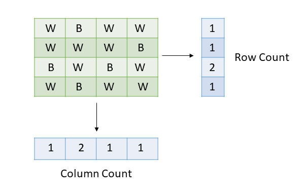
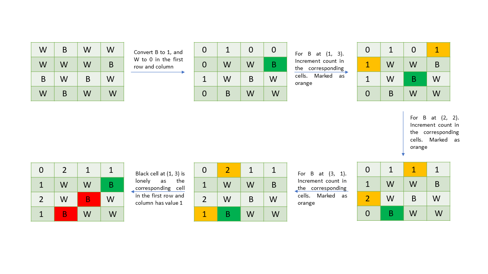

[TOC]

## Video Solution

---
 <div>
    <div class="video-container">
      <iframe src="https://player.vimeo.com/video/868867925?texttrack=en-x-autogenerated" frameborder="0"
        allow="autoplay; fullscreen"></iframe>
    </div>
</div>

## Solution

---

### Approach 1: Counting with Arrays

#### Intuition

We are given a character matrix of size $M * N$ consisting of black `B` and white `W` pixels. We need to return the count of such black cells that are located in a row and column with no other black cells.

Essentially we need to have the count of black cells in each row and column. We have $M$ rows and $N$ columns, hence we need an array `rowCount` of size $M$ to store the count of black cells in the rows and an array `columnCount` of size $N$ to store the count of black cells in the columns. We can do this by iterating over the cells in the matrix and for each black cell at `(x, y)` we will increment the count at $\text{rowCount}[x]$ and $\text{columnCount}[y]$ by `1`.

Then we can just iterate over the cells once again and for each cell at `(x, y)` we will check, if the count in the array $\text{rowCount}[x]$ and $\text{columnCount}[y]$ is `1` or not. If it is, we will increment the count `answer` by `1`.



#### Algorithm

1. Iterate over the cells in the matrix `picture`, for each black cell at `(x, y)`:

- Increment $\text{rowCount}[x]$ and $\text{colCount}[y]$ by `1`.
2. Iterate over the cells in the matrix and for each black cell at `(x, y)` check if the value of $\text{rowCount}[x]$ and $\text{colCount}[y]$ is `1`. If both values are `1`, increment the variable `answer` by `1`.
3. Return `answer`.

#### Implementation

```cpp
class Solution {
public:
    int findLonelyPixel(vector<vector<char>>& picture) {
        int n = int(picture.size());
        int m = int(picture[0].size());

        // Arrays to store the count of black cells in rows and columns.
        vector<int> rowCount(n, 0);
        vector<int> columnCount(m, 0);
        for (int i = 0; i < n; i++) {
            for (int j = 0; j < m; j++) {
                if (picture[i][j] == 'B') {
                    rowCount[i]++;
                    columnCount[j]++;
                }
            }
        }

        int answer = 0;
        for (int i = 0; i < n; i++) {
            for (int j = 0; j < m; j++) {
                // Its a lonely cell, if the current cell is black and,
                // the count of black cells in its row and column is 1.
                if (picture[i][j] == 'B' && rowCount[i] == 1 && columnCount[j] == 1) {
                    answer++;
                }
            }
        }

        return answer;
    }
};
```

#### Complexity Analysis

Here, $M$ is the number of rows in the given matrix `picture`, and $N$ is the number of columns in it.

* Time complexity: $O(M *  N)$

  We are iterating over the cells in the matrix twice, the first time to find the values in the arrays `rowCount` and `columnCount` and the second time for counting the lonely cells, hence the number of operations will be $2 * M * N$. Therefore, the total time complexity will be $O(M * N)$.

* Space complexity: $O(M + N)$

   We need two arrays, one `rowCount` of size $M$ to store the black cell count for rows and another array of size $N$ to store the count of black cell count for columns. Hence the total space complexity is equal to $O(M + N)$.

---

### Approach 2: Space Optimized Counting

#### Intuition

In the previous approach, we used two arrays to store the count of black cells in the rows and columns. Can we somehow avoid this space overhead?

Instead of using two arrays separately, we can use the matrix itself to store the black cell count. We can use the first row to store the count of black cells in each column and similarly we can use the first column to store the count of black cells in each row. But what about the lonely cells in the first row or first column itself? We can handle the first row and column separately and keep the answer for them beforehand.

Hence, we will first find the lonely cells in the first row and column and then use them to store the black cell count for the row and column as we did in the previous approach using two separate arrays.

> Interview Tip:
>
> Here we are modifying the input to save the space complexity.
> However, in the real interview, some interviewers dislike modifying the input.
> Be sure to ask your interviewer for clarification
> on whether you are allowed to modify the input or not.

#### Algorithm

1. Find the lonely cells in the first row and column:

- Iterate over the cells in the first row. For each cell `(x, y)`, call the `check()` function to find the number of black cells in the first row and column. `check()` returns true if the cell `(x, y)` is the only black cell in the first row and column. If it returns a true increment the value at `answer`

- Similarly, find the lonely cells in the first column by iterating over each cell in it and then calling the `check()` function.

2. Iterate over the first row and replace `B` cells with `1` and `W` cells with `0`. Similarly in the first column replace `B` cells with `1` and `W` cells with `0`. This row and column will be used as counters.

3. Similar to the previous approach, iterate over the cells with row `[1, M)` and column `[1, N)` and for each black cell at `(x, y)` increment the count in the first row at $\text{picture}[x][0]$ and $\text{picture}[0][y]$ by `1`.

4. Now iterate over each cell starting from the cell at `(1, 1)`, and for each black cell, if the value at the corresponding row and column in the first row and column is `1`, then increment `answer`.

5. Return `answer`.



#### Implementation

```cpp

class Solution {
public:
    // Returns true if the cell at (x, y) is lonely.
    // There should not be any other black cell
    // In the first row and column except (x, y) itself.
    bool check(vector<vector<char>>& picture, int x, int y) {
        int n = int(picture.size());
        int m = int(picture[0].size());

        int cnt = 0;
        for (int i = 0; i < n; i++) {
            cnt += (picture[i][y] == 'B');
        }

        for (int j = 0; j < m; j++) {
            // avoid double count (x, y)
            if (j != y) cnt += (picture[x][j] == 'B');
        }
        return picture[x][y] == 'B' && cnt == 1;
    }

    int findLonelyPixel(vector<vector<char>>& picture) {
        int n = int(picture.size());
        int m = int(picture[0].size());

        int answer = 0;
        // Lonely cells in the first row
        for (int j = 0; j < m; j++) {
            answer += check(picture, 0, j);
        }
        //Lonely cells in the first column
        for (int i = 1; i < n; i++) {
            answer += check(picture, i, 0);
        }

        // Convert cell 'B' to '1' and 'W' to '0'
        for (int j = 0; j < m; j++) {
            picture[0][j] = (picture[0][j] == 'B' ? '1' : '0');
        }

        for (int i = 0; i < n; i++) {
            picture[i][0] = (picture[i][0] == 'B' ? '1' : '0');
        }

        // If the cell is black increment the count of corresponding row and column by 1
        for (int i = 1; i < n; i++) {
            for (int j = 1; j < m; j++) {
                if (picture[i][j] == 'B') {
                    picture[i][0]++;
                    picture[0][j]++;
                }
            }
        }

        for (int i = 1; i < n; i++) {
            for (int j = 1; j < m; j++) {
                if (picture[i][j] == 'B') {
                    if (picture[0][j] == '1' && picture[i][0] == '1') {
                        answer++;
                    }
                }
            }
        }

        return answer;
    }
};
```

#### Complexity Analysis

Here, $M$ is the number of rows in the given matrix `picture`, and $N$ is the number of columns in it.

* Time complexity: $O(M * N)$

   We spent $O(M * N)$ time to find the number of lonely cells in the first row and column because we iterate over each of the $M$ cells in the first row and then traverse over the cells in the first row and its column. Similarly for the lonely cell in the first column. To find the lonely cells in the rest of the matrix we used an approach similar to the first one and just iterated over each cell twice. Therefore, the total time complexity is equal to $O(M *N)$.

* Space complexity: $O(1)$

  We are not using any separate array as we did in the previous approach. Hence the total space complexity will be equal to $O(1)$.

---