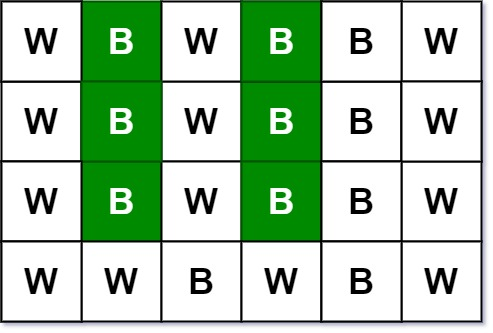
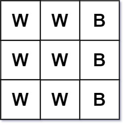

### 1. Description

Given an `m x n` `picture` consisting of black `'B'` and white `'W'` pixels and an integer target, return *the number of **black** lonely pixels*.

A black lonely pixel is a character `'B'` that located at a specific position `(r, c)` where:

- Row `r` and column `c` both contain exactly `target` black pixels.

- For all rows that have a black pixel at column `c`, they should be exactly the same as row `r`.

### 2. Function Contract

**Inputs**

- `picture`: a nonempty rectangular matrix containing only `"B"` and `"W"`
- `target`: the required number of black pixels in both the qualifying row and column

**Return value**

- Return the number of black coordinates whose row and column counts equal `target` and whose column's black pixels
  all occur in rows identical to that coordinate's row.

### 3. Examples

#### Example 1

- **Input:** $picture = [["W","B","W","B","B","W"],["W","B","W","B","B","W"],["W","B","W","B","B","W"],["W","W","B","W","B","W"]], target = 3$
- **Output:** `6`
- **Explanation:** All the green 'B' are the black pixels we need (all 'B's at column 1 and 3).
Take 'B' at row r = 0 and column c = 1 as an example:
- Rule 1, row r = 0 and column c = 1 both have exactly target = 3 black pixels.
- Rule 2, the rows have black pixel at column c = 1 are row 0, row 1 and row 2. They are exactly the same as row r = 0.
#### Example 2

- **Input:** $picture = [["W","W","B"],["W","W","B"],["W","W","B"]], target = 1$
- **Output:** `0`

### 4. Constraints

- $m = \text{picture.length}$

- $n = \text{picture}[i].length$

- $1 \le m, n \le 200$

- $\text{picture}[i][j]$ is `'W'` or `'B'`.

- $1 \le target \le min(m, n)$